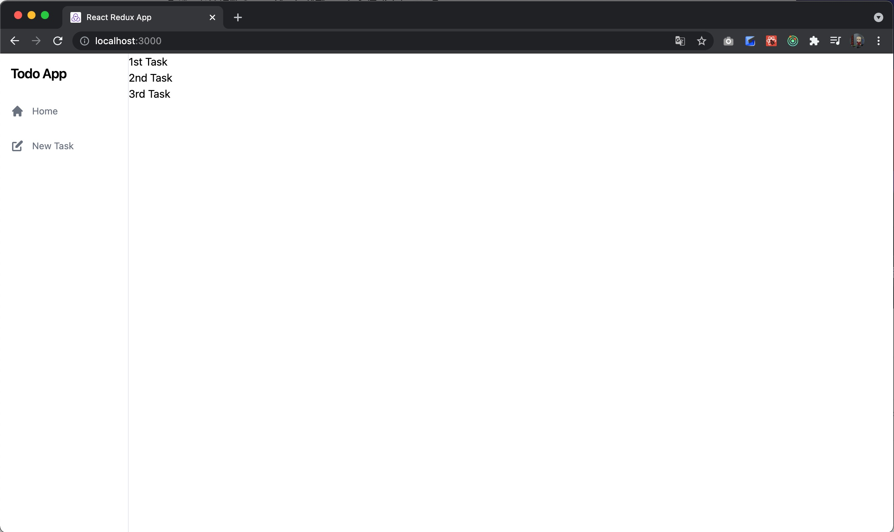

# 5日目

ではTodoを作成するバックエンドAPIを作成していきましょう。

## タスク作成バックエンドAPI

### テスト

まず、サーバのテストを書いてみましょう。
`POST /todos`に対してJSONをボディにセットして、リクエストしたときの、
レスポンスコードとレスポンスデータを確認するテストを書いてみます。

```kotlin
// TodoControllerTest.kt
package com.fujitsu.todoappserver.controller

import com.fasterxml.jackson.module.kotlin.jacksonObjectMapper
import com.fasterxml.jackson.module.kotlin.readValue
import com.fujitsu.todoappserver.model.Todo
import org.assertj.core.api.Assertions.assertThat
import org.json.JSONObject
import org.junit.jupiter.api.Test
import org.springframework.beans.factory.annotation.Autowired
import org.springframework.boot.test.context.SpringBootTest
import org.springframework.boot.test.web.client.TestRestTemplate
import org.springframework.http.*

@SpringBootTest(webEnvironment = SpringBootTest.WebEnvironment.RANDOM_PORT)
class TodoControllerTest {
    @Autowired
    lateinit var restTemplate: TestRestTemplate

    @Test
    fun タスク一覧を取得できる() {
        val header = HttpHeaders()
        header.contentType = MediaType.APPLICATION_JSON
        val response = restTemplate.exchange("/todos", HttpMethod.GET, HttpEntity(null, header), String::class.java)
        val mapper = jacksonObjectMapper()
        val articles: List<Todo> = mapper.readValue(response.body!!)
        assertThat(response.statusCode).isEqualTo(HttpStatus.OK)
        assertThat(articles.size).isEqualTo(0)
    }

    @Test
    fun タスクを新規作成できる() {
        val newTodoJson = JSONObject()
        newTodoJson.put("title", "test title")
        val header = HttpHeaders()
        header.contentType = MediaType.APPLICATION_JSON
        val postResponse = restTemplate.exchange("/todos", HttpMethod.POST, HttpEntity(newTodoJson.toString(), header), String::class.java)
        val mapper = jacksonObjectMapper()
        val todo: Todo = mapper.readValue(postResponse.body!!)
        assertThat(postResponse.statusCode).isEqualTo(HttpStatus.CREATED)
        assertThat(todo.id).isEqualTo(1)
        assertThat(todo.title).isEqualTo("test title")
        assertThat(todo.completed).isEqualTo(false)
    }
}
```

これは先日書いた`Get /Todos`のテストと同等なので大丈夫でしょう。

### 実装

これも先日実装した`Get /Todos`とほぼ同等ですので、コードだけ示します。

#### Model

```kotlin
// NewTodo.kt
package com.fujitsu.todoappserver.model

data class NewTodo(
    val title: String,
)
```

#### Controller層
```kotlin
// TodoControllerInterface.kt
package com.fujitsu.todoappserver.controller

import com.fujitsu.todoappserver.model.NewTodo  // 追加
import com.fujitsu.todoappserver.model.Todo

interface TodoControllerInterface {
    fun getTodos(): List<Todo>
    fun createTodo(newTodo: NewTodo): Todo  // 追加
}
```

```kotlin
// TodoController.kt
package com.fujitsu.todoappserver.controller

import com.fujitsu.todoappserver.model.NewTodo
import com.fujitsu.todoappserver.model.Todo
import org.springframework.http.HttpStatus
import org.springframework.web.bind.annotation.*

@RestController
class TodoController(private val todoService: TodoControllerInterface) {
    @GetMapping("/todos")
    @ResponseStatus(HttpStatus.OK)
    fun getTodos() : List<Todo> {
        return todoService.getTodos()
    }

    // 追加
    @PostMapping("/todos")
    @ResponseStatus(HttpStatus.CREATED)
    fun createTodo(@RequestBody newTodo: NewTodo): Todo {
        return todoService.createTodo(newTodo)
    }
}
```

#### Service層

```kotlin
// TodoServiceInterface.kt
package com.fujitsu.todoappserver.service

import com.fujitsu.todoappserver.model.NewTodo  // 追加
import com.fujitsu.todoappserver.model.Todo

interface TodoServiceInterface {
    fun getTodos(): List<Todo>
    fun createTodo(newTodo: NewTodo): Todo      // 追加
}
```

```kotlin
// TodoService.kt
package com.fujitsu.todoappserver.service

import com.fujitsu.todoappserver.controller.TodoControllerInterface
import com.fujitsu.todoappserver.model.NewTodo  // 追加
import com.fujitsu.todoappserver.model.Todo
import org.springframework.stereotype.Service

@Service
class TodoService(private val todoRepository: TodoServiceInterface) : TodoControllerInterface {
    override fun getTodos(): List<Todo> {
        return todoRepository.getTodos()
    }

    // 追加
    override fun createTodo(newTodo: NewTodo): Todo {
        return todoRepository.createTodo(newTodo)
    }
}
```

##### Repository層

```kotlin
// TodoRepository.kt
package com.fujitsu.todoappserver.repository

import com.fujitsu.todoappserver.model.NewTodo  // 追加
import com.fujitsu.todoappserver.model.Todo
import com.fujitsu.todoappserver.service.TodoServiceInterface
import org.springframework.jdbc.core.JdbcTemplate
import org.springframework.jdbc.support.GeneratedKeyHolder
import org.springframework.stereotype.Repository
import java.sql.ResultSet
import java.sql.Statement

@Repository
class TodoRepository(val jdbcTemplate: JdbcTemplate) : TodoServiceInterface {
    override fun getTodos(): List<Todo> {
        return jdbcTemplate.query(
            """select id, title, completed from todo"""
        ) { rs: ResultSet, _: Int ->
            Todo(
                rs.getInt("id"),
                rs.getString("title"),
                rs.getBoolean("completed")
            )
        }
    }

    // 追加
    override fun createTodo(newTodo: NewTodo): Todo {
        val keyHolder = GeneratedKeyHolder()
        jdbcTemplate.update({ connection ->
            val statement = connection.prepareStatement(
                """insert into todo(title, completed) values (?, false)""", Statement.RETURN_GENERATED_KEYS
            )
            statement.setString(1, newTodo.title)
            statement
        }, keyHolder)
        return Todo(
            keyHolder.keys!!["id"] as Int,
            newTodo.title,
            false
        )
    }
}
```

リポジトリは少しテクニカルなことをしていて、insert文を実行したときにインクリメントされた`id`を返すようにしていて、
それを使って、戻り値を返すようにしています。

こうすると、データを作成した後にサイドselect文を発行する必要がなくなりレスポンスが早くなります。

### 再実行可能なテスト

さて、実装は完了したのでテストを動かして検証していきたいわけですが、このテストは問題なく動いているでしょうか？
このテストはデータベースの状態に強く依存していて、動く人もいれば動かない人もいます。
もし、運良くテストが動いた人も、もう一度全件テストを動かすと失敗するはずです。

これはテストを実行する度に、todo_dbに対してデータの追加を行っているからで、
一度todoテーブルに対してデータを追加すると、2回目以降はidが1にはならないからです。
つまり、これは再現可能なテストになっていません。

この問題に対処するにはテストを実行する度にDBをリセットしてしまえばいいので、その設定をしてみましょう。

まず、src/test配下に`resources`ディレクトリを作成し、その中に`clear_db.sql`を作成します。

```sql
/* clear_db.sql */
truncate table todo restart identity cascade;
```

やっている内容は単純でtodoテーブルの内容をtruncateすると共に、idのシーケンスをリセットしています。
そして、テストを実行する度にこのSQLを実行したらいいわけですが、これもアノテーションを付与するだけで簡単に実現できます。

```kotlin
// TodoControllerTest.kt
package com.fujitsu.todoappserver.controller

import com.fasterxml.jackson.module.kotlin.jacksonObjectMapper
import com.fasterxml.jackson.module.kotlin.readValue
import com.fujitsu.todoappserver.model.Todo
import org.assertj.core.api.Assertions.assertThat
import org.json.JSONObject
import org.junit.jupiter.api.Test
import org.springframework.beans.factory.annotation.Autowired
import org.springframework.boot.test.context.SpringBootTest
import org.springframework.boot.test.web.client.TestRestTemplate
import org.springframework.http.*
import org.springframework.test.context.jdbc.Sql    // 追加

@SpringBootTest(webEnvironment = SpringBootTest.WebEnvironment.RANDOM_PORT)
@Sql(scripts = ["/clear_db.sql"])       // 追加
class TodoControllerTest {
    @Autowired
    lateinit var restTemplate: TestRestTemplate

    @Test
    fun タスク一覧を取得できる() {
        val header = HttpHeaders()
        header.contentType = MediaType.APPLICATION_JSON
        val response = restTemplate.exchange("/todos", HttpMethod.GET, HttpEntity(null, header), String::class.java)
        val mapper = jacksonObjectMapper()
        val articles: List<Todo> = mapper.readValue(response.body!!)
        assertThat(response.statusCode).isEqualTo(HttpStatus.OK)
        assertThat(articles.size).isEqualTo(0)
    }

    @Test
    fun タスクを新規作成できる() {
        val newTodoJson = JSONObject()
        newTodoJson.put("title", "test title")
        val header = HttpHeaders()
        header.contentType = MediaType.APPLICATION_JSON
        val postResponse = restTemplate.exchange("/todos", HttpMethod.POST, HttpEntity(newTodoJson.toString(), header), String::class.java)
        val mapper = jacksonObjectMapper()
        val todo: Todo = mapper.readValue(postResponse.body!!)
        assertThat(postResponse.statusCode).isEqualTo(HttpStatus.CREATED)
        assertThat(todo.id).isEqualTo(1)
        assertThat(todo.title).isEqualTo("test title")
        assertThat(todo.completed).isEqualTo(false)
    }
}
```

これでテストは動くはずです。データを追加できるようになったため、データを追加した後Getでレスポンスデータを確認するテストを追記しても良いでしょう。

ここまでのサーバのソースコードは
[https://github.com/Onebase-Fujitsu/todo-app-server/tree/step3](https://github.com/Onebase-Fujitsu/todo-app-server/tree/step3)
においてあります。

## タスク画面のデザインの適用



現在クライアントを連携させると、NewTask画面で追加したタスクがHome画面に追加できていることがわかります。
しかし、デザインがまだ適用されていないので、デザインを適用してみましょう。

```typescript jsx
// TodoList.tsx
import {useSelector} from 'react-redux'
import {ArchiveIcon} from "@heroicons/react/solid";
import {RootState} from '../stores/store'

const TodoList = () => {
  const todos = useSelector((state: RootState) => state.todos)

  return (
    <ul data-testid="TodoList" className="w-full p-8 flex flex-col">
      {todos.map((todo) => (
        <li key={todo.id} className="w-full flex justify-center items-center pb-4">
          <div className="border-2 flex justify-between border-gray-200 w-full rounded-lg shadow-lg p-4">
            <div>
              <p className="text-xl font-bold">{todo.title}</p>
            </div>
            <button type="button">
              <ArchiveIcon className="w-6"/>
            </button>
          </div>
        </li>
      ))}
    </ul>
  )
}

export default TodoList
```

タスクリストにデザインを適用してみました。


ここまでのクライアントのソースコードは
[https://github.com/Onebase-Fujitsu/todo-app-client/tree/step8](https://github.com/Onebase-Fujitsu/todo-app-client/tree/step8)
に置いてあります。


## API設計

さて、ここまで`/todos`に対するGETの処理やPOSTの処理を実装しましたが、
ここで少し箸休めにAPIの設計について簡単に説明しようと思います。

### いいAPIの設計とは

4日目に以下のような文書を記載しました。


HTTP通信のオーバーヘッドはメモリアクセスや、ディスクアクセスと比較して比べ物にならないほど大きいです。
良くないAPIを揶揄する言葉に「おしゃべりなAPI」というものがあります。
つまり、画面を描画するのになんどもなんどもAPIをコールする必要があるAPI設計は良くないということです。


これはよくある悪いAPIの設計の話なのですが、逆にいいAPIとはなんでしょうか？

いいAPIの定義は人によって様々だと思いますが、筆者は **「開発者がドキュメントを見なくても自然に使えるAPI」** がいいAPIだと思っています。
自然に使えるというのは **つまりWeb標準に従っているAPI** ということです。つまりRESTのルールに準拠して設計をしなさいということになります。

### REST

HTTPのメソッドは4つしかありません。

- GET
- POST
- PUT
- DELETE

### リソース志向

### パラメータ

### レスポンスデータの設計

### Swagger