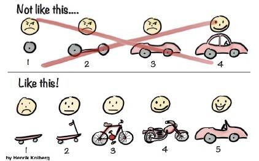
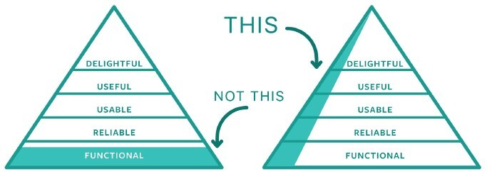

# MVP

## 概要
MVP(Minimum Viable Product)とは、ユーザーに価値を提供できる最小限のプロダクトのことです。

- 最小限(Minimum)

  最小限の時間・投資で作るプロダクトです。

- 実行可能(Viable)

  ユーザーに価値を示し仮説を検証するのに十分な体験を提供するプロダクトです。

## なぜMVP?
MVPは最小限のコストで最大の仮説を検証し、最大のリスクを最小化するのに利用されます。
早期にプロダクトをユーザーに利用してもらいフィードバックを得ることで、プロダクトを作り続けるべきか、ビジネスとして継続するべきか、を判断するのに役立ちます。

## MVPのポイント
- MVPはデリバリーのマイルストーンではなく、学びを得るにあたってのマイルストーンになります。

  ユーザーに提供する価値を適切に設定し(速く移動する)、MVPに対するフィードバックを集め早期に学びを得ます。早期に学びを得ることによって、途中(バイク)でユーザーが満足する可能性もあるし、最終的に目指していたプロダクト(車)を提供する際にもより満足度の高いもの(風を感じられるオープンカー)にできます。

  

- MVPを構築する際、検証したいことに直接結びつかない機能やプロセス、労力は取り除くのが原則です。

  
