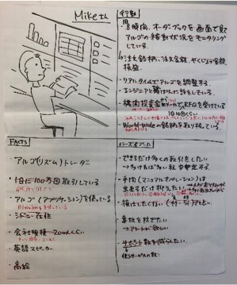

# ペルソナ

## 概要
「ペルソナ」はユーザーのプロトタイプモデルです。
多数の実ユーザーを対象にヒアリングなどによる調査を行い、類似するニーズ、ゴール、コンテキスト、及びタスクを収集して、ペルソナを作成します。
情報が不足している場合、仮説を立ててペルソナを作成し(プロトペルソナ)、検証を行った上で内容を更新していきます。

ペルソナとして以下を可視化します。
- ユーザー名 (ペルソナの名称)、イメージ図
- Facts (例: 業種、経験、役職)
- Behaviors & Habits (例: 行動、ルーティン、好き嫌い)
- Needs & Goals (例; ~したい、~を目指している)

## なぜペルソナ?
ペルソナは、プロダクトを提供するユーザー像を具体化し、チーム内で認識を揃えることを目的としています。
また、ペルソナを作ることによって、ユーザーの視点に立ちやすくなり、より具体的なアイデアが出しやすくなったり、プロダクトに関わる判断を行うときの指針になったりします。
ペルソナを作成した後は、チームでの会話やユーザーストーリーなどではペルソナの名称を使います。

## ペルソナのポイント
- 必要なメンバーで一緒に作る

  Designerだけで作業せず、ProductManagerやユーザーをよく知る人と一緒にワークして作成します。

- 1時間程度で仕上げる

  時間をかけて完璧なものを最初に作る必要はなく、タイムボックスして作業を行います。

- 全員の認識を可視化することを大事にする

- 「今わからないこと」は貴重な発見

- プロダクトに関係のないことは書かない

  例えばBtoBシステムの場合、趣味や家族構成はあまり関係ないことが多いので、記載しません。

- 具体的に書く

  ペルソナの各情報は具体的に記述します。具体的に書くことが、チーム内で意識のズレをなくすことに繋がります。

- 随時アップデートする

  ユーザーへのヒアリングなどによって新たな事実を得たり、誤りに気づいたら、ペルソナを随時アップデートします。ユーザーの状況も変化し続けるため、古いペルソナをベースとしてプロダクト開発を進めることがないように、ペルソナも合わせて更新し続けることが必要です。

- プロジェクト関係者の名前は避ける

  ペルソナの名前をつける時は、プロジェクト関係者がペルソナを共有できるように、また、ペルソナとは異なる先入観を抱くことがないように、プロジェクト関係者や身近な人の名前は避けるようにします。

