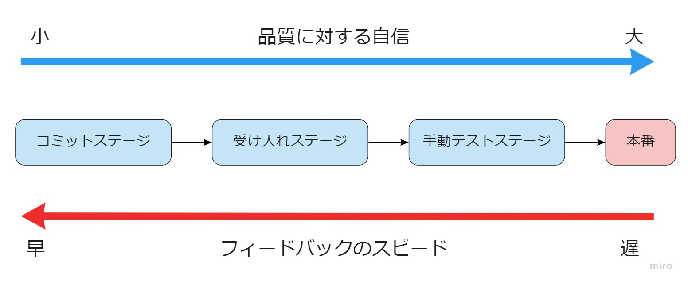

# CI/CD

## 概要
CI/CDとは継続的インテグレーション（CI）と継続的デリバリー（CD）を組み合わせたプラクティスです。ビルド/テスト/デプロイを自動化することで、繰り返し実行が可能となります。

## なぜCI/CD?
CI/CDを導入することで、バグの検出やリリース作業を効率よく実施できます。また、テストを自動で実行可能なため、繰り返し開発を実施するアジャイル開発には必須のプラクティスです。
### CI/CDがないとどうなる？
 - 繰り返しテストが多発し、機能追加に投資できない
 - マージの際にコンフリクトが多発
 - 本番環境特有の設定値を考慮漏れ
 - 外部システムとの連携不可 or 連携パフォーマンスの低下
### CI/CDのメリット
 - バグの検出やリリース作業を効率よく実施できる
 - 常に動作するソフトウェアを維持できる
 - リリースによるリスクを早期に発見可能

## CI/CDのポイント

### テスト戦略を考慮してステージ分割する
開発者はCI/CD環境で包括的なテストを実行し品質に対する自信を大きくしたい反面、包括的なテストはフィードバックにそれなりの時間を要します。この問題を解決するために、デプロイメントパイプラインは、通常いくつかのステージに分割します。前半のステージでは大半の問題をあぶり出し、素早いフィードバックを実施します。後半のステージではじっくり時間をかけて包括的なテストを実行し、プロダクトの品質を高めます。以下にデプロイメントパイプラインのステージ分割の例を示します。

#### コミットステージ
コミットステージは開発者がプッシュしたタイミングで初めに実行されるステージです。**「アプリケーションが壊れていないか」** を素早く知ることが目的となります。コミットステージでは以下の項目を実施します。
- 単体テスト（コンポーネントテスト）
- 静的解析
- ビルド
- 上記が問題なければ成果物のアップロード

#### 受け入れステージ
受け入れステージでは、コミットステージで生成された成果物を疑似本番環境で実行させ、**「お客様の期待する振る舞いどおりに動いているか」** を確認することが目的となります。受け入れステージでは以下の観点での確認を実施します。
- ユーザーの求める価値を提供しているか
- 環境や設定ファイルに起因する問題はないか
- 新規の変更により既存の振る舞いにバグは生じていないか

#### 手動テストステージ
手動テストステージでは、限りなく本番環境に近い環境で手動によるテストを実施します。アジャイル開発では手動テストステージにおいて「探索的テスト」がよく用いられます。探索的テストは手動でリグレッションテストを実施するのではなく、最もシステムに詳しい開発者自身が自身の経験を活かして「なんとなくヤバそうなポイント」を手動でテストするやり方です。ウォーターフォールで採用される記述式のテストとの特徴である網羅性に欠ける反面、短時間で効率よくバグを検出可能なプラクティスです。
