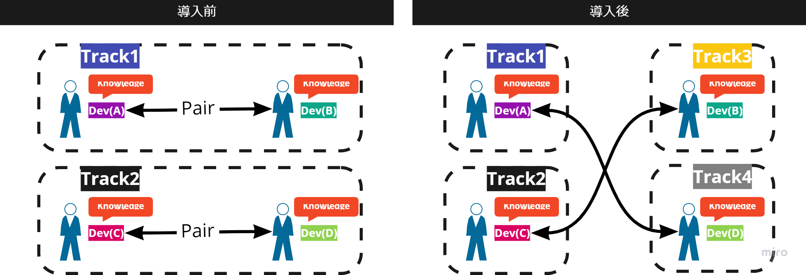

# ソロプログラミング

## 概要
ソロプログラミングは、開発者が1人でプログラミングを行うという手法です。これまで多くのSIの現場で採用されており、
開発者は設計・開発・テストを1人で黙々と作業します。

## なぜソロプログラミング?
以下のような特性を持ったプロジェクトでは、開発持続性よりも一時的な開発スピードを優先しなければならない場合があります。

- プロジェクトの期限を厳守しなければならない
- プロダクトの要件を変更できない

ソロプログラミングでは、ペアプログラミングに比べてチームが同時に取り組めるタスク数が増加します。また、開発者は自らの考えを他者と議論することなくコードに落とし込むことができます。結果として、一時的にではありますが、よりスピーディーな開発が可能となります。

{}
**ソロプログラミングの注意点**

ソロプログラミングを採用することで、ペアプログラミング利点であるコードの共同所有やナレッジ共有の促進などが**失われる**可能性があります。

なぜなら、開発者個人個人にタスクが割り振られるため、目の前の作業に集中しやすく、チーム全体のことを考える余裕がなくなりやすい状況になるからです。
また、タスク間の作業のような「計画段階では決めきれない作業」の押し付け合いが発生する可能性もあるなど、ペアプログラミングに比べて様々な問題が発生しやすい進め方です。

そのため、ソロプログラミング導入の際には、発生した課題に対してをチームで向き合い、**常に改善し続ける**ことが重要になります。
{}

## ソロプログラミングのポイント
- アジャイル開発の経験が豊富なメンバーをアサインする
  
  冒頭で「ソロプログラミングはSIの現場で多く採用されていた」と紹介したので、「ソロプログラミングはSIの延長線上にあり、アジャイル開発の経験は不要」と考えるかもしれませんが、これは大きな誤解です。

  開発の進め方をソロプログラミングにしても、お客様から求められることは変わりません。そのため、基本的な考え方はアジャイルです。さらに、ペアプログラミングと違い一定の型が存在しません。チームで型を作り出す必要があります。結果として、より一層アジャイル開発の知識・経験が必要になります。

- 失敗を許容する風土・仕組みを作る
  
  アジャイル開発を進める上では「早く失敗して、早く改善する」ことが非常に重要です。
  しかし、ソロプログラミングは常に一人で作業するため、失敗を隠蔽しやすい状況が作られやすいです。そのため、
  失敗や間違いに気づいた人が損をしない仕組みづくりや、報告しやすい風土作りが重要になります。

- コーディング規約などの開発ルールを事前に決める
  
  アジャイル開発では、開発プロセスやルールも常に改善しながら進めるため、初期段階では細かく決まっていない場合があります。それでも、ペアプログラミングであれば都度決めながら開発を進めることも比較的容易です。しかし、ソロプログラミングでは一人の考えをベースに全員が関わるルールやプロセスを作らなければならず、一人で決定するのは非常に困難です。

  開発スピードを上げるためにソロプログラミングを導入したのに、プロセスなどの決定に時間をかけては本末転倒です。事前に開発者全員が合意できるルールやプロセスを決め、都度見直し、改善することが重要になります、

- 積極的にナレッジを共有する
  
  日々技術が進歩する中で、1人の力だけで開発を続けることは、開発効率や品質において非常にリスクの高い進め方です。しかし、ソロプログラミングを採用した場合、開発者は原則1人で作業します。また、WF型のプロジェクトと異なり、開発リーダーなども存在しないため、開発者以外の考えを開発中にプロダクトへ取り込む機会が非常に少ないです。そのため、アジャイル開発でソロプログラミングを採用する場合は特に、開発者全員のナレッジでプロダクトを作り上げられる環境づくりが重要になります。

## おすすめの導入方法

前述のとおり、アジャイル開発においては、ソロプログラミングはペアプログラミングに比べて難易度の高い開発手法です。
そのため、もしプロジェクト初期段階からソロプログラミングを導入したい理由があったとしても、まずはペアプログラミングからスタートすることをおすすめします。ペアプログラミングからスタートする中で、プロジェクトやメンバーの特色をチーム全員が理解し、改善できる土台を作ることが非常に重要になります。
また、ソロプログラミング移行後も継続してコミュニケーションを取り合い、開発者が個人の作業ではなくチーム全体を考えた意思決定を行える状態を形成する必要があります。

