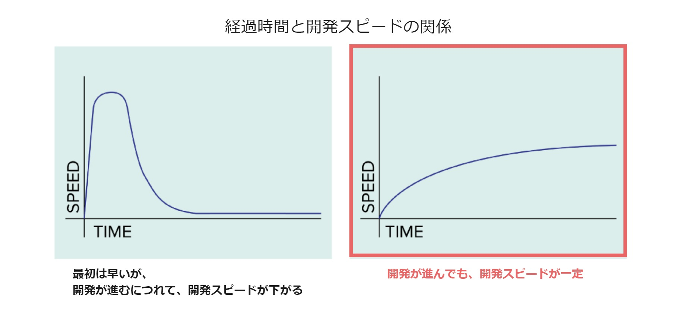
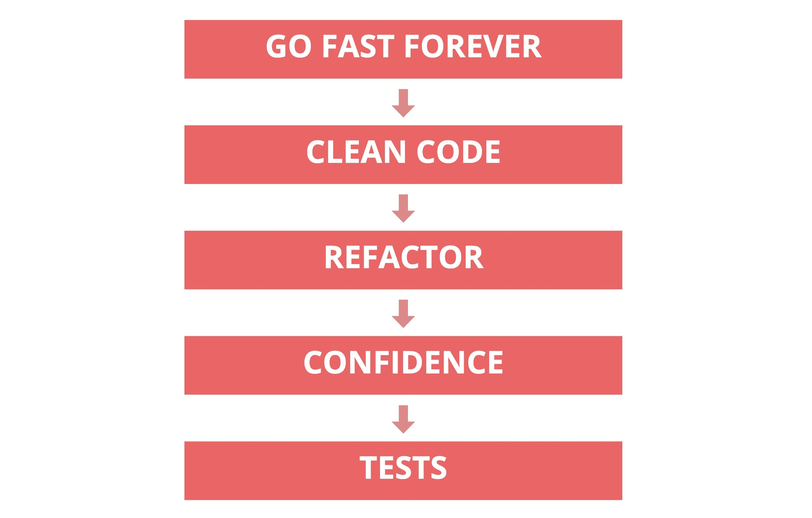

# TDD
## 概要
テスト駆動開発（Test-Driven Development; TDD)は、先にテストを書き、次に機能の実装し、その後コードのリファクタリングを行うという工程を繰り返す開発手法です。  
[テストファーストの開発](../../../xp/practice/#テストファーストの開発)、[テスト駆動開発とは](../../../softwaretest/fizzbuzz/#テスト駆動開発とは)も合わせて参照してください。

## なぜTDD?

開発が進むにつれて、プロダクトに実装された機能が徐々に増えソースコードが複雑化していくため、開発スピードが遅くなっていくことが考えられます。  
継続的な開発を行っていく上では、常に速いスピードで開発を続けられることが望まれています。

TDDでは、テストを用いて動作・機能の保証をしながら、常にソースコードのリファクタリングを行い、わかりやすいコードを保持することで、速いスピードの開発を続けることができます。

- **Go Fast Forever　//継続的に速いスピードで開発を進める**
  - 継続的な開発のためには、継続的に速いスピードで開発を進められることが望ましいです。
- **Clean Code　//わかりやすいコード**
  - 速いスピードで開発を進めるためには、わかりやすいコードである必要があります。
      - わかりやすいコードとは、**他の人が読んでも、理解と修正が容易なコード**です。  
追加・修正箇所、影響範囲の特定が容易になり、バグを作りこみにくくなります。 
- **Refactor　//挙動を変えることなくソースコードを整理する**
  - わかりやすいコードを保つためには、こまめなリファクタリングが必要です。
    - 「機能を実装すること」と「綺麗なコードを書くこと」を両立することは難しいため、別の工程として行います。TDDでは、動作しないソースコードは製品として価値が無いと考えられているため、機能実装後にリファクタリングを行います。
- **Confidence　//バグや後退を発生させない自信**
  - 何度リファクタリングを行っても、挙動を変えずにバグを作りこまないようにするためには、動作(価値)の保証が必要です。
- **Tests　//テスト**
  - 動作(価値)を保証するためには、テストコードを作成し全てのテストをクリアすることを常に確認します。
    - テストコードを初めに書くことで、実装に依存しないテストコードを作成できます。  
      実装が変わっても機能を満たしていればクリアするテストを作成する必要があります。

## TDDのポイント

### いいテストとは?
- **サイズが小さく、実行が速い**
  - 適切なテスト範囲
- **わかりやすい**
  - 誰が見ても、テストの内容が一目でわかる
  - テストの変数名、関数名が適切
  - 準備、アクション、アサーションの順番に書かれている
- **繰り返し実行できる**
- **クリア**
  - 不要なもの、重複がない
  - メンテナンスされている
- **独立している**
  - 実装に依存しない
  - 実行順序に依存しない
- **テストとしての機能を満たしている**
  - テストに使用する値が正しい
  - 機能の確認ができている
  - エラーになるべき時に失敗する
