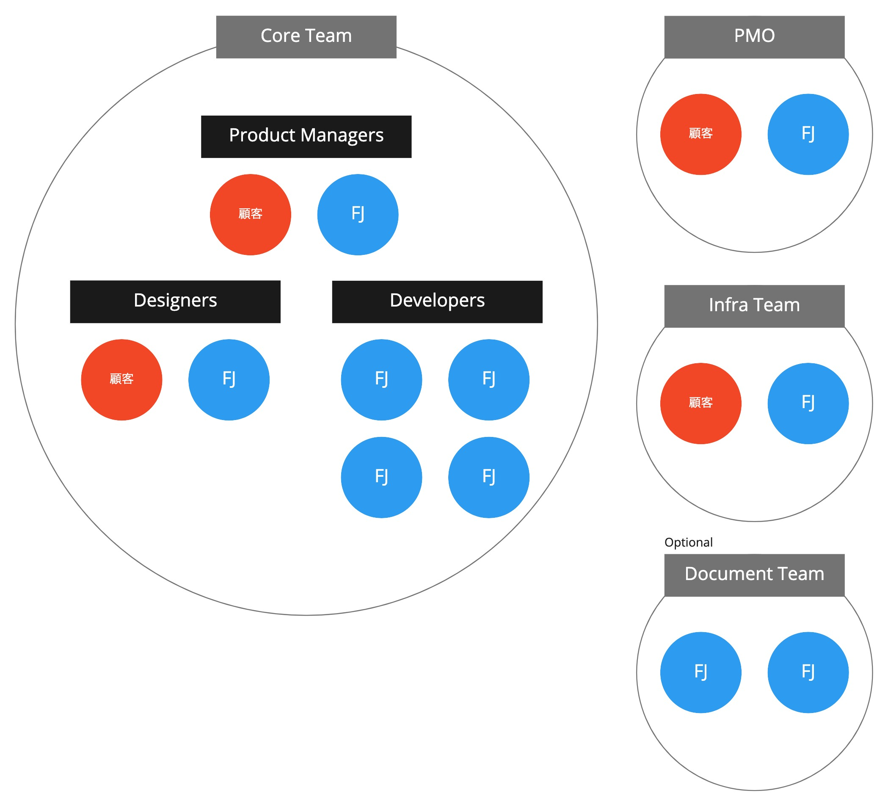

# 体制・役割

## Coreチーム
### Product Managers
Product Managers(PdMs)は正しいものを作るためにビジネス価値、ユーザー価値、技術的な難易度を踏まえて機能の優先度付けを行い価値あるプロダクトを提供することに責任を持ちます。
ユーザーストーリーを作成してチーム内で正しく情報共有を行い、開発完了後には受け入れ確認としてプロダクトが意図した通りに価値を提供するものになっていることを確認します。
その他にも、PdMsはCoreチーム内のコミュニケーションに加えて、CLミーティングやInception/Outceptionを開催してPMOや他チームとの間の情報連携を行います。
様々な情報を把握していることから、会議の全体進行などはPdMsが中心となることが多くなります（全体を把握しているメンバーが進行するのがスムーズ）。

チームの方向性と現状を見極めながら、ユーザー・ビジネス・技術の様々な情報を基に常に最善の判断を行う必要があるため、ドメイン知識だけでなく経験と知恵が必要なポジションです。
様々な視点で物事を見るための理解力や柔軟性、アジェンダなどの事前準備に加えてその場の判断・対応して進行するためのコミュニケーション能力や対応力が必要となります。

業務知識がありビジネス的な判断ができる顧客に参画いただき、1チームにつき富士通1人と顧客1人の1ペアが担当します。

Product Manager

### Designers
Designersは正しいものを作るためにユーザーのことを理解し、プロダクトによってユーザーに価値を提供することに責任を持ちます。
ペルソナやユーザーのシナリオを作成して仮説を特定し、ユーザーへのヒアリングやプロトタイプや実プロダクトなどを利用してリサーチを行って仮説の検証を行い、ユーザーに提供するソリューションの決定を行います。
また、デザインストーリーを作成し、開発完了後には受け入れ確認としてプロダクトが意図したのデザインとなっているかを確認します。
その他にも、ユーザーに向けてプロダクトのリリース情報やマニュアルを準備して発信したり、ユーザーがプロダクトを利用するための申請手続きを整備したりします。

ユーザーの業務に理解がある顧客に参画いただき、1チームにつき富士通1人と顧客1人の1ペアが担当します。

Designer

### Developers
Developers(Devs)はプロダクトを正しく作ることに責任を持ちます。
ユーザーストーリーを実現するためにSaaSやPaaSを評価・活用しながらアプリケーションの開発を行うのに加え、品質を確保するためにテストの方針を中心になって決めたり、CI/CDのパイプラインを構築したりします。

テスト方式を検討したり、クラウドの利用が必要であったり、バックエンドとフロントエンドの各開発で別々のプログラミング言語を利用したりと幅広い技術スタックが求められます。
Devsの一人一人がこれら全てをカバーすることは必須ではありませんが、チームとして対応できる状態、かつ、知見が特定のメンバーに偏らないようにすることを目指し、知らない技術・知識を学んで身に付けていくことが必要です。
また、ユーザーストーリーやPdMsやDesignersとのコミュニケーションを通してプロダクトが適用する価値を理解することや過去の経験から技術的なリスクなどについての勘所を押さえることも、開発における細かい判断やエッジケースでの課題や制約への気付きなどにつながるため、高いパフォーマンスを発揮するために重要です。

1チームにつき富士通の2〜3ペア（4〜6人）が担当します。

Developer

## PMO
PMOはプロジェクトを成功に導く役割を担います。
CoreチームとCLミーティングでの情報共有、また、必要に応じて朝のデイリースタンドアップに参加して情報収集や課題確認などを実施して、プロジェクト全体の推進・管理を行います。

Coreチームがプロダクトの開発に集中できるように、Coreチームのみでは解決できない課題を対処するための支援や、Coreチームに対して外部割り込みの作業を少なくする、また、心理的安全性を確保するための振る舞いが求められます。

## Infraチーム
Infraチームは、システム基盤と運用構築を行う役割を担います。
Coreチームで機能を追加するにあたって必要な基盤を構築します。
Coreチームとプロダクトの方向性や開発する具体的な機能とそのために必要な基盤、また、基盤構築にあたっての制約について情報を共有する必要があります。

## (Optional) Documentチーム
Documentチームは、アプリケーションに関するドキュメント作成を行う役割を担います。
Coreチームはドキュメントに依存せずにプロダクトの開発に集中し、Coreチームがプロダクト開発後に維持保守や新規参画者のために設計ドキュメントの作成を行います。
