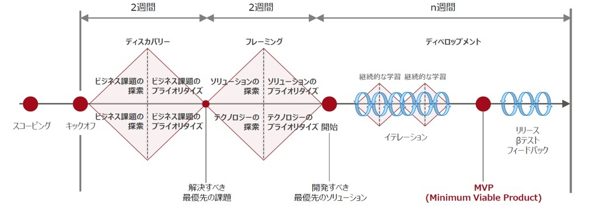
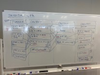

# リーンスタートアップアジャイルの流れ

リーンスタートアップアジャイルでは、ユーザーに対する仮説検証を繰り返しながら、アジリティを持ってプロダクトを開発し続ける「リーンXP」の開発手法を、「バランスチーム」の中で実践します。
- リーンXP
  - リーンスタートアップとユーザー中心設計のプラクティスにより、ユーザーに対する仮説検証を繰り返して、無駄なもの（＝ユーザーに使われないもの）を作らない  
  - エクストリーム・プログラミング（XP）のプラクティスにより、高品質で変化に強いソフトウェアを作る
- バランスチーム
  - ビジネス部門の開発への参画、メンバー間のフラットかつ頻繁なコラボレーションによる真のアジリティを獲得する

プロジェクトの開始前にScoping（必要に応じてPre-Scoping）を行い概要を理解した上で、プロジェクトの開始後に最初の4週間のDiscovery & Framingで開発するプロダクトを計画し、5週目から実際に開発を行います。

開発開始以降は、プロダクトビジョン実現を目指し、プロダクトを成長させる戦略を決めて、検証→学ぶ→作るのサイクルを繰り返します。

## Pre-Scoping
Pre-Scopingでは、Scopingの前にプロジェクトの開始前に事前に検討／調査している内容についてプロジェクトの参加者で共有します。
Scopingで円滑にミーティングを進められるように事前に情報をインプットします。

## Scoping
Scopingでは、プロジェクトの開始にあたって関係者が集まり以下を整理し、理解を深めます。
- ビジネスゴール
  - ビジネスの目標とKPI
- プロダクト概要
  - ユーザーの業務プロセス
  - ユーザーに提供する価値
  - システムの構成
- 競合
  - 競合他社の情報
  - プロダクトの優位性

また、プロジェクトにおけるリスクの抽出を行い、アクションを検討します。

Risks & Mitigations

## Discovery & Framing
Discovery & Framing(D&F)では、プロダクトのアイデアを調査および検証して、プロダクトの開発に必要な情報を取得します。
検証結果に基づいて、プロダクトリスクを軽減するために優先すべき機能を定義します。
開発着手して以降もこれらのプロセスは継続して繰り返していきます。

また、開発に入る前に、プロダクトのビジョンとバリュープロポジション（ユーザーへの提供価値）を改めて策定し、直近のゴールを定めます。

プロダクトビジョン / バリュープロポジション
OKRs

### Discovery
Discoveryでは、プロダクトのビジネスケースとターゲットユーザーを深く理解し、優先度の高い課題を定義します。
- ユーザーへのGenerativeなリサーチを通して、ユーザーの業務を理解し、アイデアを抽出する
- プロダクトに関わる登場人物の関係を理解する（ペルソナ・エコシステム）
- プロダクトによる利害関係者、及び、競合他社や製品の分析を行い、ビジネスモデルを理解する
- プロダクトの技術的な実現性を評価する

ペルソナ

### Framing
Framingでは、ユーザー、ビジネス、技術スタックに対してさらに理解を深め、課題を解決する優先度の高い機能を絞り込みます。
- ターゲットユーザーの行動や振る舞い、ニーズ、および目標の概要を理解する
- プロダクトのユースケース（シナリオ）を理解する
- プロダクトのデザインを決めるにあたっての基本的な理念（デザイン原則）を定義する
- ワイヤーフレームなどで画面の大まかなレイアウトや主な動きを理解する
- ユーザーへのEvaluativeおよびUsabilityのリサーチを通して、ワイヤーフレームやシナリオを利用してユーザー価値を実現できるかテストを行う
- 機能の優先度を整理し、MVPを定義する
- プロダクトの基本的なアプリケーション構造の方針を検討する

ペルソナ
シナリオ
リサーチ計画
プロトタイピング
リサーチ
ユーザーストーリーマッピング
MVP

## Inception
Discovery & Framing後にプロダクトを本格的に開発していくにあたって、チーム全員のプロダクトに関する理解を深めるために、Inceptionを実施します。
ゴールを再確認し、D&Fでのアップデート内容や今後の予定について共有します。
また、プロジェクトにおけるリスクの抽出を行い、アクションを検討します。

> **アジェンダ例**
>
> - PointBの確認
> - アップデート内容の共有
>   - ペルソナ
>   - デザイン原則
>   - デザイン案
> - リサーチ・ロードマップの共有
>   - ペルソナ毎に検証したい仮説
>   - インタビュー・スケジュール
> - ゴールの再確認
>   - プロダクトの方向性
>   - ビジネスゴール・プロダクトゴール・直近のゴールの振り返り
> - プロダクト・ウォークスルーとストーリーのポインティング
>   - 現状のビルドの共有
>   - ストーリーのポインティング（IPM）
> - Risk & Mitigations
> - レトロ

Risks & Mitigations

## Development
ユーザーへのインタビューなどで検証できた自信度の高いものを、優先度が高いものから順に各イテレーションで開発していきます。  
MVPを作ったら、プロダクトを実際にユーザーに使ってもらってテストを行い、学びを得て、次の開発を続けていきます。

イテレーション開発

## Outception
開発期間を振り返って以降に継続的に開発を行っていくために、Outceptionを実施します。  
開発の区切りでOutception / Inceptionを行い、定期的に振り返りとプロジェクト関係者への情報共有を行っていきます。

> **アジェンダ例**
>
> - PointBの確認
> - 開発期間の振り返り
>   - ゴール（OKR）の振り返り
>   - プロダクトのデモ
>   - プロダクトによるユーザーテストの結果共有
>   - Q&A
> - プロダクトの今後の予定
>   - プロダクトロードマップの共有
>   - 今後開発予定のエピック／機能と優先順位
>   - Q&A
> - Risk & Mitigations
> - レトロ

レトロ
