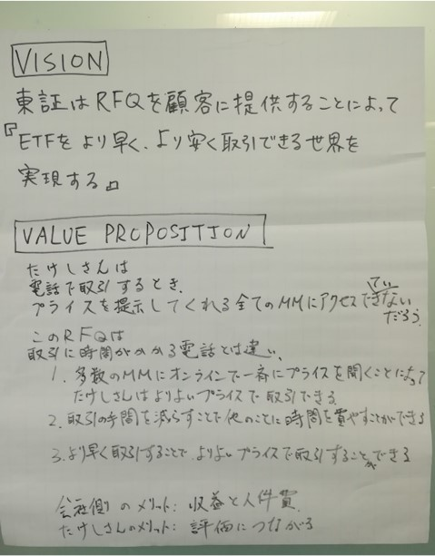

# プロダクトビジョン / バリュープロポジション

プロダクトビジョンは、プロダクトを通じて実現しようとしている世界を定義します。
プロジェクトのメンバーは常にこのビジョンを意識し、日々の判断を下してい来ます。

バリュープロポジションは、ユーザーへの提供価値を具体的に記述します。
現状どのようなペインがあり、プロダクトがどう課題解決できるのかを明確化します。

### プロダクトビジョンは次のものを伝えるものでなければならない。
- プロダクトビジョン / バリュープロポジションの設定
- そのプロダクトはどんなニーズや要求に対処するのか
- そのプロダクトはどんなメリットをもたらすか

### プロダクトビジョン作成時のポイント
- プロダクトビジョンは以下を伝えるものでなければならない。
  - 誰のためにそのプロダクトを作っているか
  - そのプロダクトはどんなニーズや要求に対処するのか
  - そのプロダクトはどんなメリットをもたらすか
- プロダクトビジョンはプロダクトのストーリーを伝えるのに役立つ。説得力のあるのは以下。
  - 他の人がプロダクトがどんなものであるか、なぜそれが重要なのかを理解する手助けとなる。
  - プロダクトを成功させるために関係者全員に対して認識を統一し、ガイドし、動機付けとなる。
  - 急速に変化する状況の中で焦点を定め、効果的なコラボレーションを可能にする。

- 優れたプロダクトビジョンを生み出すためのベストプラクティス
  - 短く簡潔にする
  - 会社のビジョンと整合させる
  - ユーザーに集中する
  - 特定のソリューションに固執させない
  - 大きく野心的なものにする
  - インスピレーションを与える
  - ユニークにする
  - 反復する

