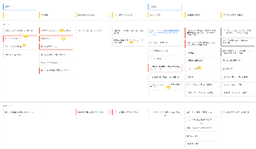
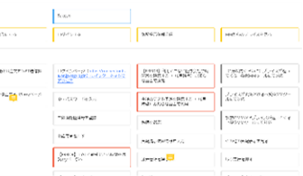

# ユーザーストーリーマッピング
## Description
ペルソナがソフトウェアを使う流れ（ストーリー）と、必要となる情報や機能を整理し、開発すべきものをチーム内で意識合わせをする。
情報や機能は優先度をつけ、リリース計画を検討する。

- ペルソナのストーリーを書き出す。
- 各ストーリで必要となる細かい要求（情報や機能）を書き出す。
- 要求に優先度をつけ、リリース別に横線を書く。
- もっともミニマムなものをリリース１として開発し、その後のリリースで付加機能を追加していく。

## Tips
- PMs, Designers, Devs全員で行う方が良い。
- ユーザーストーリーマッピングはユーザーの体験とソフトウェアの機能の対応を整理し、優先度付けするもの（カスタマージャーニーマップやシナリオではない）
- 例：ユーザーは決済する
  - リリース１：クレジットカード決済のみ
  - リリース２：PayPayなどキャッシュレス決済も追加

