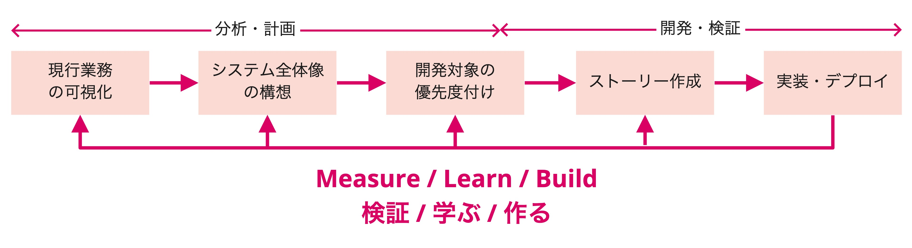

# モダナイゼーションアジャイルの流れ

モダナイゼーションアジャイルでは、既存のブラックボックス化しているレガシーシステムに対して、ビジネス視点で分析を行い、必要なものから開発を行います。リーンスタートアップアジャイルと同様、「リーンXP」の開発手法を「バランスチーム」の中で実践します。

プロジェクトの開始後、最初の2〜4週間で分析を行い、3〜5週目から実際に開発を行います。

モダナイゼーションに合わせて業務の見直しを行う場合には、「リーンスタートアップアジャイル」と同様に、リサーチを通してユーザーを理解しアイデアを検証して、現行の業務と合わせて優先度の高いものから順に開発を進めていきます。

## Inception
プロジェクトの開始にあたり、チーム全員でゴールとプロダクトの概要を整理し、理解を深めるために、Inceptionを実施します。

> **アジェンダ例**
>
> - PointBの確認
> - Day1のスケジュール確認
> - 体制
> - アジャイル開発の目的の共有
> - プロダクトの共有
>   - プロダクトで実現する業務
>   - モダナイゼーションを実施する背景
>   - モダナイゼーションを実施する対象範囲
>   - 現状のプロダクトの課題
> - ゴールの確認
>   - ビジネスゴール・プロダクトゴール・直近のゴールの確認
> - Risk & Mitigations
> - モダナイゼーションアジャイルの進め方の説明
>   - Swift Methodの概要説明
> - レトロ

Risks & Mitigations

## 分析
Swift Methodを用いて現行業務を分析して、モダナイゼーション後のシステムの全体像を掴み、開発の見通しを立てます。
また、業務の優先度、及び、技術的な難易度を考慮して開発の順序を決めます。

段階的にモダナイゼーションを行う場合は、各断面でのシステムの全体像とモダナイゼーション対象の範囲を可視化します。  
まずは、直近で開発する対象を明確にし、開発着手して以降も分析した内容のアップデート、及び、次に開発すべき機能の優先順位付けを行っていきます。

Swift Method

## 開発
分析フェーズで優先度付けした順に各イテレーションで開発していきます。

イテレーション開発

## Outception
開発期間を振り返って以降に継続的に開発を行っていくために、Outceptionを実施します。  
開発の区切りでOutception / Inceptionを行い、定期的に振り返りとプロジェクト関係者への情報共有を行っていきます。

> **アジェンダ例**
>
> - PointBの確認
> - 開発期間の振り返り
>   - ゴールの振り返り
>   - 分析結果の共有
>   - プロダクトのデモ
> - プロダクトの今後の予定
>   - 今後の開発予定のスライスと優先順位
> - レトロ

レトロ
