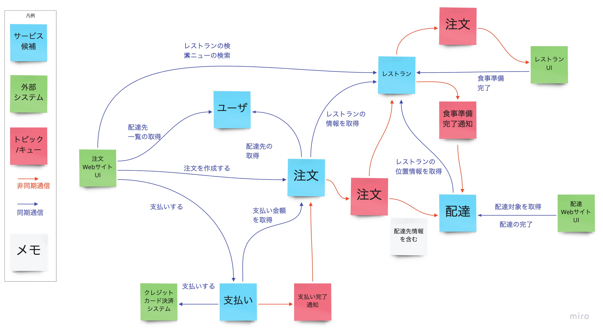
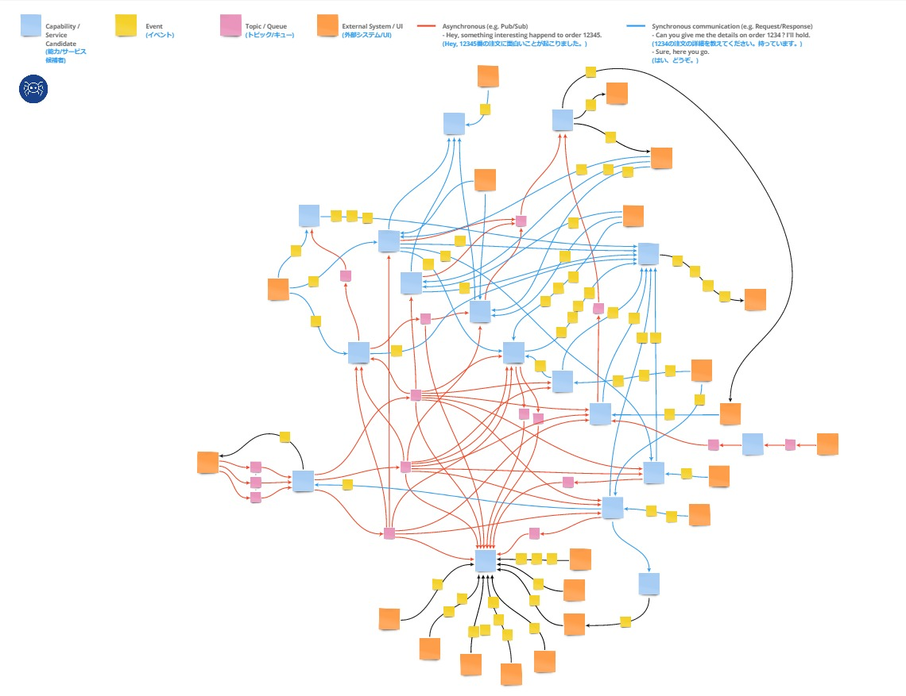

# Boris

## 概要
Borisは既存システムをいくつかの小さい単位のサービスに分解したいときに使うアクティビティの一つです。サービス候補（Event Stormingのアウトプット）間の繋がり（通信の仕方やデータ）をチームで洗い出し、ディスカッションすることで、サービス間の関係に対してチームが共通の認識を持つことができます。Swiftメソッド全体の位置付けとしては2つ目のアクティビティとなっています。 


**参考資料の原文**
```
複雑なシステムにおけるサービス間の関係を特定して、
想定されるターゲット・システム・アーキテクチャを明らかにし、
それをSnapEを使って記録します。
```


## 参加者
### Must
- モノを作る人  
  この後実際に作る人が理解してないと作れないので必須です。
- ユーザーストーリーを書く人  
  この後ユーザーストーリーを書く人が理解してないと書けないので必須です。
- ドメイン駆動設計をわかってる人  
  サービス候補間の繋がりを議論してると、必ずサービス候補の妥当性の話に戻るので、DDDを理解している人が必要です。
### Option
- 既存システムのアーキテクト、セキュリティ担当・・・  
  議論してる中で「これどうなってるんだっけ？」になった際に、その場で解決できると良いです。


**参考資料の原文**
```
ビジネスステークホルダー、アーキテクト、テクニカルリード、デベロッパー、コアメンバー
```


## 次のアクティビティに進むための条件

※Step2：BorisとStep3：SnapEは2つを行ったりきたりするので、Boris完了時の状態を明確に定めることはできません。
- （Event Stormingで可視化した）ビジネスフローに必要なサービス候補間の連携情報（通信方式、送受信データ）が可視化できた


**参考資料の原文**
```
Borisの演習の最後には、サービス、API、データ、イベントの振り付けと、
バックログが明らかになり始めます。SnapEは、Borisの成果をリアルタイムで
素早く文書化するために使用します。情報は、APIs、Data、Pub/Sub、
External Systems/ UI 、Story、Risksに分類されます。
重要なアーティファクトはSnapEボードで、Borisに描かれたノードやサービスごとに
1つのSnapEがあります。
通常、Borisに描かれたノードやサービスごとに1つのSnapEがあります。
各SnapEは、6つのカテゴリに関するドキュメントで構成されています。
各SnapEは、API、Data、External Systems/UI、Pub/Sub、Story、Risksの
6つのカテゴリに関するドキュメントで構成されています。
```


## 進め方
### 基本ルール
- チーム全員で進める
- Event Stormingの過去～未来の順番に進める
- サービス候補ごとに以下について検討し、後述する表記ルールに基づき記述する
  - 必要なデータ
  - 必要な振る舞い
  - 必要な他サービス
  - 必要な外部システム

### 表記ルール
- サービス候補
  - 青色の付箋で記述
  - もし、Boris実施中にサービス候補が変更した場合はEvent Stormingも併せて修正する

- 連携方式
  - 同期
    - HTTP通信とかのAPI
    - 矢印が向かう方がAPIを提供する側
    - 黄色い付箋でイベントを記述する
    - イベントなので必ず動詞を記述する
    - 青い矢印に重ねて黄色い付箋を置く
  - 非同期
    - キューなど
    - 矢印はデータの受け渡し方向
    - ピンクの付箋で渡すデータを記述する
    - キューの場合は「矢印⇒付箋⇒矢印」で表記する
  - その他（まだ決めれない連携）
    - 外部システムとの通信など
    - 書き方は同期通信と一緒

- 補足
  - メモは白い付箋で記述する
  - 参加者では解決できない課題や疑問などは紫の付箋で記述する




**Tips**
- 最終的なアウトプットはクモの巣のようになります。Borisの名称の由来このクモの巣から来ています。





**参考資料**
- [Tanzu Practices Boris](https://tanzu.vmware.com/developer/practices/boris/)


SnapE