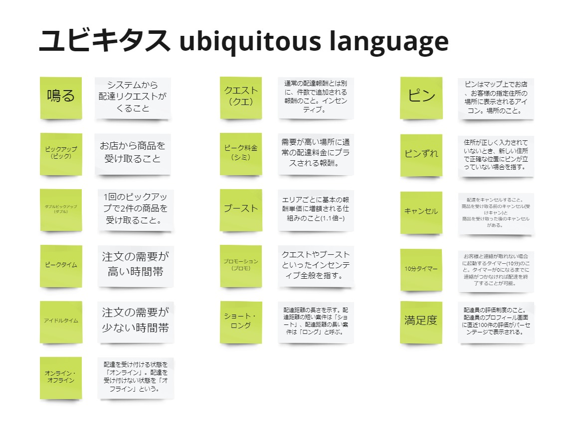

# Event Storming

## 概要
Event Stormingは、既存システムをいくつかの小さい単位のサービスに分解したいときに使うアクティビティの一つです。
既存システムの「現状」と「あるべき姿」を可視化し、チーム全員が共通の認識を持つためのアクティビティです。
Swiftメソッド全体の位置付けとしては1つ目のアクティビティとなっています。  
Event Stormingの大まかな流れは以下の通りです。
  - 現状のシステムがビジネスにおいてどのように使われているのかを可視化する（現状の可視化）
  - そのシステムにつながってる外部のシステムを可視化する（現状の可視化）
  - 改善したいポイントをだす（現状とあるべき姿のギャップ）
  - ドメインごとにいくつかのサービスに分ける（あるべき姿の可視化）
  - 可視化の中でチームで共通のユビキタスを整理する


**参考資料の原文**
```
イベントストーミングは、モノリスをマイクロサービスに分解することを可能にします。
次世代のソフトウェアシステムを構想するために、新しい流れやアイデアをモデル化し、
知識を統合し、対立することなく積極的なグループ参加を促すことができます。
```


## 参加者

### Must
- ビジネスの方向性を示せる人  
  将来的に会社を○○にしたい。そのためにこのシステムは○○ができるようになりたいとかを示すことで、改善ポイントの優先順位をつけることができます。
- モノを作る人  
  この後実際に作る人が理解してないと作れないので必須です。
- ユーザーストーリーを書く人  
  この後ユーザーストーリーを書く人が理解してないと書けないので必須です。
- ドメイン駆動設計をわかってる人  
  あるべき姿のサービスに分ける際に必要です。
### Want
- 現状のシステムを使ってる人  
  この人がいないと現状のシステムがどのように使われているのかを可視化できません。
  現状の不満点などもこの人が一番理解しています。
### Option
- 既存システムのアーキテクト、セキュリティ担当・・・  
  議論してる中で「これどうなってるんだっけ？」になった際に、その場で解決できると良いです。


**参考資料の原文**
```
ビジネスステークホルダー、ビジネスアナリスト、エグゼクティブ、開発者、
アーキテクトチームリーダー、ドメインエキスパート、コアチームのメンバー
```


## 次のアクティビティに進むための条件

- コアメンバー全員がシステムやビジネスに対して共通の理解が形成できた
- コアメンバー全員が共通のユビキタス言語で会話可能な状態になった
- 再構築後のあるべき姿に適したサービス分割ができた
- システムの改善ポイントを洗い出すことができた
  



**参考資料の原文**
```
・システムやビジネスプロセスに対する理解の共有
・グループ間の明確なコミュニケーションのためのユビキタス言語
・システムの再構築を始めるためのサービス候補のリスト
・ユーザー・ジャーニーやシステム機能のリスト（「シン・スライス」とも呼ばれ、システム・モデルを演習する際に使用される）（Borisを参照）
・システムの痛みや制約のトップシステム
・ビジョン指向の思考プロセス
```


## 進め方

- Step1：ビジネスイベントの洗い出し
  - ビジネスプロセスの中で発生するイベントを各自で出す
    - このときの粒度については事前に合わせる必要はないとのこと
    - チームでディスカッションするなかでだんだんと合わせるのが重要
    - 必ず過去形でイベントを定義すること
    - イベントは過去形で統一することでチームの理解がぶれにくい
    - 次のステップのイベントを時系列で並べる際に役立つ

- Step2：イベントの整列
  - Step1で各自が洗い出したイベントを全員で時系列順に横方向に並べる。（過去～未来）
  - 並列処理が発生する場合は縦方向に並べる
  - この際にわからないことはどんどん質問する
    - 議論の内容は必ずメモする
      - メモを残すことで後から見てもわかるのはもちろんのこと、メンバーが増えたときなどにも役立ちまます。
    - ディスカッションの中で出てきた言葉などはユビキタス（チームの共通言語）としてユビキタスエリアに言葉と意味をセットで書き出す
    - もし、チームの中で解決できない問題などは別の色の付箋でわかるようにしておく

- Step3：ペインポイントの洗い出し
  - Step2で並べたフローに対してユーザーの改善したいポイントを赤い付箋で記入する
    - 赤い付箋には以下のフォーマットで書く
      - 〇〇をしたい。なぜなら××だから
        - 実際の利用者目線で書く
        - 理由を書くことでペインポイントの優先順位をつけるさいに使用できる
    - 時間をとって各自で記入してもらう
    - その後全員で確認する
    - その際にコンフリクトがあれば話し合う

- Step4：関係する外部システムの洗い出し
  - 関係する外部システムを緑色の付箋で書く
    - 外部システムに対してどんなデータを送る or もらうのか
    - それはどうやって実現しているのか
      - 方式やトリガーなどを明確にする
    - それはなぜ必要なのか
      - その理由に基づいて実装方式を検討する
    - より詳細化することでEvent Stormingの次のアクティビティであるBorisが楽になる

- Step5：サービス候補の洗い出し
  - イベントの塊に対して、モダナイ後の あるべき姿（DDD） のサービス候補を検討する
    - サービス候補の検討材料は以下
      - ペインポイント
      - 外部システム
      - ドメイン
    - サービス候補を見つける際のガイドライン
      - Business Capabilities
      - Data ownership
      - Loosely Coupled
      - Testability
      - ↑でも特に「Business Capabilities」と「Data ownership」が特に重要
    - サービス候補が妥当かどうかの検討基準
      - Rate of Change
      - Scalability（Independent）
      - Lifecycle management
      - Isolated failure
      - Simplifying external dependency
      - Freedom of choosing other technology
      - ↑の中での優先度に決まりはない
    - サービス候補の洗い出しが完了したらBorisに行くが、完璧に行う必要はない
    - あくまでBorisが実施できるレベルまで完了してたらOK
    - Borisの中サービスの関係性を可視化しながら議論することでよりよいサービス候補が見つかることもある
  



**Tips**

Event Stormingを初めて実施する方に言葉で説明するだけでは、上手くイメージを持ってもらえない場合があります。
そのため、簡単な練習を一度するとイメージが持ちやすくなり、今後の進行がスムーズになります。
例えば「スターバックスのコーヒーを飲みたいと思ったときから、飲み終わった状態まで」という誰もがイメージしやすいものを練習題材とします。



**参考資料**
- [Tanzu Practices Event Storming](https://tanzu.vmware.com/developer/practices/event-storming/)


Boris