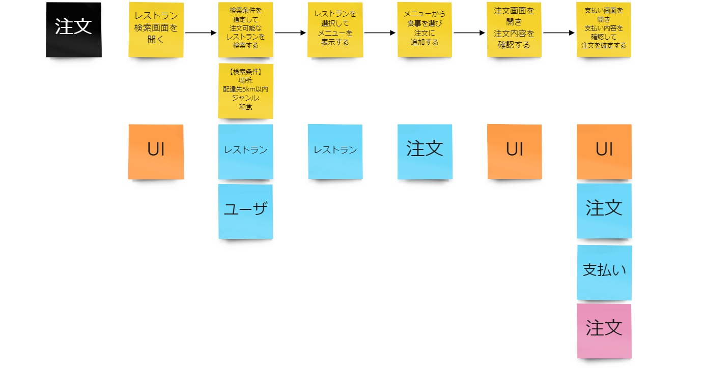
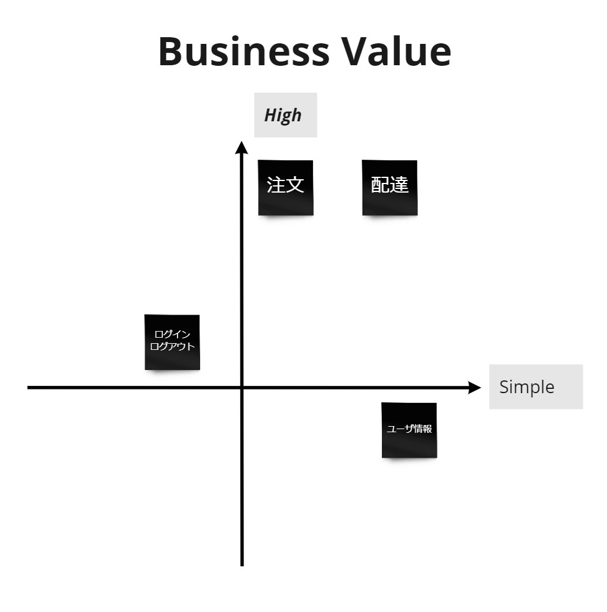

# Slices

## 概要

Slicesは、どこから開発を始めるか決めるアクティビティです。Swiftメソッド全体の位置付けとしては4つ目のアクティビティとなっています。  
Slicesの大まかな流れは以下の通りです。
- EventStormingからビジネス価値の高い業務のシナリオを選定する（シナリオの選定）
- 業務の実現に必要な要素をシナリオに追加する（シナリオの具体化）
- フローに対してBoris/SnapEで整理したサービスを紐づける（複雑さ/難易度の可視化）
- ビジネス価値と開発する上での複雑さ/難易度から開発するシナリオ（Slice）の順序を確定する（シナリオの開発着手順序付け）

## 参加者

### Must
- ユーザーストーリーを書く人  
  開発する優先順位を把握していないとユーザーストーリーを作成できないので必須です。
- 業務の優先度を理解している人  
  開発順序を決めるにあたり、業務の優先度・確度を考慮する必要があります。
### Option
- モノを作る人  
  開発順序を決めるにあたり、難易度や流用要否について考慮するのと開発を進めやすくなります。

## 次のアクティビティに進むための条件

- Sliceに5つのシナリオを上げて開発順が決まった

## 進め方

- Step1：ビジネス価値の高いシナリオ選定
  - EventStormingで出したシナリオの中でビジネス価値の高いものを5つピックアップする
    - 手戻りの可能性が出るため、全てのシナリオの優先付けをせずに直近で開発着手するであろう5つ程度のシナリオをピックアップする
    - 開発が進んで次のシナリオへの着手が必要となったタイミングで改めて新たなシナリオ（Slice）を追加する

- Step2：シナリオの補完
  - ピックアップしたシナリオをSlice用にコピーする
  - コピーしたシナリオを順に確認し、業務を実現する上で必要となる要素（イベント）をシナリオに追記する／新たなシナリオを作成する
    - 例えば以下のような観点で確認して補完する
      - ログイン操作が必要か
      - どのようにその画面にアクセスするのか
      - 画面で検索時にどのような条件を指定するのか
      - 画面でどのような項目を確認するのか
      - 画面で確認するデータはどうやって作成するのか
    - 開発を順番に進める上で実現不可能な点がないか確認する
    - 難易度や前後関係など、開発順序を決めるのに必要な情報をチームで共有できれば良い（より具体的な内容はストーリーを作成する際に確認する）
  - シナリオの各イベントに対してBoris/SnapEで整理したサービス、 UI、外部システムを紐づける
    - 複数のサービスが必要、外部システムとの関連がある、などが可視化され複雑さをイメージできる

　

- Step3：開発の優先順位付け
  - ビジネス価値（高い→低い）、開発の複雑さ/難易度（易しい→難しい）の２軸で2x2の表を作成する
  - 2x2の表を元にシナリオ（Slice）毎での開発順序をチームで合意する
 
  


**Tips**

Slicesとして明確な手順や決まった成果物イメージはありません。
エンゲージメント時に実践した流れに基づいて手順を記載していますが、あくまでも一例です。
直近で開発すべきシナリオを選定してチームで認識を合わせ、ストーリーを作成して開発に着手できるようにする、
という目標を達成することができれば、形のあるアウトプットを残すことに時間をかける必要はありません。



**参考資料**
- [Tanzu Practices Swift Method](https://tanzu.vmware.com/developer/practices/swift-method/)


Tech Choice