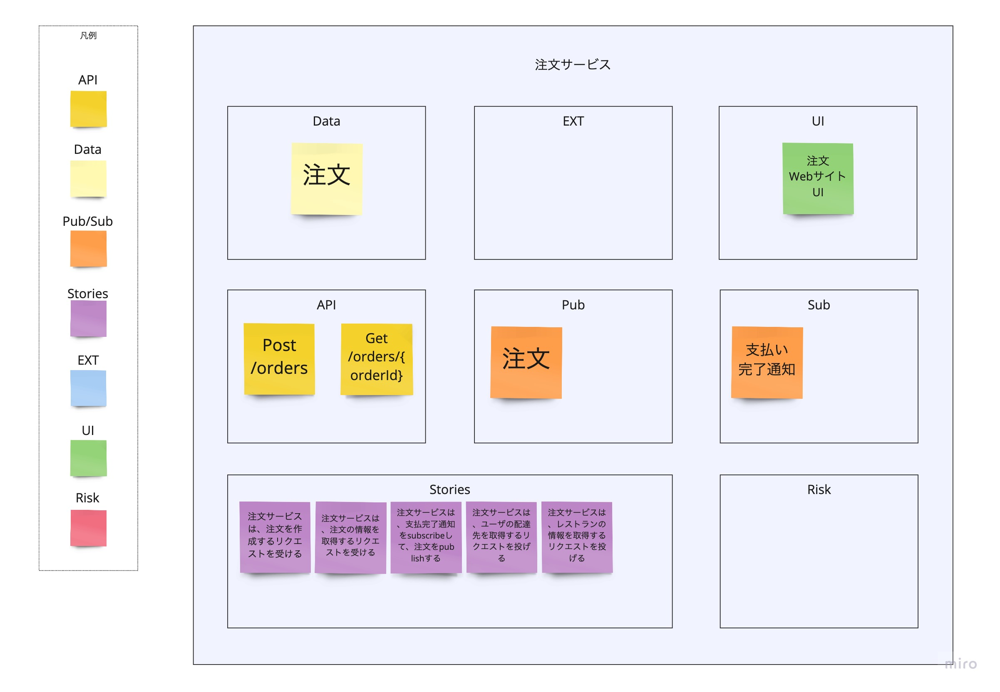

# SnapE

## 概要
SnapEは既存システムをいくつかの小さい単位のサービスに分解したいときに使うアクティビティの一つです。サービス候補（Event Stormingのアウトプット）の中身（通信の仕方や所有データ、ストーリ、リスク・・等）をチームで洗い出し、ディスカッションすることで、各サービスの中身に対して、チームが共通の認識を持つことができます。Swiftメソッド全体の位置付けとしては3つ目のアクティビティとなっています。

## 参加者
### Must
- モノを作る人  
  この後実際に作る人が理解してないと作れないので必須です。
- ユーザーストーリーを書く人  
  この後ユーザーストーリーを書く人が理解してないと書けないので必須です。
- ドメイン駆動設計をわかってる人  
  サービス候補間の繋がりを議論してると、必ずサービス候補の妥当性の話に戻るので、DDDを理解している人が必要です。
### Option
- 既存システムのアーキテクト、セキュリティ担当・・・  
  議論してる中で「これどうなってるんだっけ？」になった際に、その場で解決できると良いです。


**参考資料の原文**
```
ビジネスステークホルダー、アーキテクト、テクニカルリード、デベロッパー、コアメンバー
```


## 次のアクティビティに進むための条件
- （Borisで可視化した）各サービス候補に必要な情報（必要なAPI、所有するデータ、連携する外部システム、呼び出せれる画面、受け取るor送る必要があるキュー、サービス候補実現に必要なストーリ、実現する際のリスク）が可視化できた


**参考資料の原文**
```
Borisの演習の最後には、サービス、API、データ、イベントの振り付けと、
バックログが明らかになり始めます。SnapEは、Borisの成果をリアルタイムで
素早く文書化するために使用します。情報は、APIs、Data、Pub/Sub、
External Systems/ UI 、Story、Risksに分類されます。
重要なアーティファクトはSnapEボードで、Borisに描かれたノードやサービスごとに
1つのSnapEがあります。
通常、Borisに描かれたノードやサービスごとに1つのSnapEがあります。
各SnapEは、6つのカテゴリに関するドキュメントで構成されています。
各SnapEは、API、Data、External Systems/UI、Pub/Sub、Story、Risksの
6つのカテゴリに関するドキュメントで構成されています。
```


## 進め方
### 基本ルール
- チーム全員で進める
- サービス候補ごとに以下について検討し、後述する表記ルールに基づき記述する  
  ※基本全部やるので実施の順番に決まりはない。  
  ※Borisの赤・青・黒で表現した矢印ごとに検討した。
  - 必要なAPI
  - 所有するデータ
  - 連携する外部システム or UI
  - 送受信キュー
  - 必要なストーリ
  - リスク
### 表記ルール
- サービス候補ごとに箱を作り以下の内容を記述する
  - API
    - Borisの「青い矢印と黄色い付箋」で表現したアクションに必要なAPIを定義する  
    ※APIは提供する側のサービスのみ記述する
    - APIのエンドポイントと通信方式（get/post）、リクエストパラメータを定義する
  - Data
    - サービス候補の所有するデータを定義する
    - 所有する必要があるかどうかはチームで検討する  
      ※以下の方針で所有データを決めた
      - サービス候補のストーリ実現に必要なデータである
      - サービス候補から見て不変的なデータでない
      - 他サービス、キュー、外部システムが同様のデータを持っていない
  - Pub(publishers)
    - サービス候補が発行するキューを定義する
    - Borisの「赤い矢印とピンクの付箋」で表現したキューと同様のものを記載する（サービス候補から矢印がでるものだけ）
  - Sub(subscribers)
    - サービス候補が使用するキューを定義する
    - Borisの「赤い矢印とピンクの付箋」で表現したキューと同様のものを記載する（サービス候補に矢印が向かってるものだけ）
  - Ext（外部システム）
    - サービス候補に関連する外部システムを定義する
    - Borisの「オレンジの付箋」で表現した外部システムと同様のものを記載する  
    ※黄色い付箋のアクションについては後述するストーリで定義する
  - Stories
    - サービス候補が実現する機能を定義する  
    ※ストーリの数はBorisでサービス候補につながる黄色い付箋とピンクの付箋の合計数と一致する
    - 各ストーリには以下を記述する
      - 対象のサービスが他のサービスやキュー、外部システムに対して何をして、どんなデータを受け取る or 渡すのかを記載する  
      ※所有するデータがある場合はどのタイミング（例：○○キューからデータを受け取ったとき）で作成するかも記載する
  - Risk
    - サービス候補の妥当性の検討材料、また、開発を進めた際に顕在化する可能性があるものをリスクとして記述する
    - リスクの例
      - サービスが頻繁に大量のリクエストを受けるため、サービスの分割などが必要となる可能性がある
      - サービスが頻繁に大量のリクエストを受けるため、キャッシュを利用する必要がある可能性がある
      - 他システムがデータを参照するサービスがマスタデータサービスのような扱いに見える




**参考資料**
- [Tanzu Practices Boris](https://tanzu.vmware.com/developer/practices/boris/)


Slices