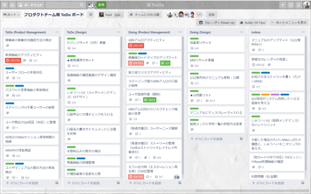

# ONEbaseでの働き方

### 心理的な安全性のあるチームで、安定したペースでの開発を目指します。

- **ペアワーク**
    - すべて作業をペアワークで行きます。
    - 手戻り防止、情報シェア、スキルトランスファーなどの効果があります。
- **集中**
    - 100%専任（クライアント含）です。
    - ミーティング中、脇で会話しないことです。
    - お菓子飲み物自由にします。（買いに行く時間が無駄）
- **フラット**
    - メンバーは全員フラット（リーダーなし）ニックネームで呼び合います。
    - 一人ひとりを尊重し、発言の機械を作ります。
    - 良いことも悪いこともすべてチームで対応します。
- **タイムボックス**
    - 時間を意識しリズムよく作業します。
    - 議論が長引いている場合は議題の分割を考えます。
    - 何があれば判断できるかを考えましょう。
- **疲れをためない**
    - 1時間に5~10分程度の休憩を取りましょう。
    - 卓球でリフレッシュしよう。
    - 18:00退社厳守します。
- **カイゼンと成長**
    - 毎週1on1のペアフィードバック、チーム全体のレトロスペクティブがあります。
    - チームの健康状態を意識し、早めに対処をします。

# ONEbaseの一週間

一週間単位のイテレーションの中で、バックログの開発を実施します。
金曜日はレトロスペクティブ（振り返り）を行い翌週にさらに良いチームになるよう改善を続けて行きます。

- **デイリースタンダップ**
    - その名の通り、毎朝たちながら実施する数分のミーティングです。
    - 昨日やったこと、今日やること、困っていることを共有します。
- **IPM(Iteration Planning Meeting)**
    - 当週に開発するユーザストーリーの内容をチームに共有します。
    - コミュニケーションにより、ストーリーについて理解を深めます。
    - ユーザストーリーの難易度の見積り
- **イテレーション**
    - ユーザリサーチを通じてプロダクトに何か必要かを学びます。
    - 必要と分かったものはユーザストーリーを執筆し、優先度を付けましょう。
    - ペアプロ/TDDで高品質なプロダクトを開発します。
    - チームが同じ場所に集い、頻繫にコミュニケーション
- **レトロスペクティブ**
    - 金曜夕方のチームのための時間を空けます。
    - お酒を飲みながら、今週よかったこと、よくなかった点を配慮なく出し合いましょう。
    - 改善に向けたアクションを決めます。
- **ペアフィードバック**
    - 毎週チームメイトトペアになり、お互いのフィードバックを行います。
    - 相手の良いところ、より良くなるための助言などを話します。
    - 伝える側、受け取る側も思いやりを持つ必要があります。

## デイリースタンドアップ



**Description**

毎朝メンバーで立ちながら行う数分のミーティング。
毎日リズムづくり、タスクの見える化、課題の早期発見などの効果。

>- 全体スタンドアップ（MCは当番制）
>    - NEWFACE(新しいメンバー)
>    - INTERESTING(面白い、興味があること)
>    - HELPS(困っていること、手伝って欲しいこと)
>    - EVENT(本日のイベント)
>- チームスタンドアップ（一人づつ発言）
>    - 昨日やったこと
>    - 今日やること
>    - 困っていること（あれば）

**Tips**

>- 15分以上はやらない。
>- 個別の話は別途時間を取って行います。
>- すでに誰かが話していたら「カバーされています」。
>- Interesting,Helpsは気軽に。些細なことでもチームめんばーには新鮮かもしれません。



## タスク確認（PdMとDesigners）

PdMとデザイナーで毎日共有します。
今日の作業を確認します（優先度確認）

## IPM(Iteration Planning Meeting)



**Description**

一言でいうと見積りミーティングで、**スクラムでいうプランニングポーカーです。**
>- PdMが書いた機能リストとDesignerが書いたデザインストーリーをDevsに伝えます。
>- Devはストーリーの複雑さ、難易度を0~3ポイントで見積もります。
>- 各々ポイントを心の中で決めたら、サムズアップ→せーので、何ポイント見積もったかを指を立てて一斉発表します。
>- ポイントにパラつきがあれば、話あって何ポイントにするかを合意していきます。

**Tips**
>- ポイントは各PJによって統一の基準があるわけではない。（デリバーしたストーリーのポイントの合計が一週間のベロシティになるわけだが、Aチームは30ポイント、Bチームは15ポイントだとして、Bチームが相対的に劣っているわけではないということ。）
>- ポイントは複雑さ・難易度を基準に決めます。簡単ですが、実装量が多いだけのストーリーは分割してもらうことを提案します。（粒度があらかったり量が多いだけのストーリーは実装漏れ、考慮漏れが発生しやすい。）



## プロダクトバックログ

ストーリー、リリース計画、ベロシティ（チームの馬力）

## CL　クライアントとの定例会(PMO ミーティング）

## レトロスペクティブ



**Description**

>- 一週間の出来事を記入
>    - よかったこと
>    - 普通なこと
>    - よくなかったこと、課題なこと
>- チームで共有
>    - 前回のアクションアイテムの確認
>    - MCはひとつずつ読み上げ記入した人がシェア
>    - 新しいアクションがでたら記入
>- 最後は必ず「よかったこと」で締め
>    - 一本締め

**Tips**
>- 「よかったこと」には拍手
>- 「多少プライベートなこともOK
>- より良いチームになるため遠慮なく話し合う



