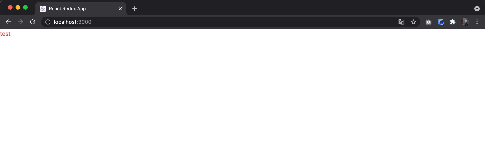
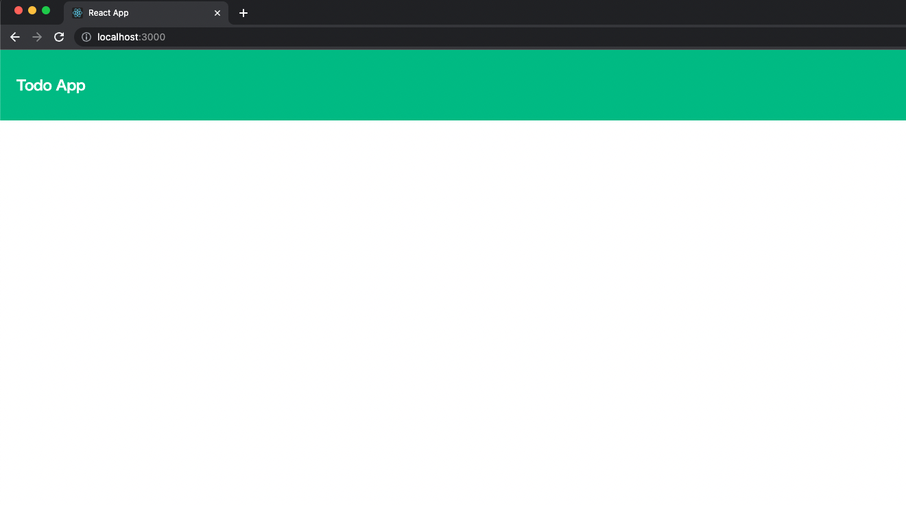

# 1日目

## アプリケーションの要件

では、早速アジャイル開発で実際に動くアプリケーションを作ってみましょう。
今回は、簡単な例としてタスク管理のアプリを作ってみます。
こういったハンズオンでなにをもってアジャイル開発と言うかは難しいところなのですが、
事前にかっちりとした設計はせずに都度必要な機能を継ぎ足していく形で進めます。
都度、新しい機能を追加するStoryが追加されているという体で読み進めてください。


## アーキテクチャと開発言語、フレームワークの決定

実は、一番難しいのがプロジェクト立ち上げのときだったりします。
アジャイル開発ではあらゆる変更を受け入れるようにSOLID原則などのプログラミング技法に則って開発をすすめます。
しかし、それでも開発を進めてからでは変更が難しいものがいくつかあります。

一つは開発言語、そしてもう一つはフレームワークです。

この２つは後から変更することが非常に困難であり、プロジェクトの特性を見極めて慎重に決定する必要があります。
最初を丁寧にやればやるほど後から楽になります。最初の検討を怠ってはいけません。

{}

**開発言語変更の例**

Javascriptとそのスーパーセットである、Typescriptはプロジェクト内で共存が可能で、
順次置き換えていくと言った戦略が取れるでしょう。
また、JavaとKotlinも順次置き換える戦略がとることができ、
現に筆者のプロジェクトでは当初JavascriptとJavaを採用していましたが、
開発に着手して１ヶ月半ほどでTypescriptとKotlinに変更しました。
しかし、これはまだ着手してまもなく規模もそこまで大きくなかったため踏み切れたものです。

ソフトウェアの開発規模が大きくなるにつれ次第に変更は難しくなります。
最初の開発言語は慎重にやるべきです。
{}

## プロジェクトの構成

今回は簡単なタスク管理アプリを作ってみます。
これから作るのはフロントエンドはReactで開発言語はTypescript、バックエンドはSpring Bootで開発言語はKotlinで、
フロントエンドとバックエンドがHTTPでJSONをやり取りして、画面を描画する極々シンプルなSPAアプリケーションです。


ディレクトリ構成は以下の形で進めていきます。
```
todo-app
├── e2e                 // e2eテスト用のディレクトリ
├── todo-app-client     // Client Appのディレクトリ
└── todo-app-server     // Backend Appのディレクトリ
```

まずは、任意の場所にtodo-appディレクトリを作成しましょう。


## クライアントの環境構築

{}

**ハンズオンを始めるにあたって**

ハンズオン形式で細かくソースコードを提示しながらアプリケーションを作っていきますが、
それをただ写すだけでは意味がありませんし、それがあなたの身につくことはありません。
ましてや、眺めているだけでは決してあなたの身につくことないでしょう。

このサンプルアプリケーションではSpring Framework(Spring Boot)や、
React.jsその他多くのOSSを使用していますが、わからないことを都度 **各ライブラリやフレームワークの公式のリファレンスや [MDN](https://developer.mozilla.org/ja/docs/Web)** を読み、
理解するよう努めることがとても大事です。

**公式のリファレンス以上に参考になるドキュメントはWeb上のどこにもない** ということを肝に銘じ、
公式のリファレンスを読めるようになりましょう。

コピペでしかソースコードを書けないエンジニアの特徴に **エラーメッセージを読もうとしない**、**公式のドキュメントを読もうとしない**、**英語のドキュメントを読もうとしない**というのがあります。
そうならないようにしましょう。

{}

### reactアプリの作成

```shell
npm create vite@latest todo-app-client -- --template react-ts
```

今回はtypescriptのtemplateから作成を始めます。
[vite](https://vite.dev/guide/)を使ってクライアントの雛形を作りました。


コマンド実行後、以下のログが表示されるため、指示に従ってコマンドを実行します。
```console
Done. Now run:

  cd todo-app-client
  npm install
  npm run dev
```  
※`npm run dev`を実行し、起動できることを確認したらCtrl + Cで終了してください。

このTemplateには不要な初期実装が含まれてますので、ひとまずmain.tsxとindex.tsx、vite-env.d.ts以外のファイルを削除しました。  
（削除したファイルを参照している箇所も削除してください。）

```
src
├── App.tsx
├── main.tsx
└── vite-env.d.ts
```

### eslintの設定

一番最初にやるべきはlintの設定です。lintとはコードが規約に準じているかを確認してくれるライブラリです。

```shell
npm install --save-dev eslint @typescript-eslint/eslint-plugin @typescript-eslint/parser
npx eslint --init
```

npx eslint --initコマンドを叩くと設定ウィザードがでてきますので、以下に従って実行します。

```
onebase@Onebase-Maguro todo-app-client % npx eslint --init  

...中略...

✔ How would you like to use ESLint? · problems
✔ What type of modules does your project use? · esm
✔ Which framework does your project use? · react
✔ Does your project use TypeScript? · typescript
✔ Where does your code run? · browser
The config that you've selected requires the following dependencies:

eslint, globals, @eslint/js, typescript-eslint, eslint-plugin-react
✔ Would you like to install them now? · No / Yes
✔ Which package manager do you want to use? · npm

...中略...

```

eslintに必要なパッケージが導入されます。　eslintの設定ファイルはjavascriptでもYAMLでもどっちでもいいのですが、
今回はjavascriptにします。

`npx eslint --init`を実行するとeslint.config.jsが出力されますが、少し手を加えます。

```Javascript
// eslint.config.js
import globals from "globals";
import pluginJs from "@eslint/js";
import tseslint from "typescript-eslint";
import pluginReact from "eslint-plugin-react";
import pluginReactJSXRuntime from "eslint-plugin-react/configs/jsx-runtime.js"; // 追加


/** @type {import('eslint').Linter.Config[]} */
export default [
  {files: ["**/*.{js,mjs,cjs,ts,jsx,tsx}"]},
  {languageOptions: { globals: globals.browser }},
  pluginJs.configs.recommended,
  ...tseslint.configs.recommended, 
    {                                               // 追加
        ...pluginReact.configs.flat.recommended,    // ←元々あった記載を変更
        settings: {                                 // 追加
            react: {                                // 追加
                version: "detect",                  // 追加
            },                                      // 追加     
        },                                          // 追加
    },                                              // 追加
  pluginReactJSXRuntime                             // 追加
];
```
**※注：** 上記記載を追加すると、エディター上では波線が表示され、  
「 シンボル 'eslint-plugin-react/ configs/ jsx-runtime. js' を解決できません」と表示されるが、  
`npm run lint`実行に必要な操作のため、無視

さらにpackage.jsonのlintのscriptを更新します。
```json
{
  "scripts": {
    "dev": "vite",
    "build": "tsc -b && vite build",
    "lint": "eslint 'src/**/*.{js,jsx,ts,tsx}'", // 更新
    "preview": "vite preview"
  }
}
```

この時点で`npm run lint`を実行すると様々なエラーが出力されるはずです。

```bash
onebase@Onebase-Maguro todo-app-client % npm run lint 

> todo-app-client@0.0.0 lint
> eslint 'src/**/*.{js,jsx,ts,tsx}'

Warning: React version not specified in eslint-plugin-react settings. See https://github.com/jsx-eslint/eslint-plugin-react#configuration .

/Users/onebase/IdeaProject/todo-app-vite/todo-app-client/src/App.tsx
  10:9  error  Using target="_blank" without rel="noreferrer" (which implies rel="noopener") is a security risk in older browsers: see https://mathiasbynens.github.io/rel-noopener/#recommendations  react/jsx-no-target-blank

✖ 1 problem (1 error, 0 warnings)
  1 error and 0 warnings potentially fixable with the `--fix` option.
```


### prettierの設定

指摘するだけですと不便ですので、自動で修正してくれるようにprettierを導入します。   
まず、eslintからprettierの競合設定を外す拡張を導入します。

```bash
npm install --save-dev eslint-config-prettier
````

`eslint.config.js`にeslint-config-prettierの設定を追加します。
```js
import globals from "globals";
import pluginJs from "@eslint/js";
import tseslint from "typescript-eslint";
import pluginReact from "eslint-plugin-react";
import pluginReactJSXRuntime from "eslint-plugin-react/configs/jsx-runtime.js";
import eslintConfigPrettier from "eslint-config-prettier";      // 追加


/** @type {import('eslint').Linter.Config[]} */
export default [
  {files: ["**/*.{js,mjs,cjs,ts,jsx,tsx}"]},
  {languageOptions: { globals: globals.browser }},
  pluginJs.configs.recommended,
  ...tseslint.configs.recommended,
  {
    ...pluginReact.configs.flat.recommended,
    settings: {
      react: {
        version: "detect",
      },
    },
  },
  pluginReactJSXRuntime,
  eslintConfigPrettier,     // 追加
];
```

次にprettierを導入します。

```bash
npm install --save-dev prettier
```

`todo-app-client`ディレクトリ配下に`.prettierrc`ファイルを作成します。

```
// .prettierrc
{
    "singleQuote": true,
    "tabWidth": 2,
    "semi": false,
    "bracketSpacing": false,
    "bracketSameLine": true
}
```

package.jsonのscriptに修正用のコマンドも入れてしまいましょう。

```json
{
  "scripts": {
    "dev": "vite",
    "build": "tsc -b && vite build",
    "lint": "eslint 'src/**/*.{js,jsx,ts,tsx}'",
    "preview": "vite preview",
    "format": "prettier --write 'src/**/*.{js,jsx,ts,tsx}'",  // 追加
    "lint:fix": "eslint --fix 'src/**/*.{js,jsx,ts,tsx}'",    // 追加
    "fix": "npm run format && npm run lint:fix"               // 追加
  }
}
```

これで設定は完了です。`npm run fix`を実行してみましょう。

```bash
onebase@Onebase-Tsurumi todo-app-client % npm run fix

> todo-app-client@0.0.0 fix
> npm run format && npm run lint:fix


> todo-app-client@0.0.0 format
> prettier --write 'src/**/*.{js,jsx,ts,tsx}'

src/App.tsx 28ms (unchanged)
src/main.tsx 2ms (unchanged)
src/vite-env.d.ts 1ms (unchanged)

> todo-app-client@0.0.0 lint:fix
> eslint --fix 'src/**/*.{js,jsx,ts,tsx}'

```

これらの設定により、エラーがprettierにより修正されるようになります。 

ここまでのソースコードは [https://github.com/onebase-fujitsu/todo-app-vite/tree/feature/step1](https://github.com/onebase-fujitsu/todo-app-vite/tree/feature/step1) においてあります。

### css in JSの設定

次にスタイルシートの記述方法を設定します。これも後から変更するのは大変ですので慎重に決定する必要があります。
有名どころはこの辺になるかと思います。

- Material UI
- Tailwind CSS
- styled-components
- Chakra UI

Material UIはスタイル適用済みのUI Componentを提供するもので、Tailwind CSSやstyled-components、Chakra UIはJSXファイルの中でスタイルを規定していくものです。
Material UIはコンポーネントが提供されているため、さっと見た目のいいアプリを作るのにはいいですが、
いかにもな"Material UI"感がでてしまうのが難点です。

Tailwind CSSやstyled-componentsなどはその点自由にデザインを組めますが、
両者でコーディングスタイルは大きく異なっています。

今回はstyled-componentsを導入してみます。

{}

**styled-componentsの利点**

styled-componentsで定義するスタイルはReactのコンポーネントそのものです。このため、styled-componentsを利用することで、componentとstyleのマッピングが無くなります。

さらに、ローカルスコープで利用できるため、複数のコンポーネントで同一の名前が使用でき、長い命名に悩まされる必要がなくなります。

また、styled-componentsを使用すると、CSSコードを記述してコンポーネントのスタイルを設定できるため、他のCSSフレームワークに比べて学習コストが低いことも利点の一つです。

{}

styled-componentsの導入方法は[こちら](https://styled-components.com/)に書いてあるので、これに習って導入してみましょう。

styled-componentsの導入は非常に簡単で以下のコマンドを実行するだけです。

```shell
npm install --save styled-components @types/styled-components
```

これでstyled-components導入ができました。
正しく導入できているか確認してみましょう。

App.tsxを以下のように変更してコンパイルしてみましょう。

```javascript
// App.tsx
import styled from 'styled-components'

const Div = styled.div`
    color: red;
`

function App() { 
  return <Div>test</Div>
}

export default App
```

```shell
npm run dev
```



ブラウザで赤い文字でtestと表示されているのが確認できたら正しく導入できていますので、確認できたらApp.tsxをもとに戻しておいてください。

ここまでのソースは [https://github.com/onebase-fujitsu/todo-app-vite/tree/feature/step2](https://github.com/onebase-fujitsu/todo-app-vite/tree/feature/step2) に置いてあります。

### テスト環境の整備

次にクライアントのテスト環境を整備していきます。  
ReactのTestライブラリとして著名なものにenzymeとReact Testing Libraryがあります。  
どちらを使ってもいいのですが、enzymeはreact16までしか現在対応していないため、  
今回はReact Testing Libraryを採用することにします。  

必要なパッケージをインストールします
- jest-environment-jsdom: Jest で DOM 要素のテストに必要
- @testing-library/react: React で Testing Library を使用するために必要
- @testing-library/jest-dom: Jest のカスタム DOM 要素マッチャーを提供
- @testing-library/user-event: イベントのテストに使用
```bash
npm install --save-dev jest @types/jest ts-jest
npm install --save-dev jest-environment-jsdom @testing-library/react @testing-library/jest-dom @testing-library/user-event
```

次に、Jestの設定ファイルを作成します。
```bash
npx ts-jest config:init
```

```javascript
// jest.config.js
/** @type {import('ts-jest').JestConfigWithTsJest} **/
export default {
    transform: {
        "^.+.tsx?$": ["ts-jest",{}],
    },
    preset: "ts-jest",                          // 追加
    testEnvironment: "jest-environment-jsdom",  // 追加
};
```

tsconfig.jsonに設定を追加します。
```json
{
  "files": [],
  "references": [
    { "path": "./tsconfig.app.json" },
    { "path": "./tsconfig.node.json" }
  ],
  "compilerOptions": {                      // 追加
    "jsx": "react-jsx",                     // 追加 
    "esModuleInterop": true ,               // 追加
    "types": ["@testing-library/jest-dom"]  // 追加
  }                                         // 追加
}
```

tsconfig.app.jsonの設定を変更します。
```json
{
  // 中略
  "include": ["src","test"]　 // 更新
}
```

`jest.setup.ts`を`todo-app-client`直下に作成し、Testing Library のセットアップを行います。
```typescript
// jest.setup.ts
import "@testing-library/jest-dom";
```

`jest.config.js` を更新し、`jest.setup.ts` を読み込むように設定します。
```javascript
// jest.config.js
/** @type {import('ts-jest').JestConfigWithTsJest} **/
export default {
    transform: {
        "^.+.tsx?$": ["ts-jest",{}],
    },
    preset: "ts-jest",
    testEnvironment: "jest-environment-jsdom",
    setupFilesAfterEnv: ["./jest.setup.ts"],        // 追加
};
```


package.json にテストコマンドを追加します。
```json
{
  "scripts": {
    "dev": "vite",
    "build": "tsc -b && vite build",
    "lint": "eslint 'src/**/*.{js,jsx,ts,tsx}'",
    "preview": "vite preview",
    "format": "prettier --write 'src/**/*.{js,jsx,ts,tsx}'",
    "lint:fix": "eslint --fix 'src/**/*.{js,jsx,ts,tsx}'",
    "fix": "npm run format && npm run lint:fix",
    "test": "jest --watchAll"            // 追加
  }
}
```


この状態で`npm run test`を実行してみましょう。テストランナーが立ち上がり、src配下のファイルの変更を監視しはじめます。
ファイルの変更があるたびにテストを実行してくれるようになります。

Jestはsrcディレクトリに直下に`__tests__`ディレクトリを作るか、
どこでもいいので`*.test.ts`という形式でテストファイルを作ると自動でテストが動きます。

どちらでもいいのですが、今回は後者の形式で、srcディレクトリと並列で`test`ディレクトリを作成する形式でいきます。

## ヘッダーの作成

### テストの作成

`todo-app-client`直下にtestディレクトリを作成し、その配下にcomponentsディレクトリを作成して、その配下にHeader.test.tsxを作りましょう。

```
├── src
│   ├── App.tsx
│   ├── main.tsx
│   └── vite-env.d.ts
└── test
    └── components
        └── Header.test.tsx
```

```typescript jsx
// Header.test.tsx
import {cleanup, render, screen} from "@testing-library/react";

describe("Header", () => {
  afterEach(() => {
    cleanup()
  })

  it("ヘッダーの初期表示", () => {
    render(<Header />)
    expect(screen.getByText('Todo App')).toBeInTheDocument()
  })
})
```

最初のテストはこのようにしてみました。h1要素があることを確認しています。

この時点ではHeaderコンポーネントは作成されていないので、当然失敗します。
npm run testを実行するとこのような表示になっているはずです。

```
> todo-app-client@0.0.0 test
> jest

 FAIL  test/Header.test.tsx
  ● Test suite failed to run

    test/Header.test.tsx:10:17 - error TS2552: Cannot find name 'Header'. Did you mean 'Headers'?

    10         render(<Header />)
                       ~~~~~~

      node_modules/typescript/lib/lib.dom.d.ts:13175:13
        13175 declare var Headers: {
                          ~~~~~~~
        'Headers' is declared here.

Test Suites: 1 failed, 1 total
Tests:       0 total
Snapshots:   0 total
Time:        0.546 s
Ran all test suites.

```


### Headerの実装

src配下にcomponentsディレクトリを作成し、その配下にHeader.tsxを作成します。

```typescript jsx
// Header.tsx
const Header = () => (
  <h1>Todo App</h1>
)

export default Header
```

Header.tsxを作ったら、Header.test.tsxを開き、先程作ったHeaderコンポーネントをインポートしてみましょう。

```typescript jsx
import {cleanup, render, screen} from "@testing-library/react";
import Header from "../../src/components/Header";

describe("Header", () => 
  afterEach(() => {
    cleanup()
  })

  it("ヘッダーの初期表示", () => {
    render(<Header />)
    expect(screen.getByText('Todo App')).toBeInTheDocument()
  })
})
```

このファイルを保存してテストを実行すると、テストが無事通っていることがわかると思います。
```
 PASS  test/components/Header.test.tsx
  Header
    ✓ ヘッダーの初期表示 (10 ms)

Test Suites: 1 passed, 1 total
Tests:       1 passed, 1 total
Snapshots:   0 total
Time:        0.689 s
Ran all test suites.
```
最初のテストが通りました！おめでとうございます。

## 画面の表示

Headerは作りましたがまだReactアプリに組み込んでいないため、まだブラウザ上ではなにも表示されていません。
次に画面に表示するようにしてみましょう。

コンポーネントのときと同じように__tests__配下にpagesディレクトリを作成し、`Home.test.tsx`を作成します。
同様にsrc/pages配下に`Home.tsx`を作成しましょう。

```
├── src
│        ├── App.tsx
│        ├── components
│        │       └── Header.tsx
│        ├── main.tsx
│        ├── pages
│        │       └── Home.tsx
│        └── vite-env.d.ts
└── test
         ├── components
         │       └── Header.test.tsx
         └── pages
                 └── Home.test.tsx

```

```typescript jsx
// Home.test.tsx
import {cleanup, render, screen} from "@testing-library/react";
import Home from "../../src/pages/Home";

describe("Home画面", () => {

  afterEach(() => {
    cleanup()
  })

  it("ホーム画面の初期表示", () => {
    render(<Home />)
    expect(screen.getByText("Todo App")).toBeInTheDocument()
  })
})
```

```typescript jsx
// Home.tsx
import Header from "../components/Header";

const Home = () => (
  <div>
    <Header/>
  </div>
)

export default Home
```

Home.test.tsxと、Home.tsxはそれぞれこのようにしてみました。
先程のテストとは違ってHeaderコンポーネントを表示していることを確認するテストになっています。
これも問題なく通ると思います。

この状態でApp.tsxを以下のように変更してみましょう。

```typescript jsx
// App.tsx
import Home from "./pages/Home";

const App = () => (
      <div className="App">
        <Home />
      </div>
)

export default App
```

`npm run dev`を実行して [https://localhost:5173](https://localhost:5173) にアクセスしてみましょう。


TodoAppという文字列が表示されていたら成功です！

## デザインの適用

このままだと寂しいのでHeaderにデザインを適用してみましょう。
styled-componentsを使ってデザインを適用していきます。
styled-componentsの使い方については[こちら](https://styled-components.com/docs/basics#getting-started)を参照してください。

実際にデザインをヘッダーに適用していきましょう。

```typescript jsx
// Header.tsx
import styled from 'styled-components'

const Wrapper = styled.div`
  display: flex;
  align-items: center;
  background-color: #10B981;
  padding: 1.5rem;
`

const Title = styled.h1`
  font-weight: 600;
  font-size: 1.25rem;
  line-height: 1.75rem;
  color: #ffffff;
  letter-spacing: -0.025em;
`

const Header = () =>
  <Wrapper data-testid='Header'>
    <Title>Todo App</Title>
  </Wrapper>

export default Header
```

Header.tsxをこのように変更してみました。

次にReactのデフォルトスタイルを修正します。

src直下にindex.cssを作成して
```css
/* index.css */
body {
    margin: 0;
}
```

index.tsxで読み込むことでデフォルトマージンを削除します。

```typescript jsx
// index.tsx
import React from 'react'
import ReactDOM from 'react-dom/client'
import './index.css' //追加
import App from './App'
import reportWebVitals from './reportWebVitals'

const root = ReactDOM.createRoot(document.getElementById('root') as HTMLElement)
root.render(
  <React.StrictMode>
    <App />
  </React.StrictMode>
)
```

以上でスタイルの適用は完了です。



ヘッダーに背景色をつけて、Headerの文字を白に、そして大きくしてみました。
一気に華やかになってきましたね。

ここまでのソースコードは [https://github.com/onebase-fujitsu/todo-app-vite/tree/feature/step3](https://github.com/onebase-fujitsu/todo-app-vite/tree/feature/step3) に置いてあります。

{}

**styled-components使用時の注意点**

実際にstyled-componentsを使用してお気づきかもしれませんが、styled-componentsは非常に自由度の高いCSSフレームワークです。

そのため、チームメンバーがそれぞれ自由に開発を進めると、可読性が下がりバグの原因に繋がります。
例えばデザインのみを定義したcomponentと、何か機能を持ったcomponentとを一見して見分けることができません。
また、定義したcomponentの全体像がわかりにくくなります。

そのためチームで開発する際には、ディレクトリ構成やファイル構造、命名規則などのルールを定めて使用しましょう。

{}

---

一日目はクライアントアプリの環境構築と最初の画面表示までいきました。
環境構築はアプリ構築になれている方がやらないとかなり難しい部分だったりします。
というのもアプリの初期構築はそんなに回数こなすものでもないためです。

特にReactは最初の環境構築がcreate-react-appで簡略化されたとはいえ難しいです。
まだReactのフレームワークも触りの部分しか扱っていません。
ここまで、躓くことが無いように頑張ってください。

---

2日目に続きます。

{}2日目{}
