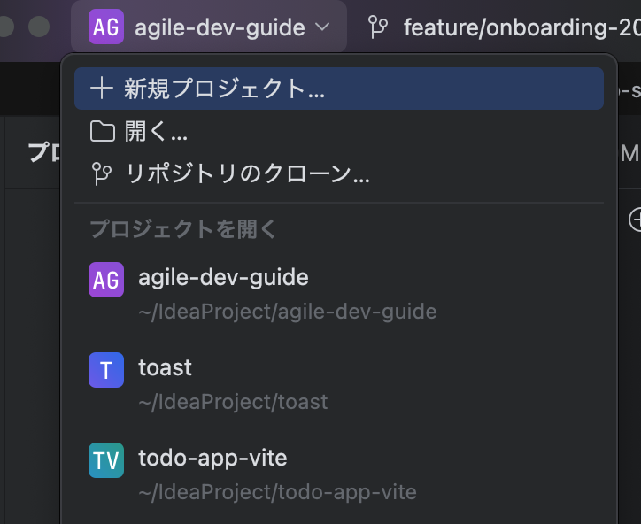
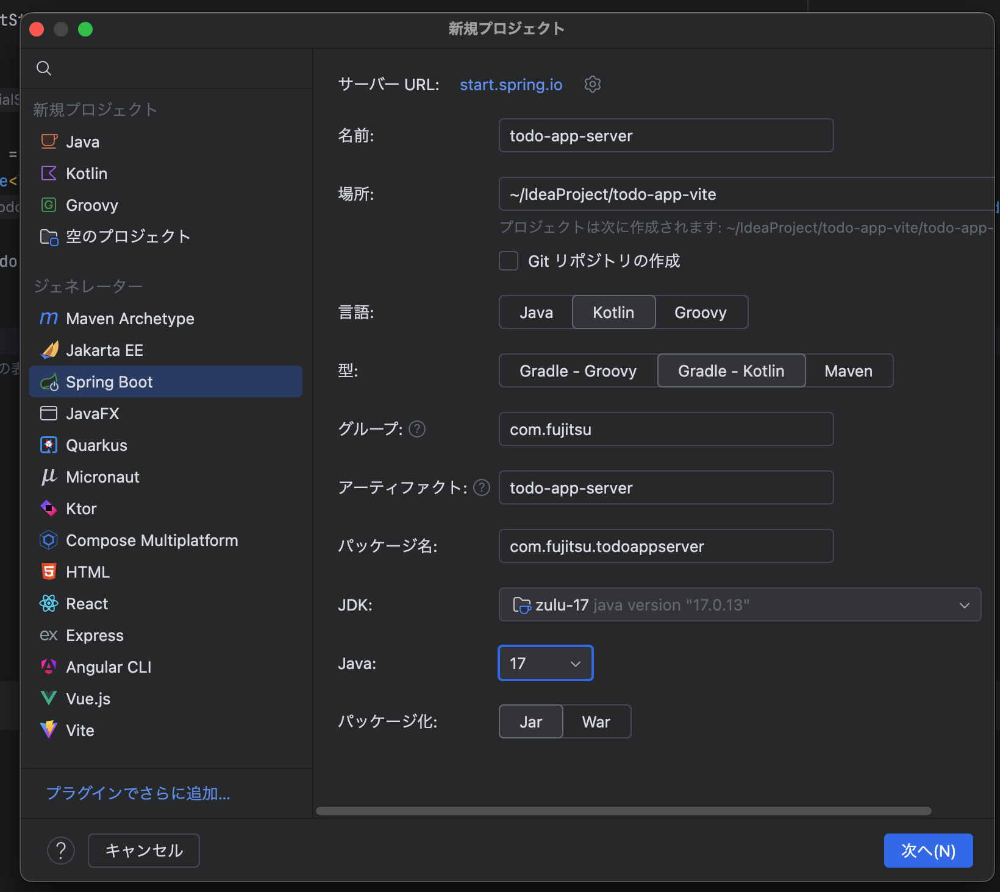
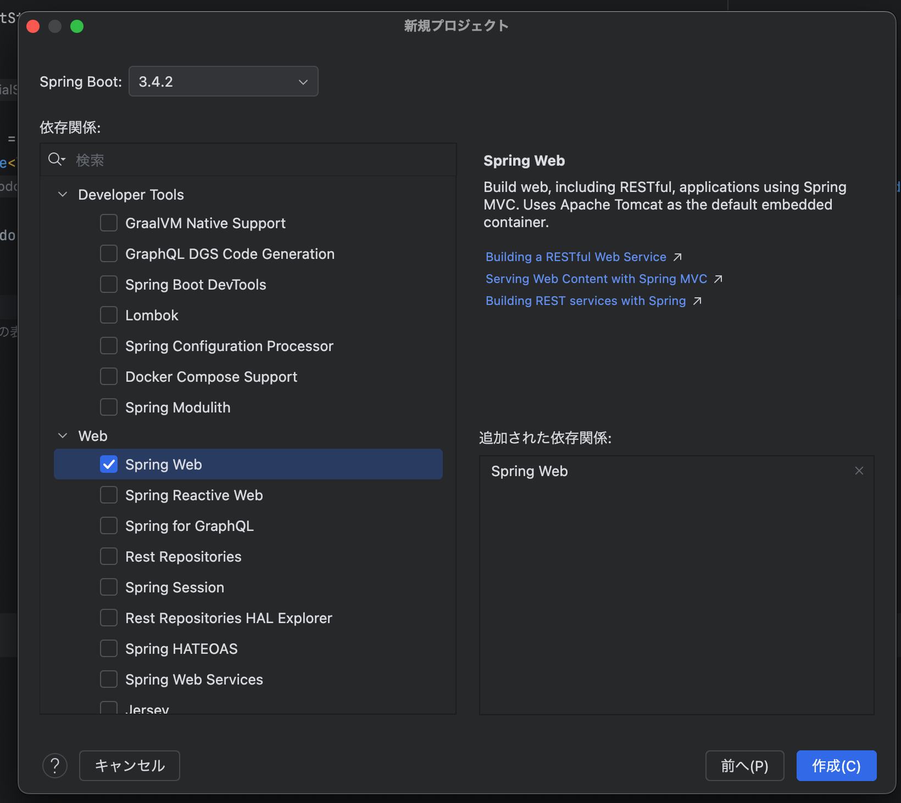
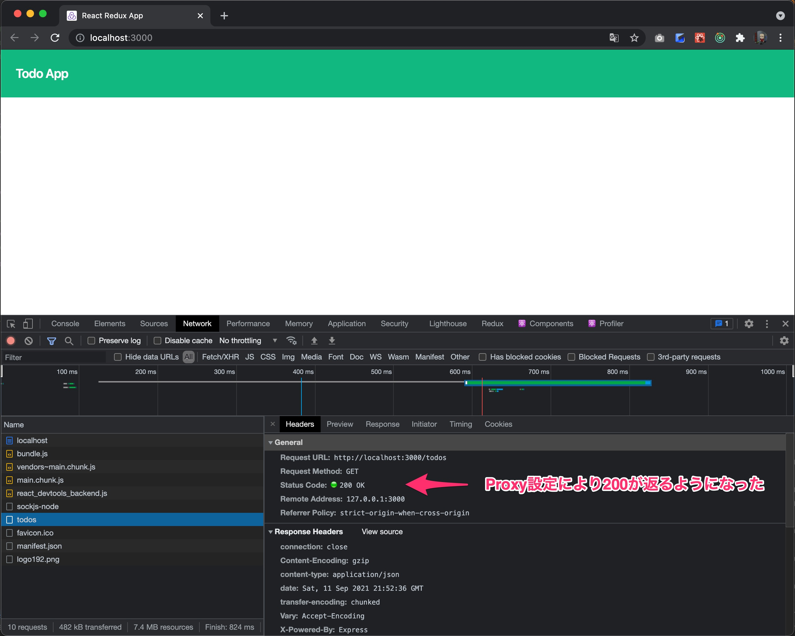

# 3日目

2日目まででタスク一覧をサーバに対して要求して、レスポンスに応じてタスク一覧を画面に描画するフロントエンドができました。
ただ、現時点でリクエストに対して応答するバックエンドがまだありませんので、これを作っていきましょう。

## バックエンドの初期設定

### Spring Bootのプロジェクト作成
Spring Bootのプロジェクトを作成するときはIntelliJの「新規ブロジェクト作成」からSpring Bootを選択すると簡単です。





生成場所はtodo-app-clientと並列になるようにしましょう。
今回はGradle Projectで開発言語はKotlinにします。

Spring Bootのバージョンはその時の安定版を指定すると良いです。

Artifact名は今回はtodo-app-serverとしました。
依存ライブラリですが、後からでも追加できますので、ここではいったん、Spring Webのみ追加しました。

これでGenerateしましょう。


※[Spring Initializr](https://start.spring.io/) でプロジェクトを作成することもできます。

### DBの設定

例によってアプリ作成は初期設定が一番大変です。頑張っていきましょう。
まず、DBの設定をしていきましょう。

今回DBは [PostgreSQL](https://www.postgresql.org/) を使用しようと思います。
ソフトウェアテストの章でつかったサンプルアプリケーションではH2をインメモリで動かしていたのですが、
流石に実際の開発のときにそんなことはしないので、実際の開発に寄せる意味でもPostgreSQLにしてみます。

まだPostgreSQLをインストールしていない方はPostgreSQLを導入してください。

PostgreSQLをサービスとしてローカルで動いているのを確認したら、
[createdb](https://www.postgresql.jp/document/9.4/html/app-createdb.html) コマンドを実行してtodo_dbを作っておきましょう。

```shell
createdb todo_db
```

まず、DB接続に必要なライブラリを追加しましょう。build.gradle.ktsを開いたらdependenciesを以下のように変更してください。

```kotlin
// build.gradle.kts
dependencies {
    implementation("org.springframework.boot:spring-boot-starter-web")
    implementation("com.fasterxml.jackson.module:jackson-module-kotlin")
    implementation("org.jetbrains.kotlin:kotlin-reflect")
    implementation("org.jetbrains.kotlin:kotlin-stdlib-jdk8")
    implementation("org.springframework.boot:spring-boot-starter-jdbc")   // 追記
    runtimeOnly("org.postgresql:postgresql")                              // 追記
    testImplementation("org.springframework.boot:spring-boot-starter-test")
}
```

次にsrc/resources/application.propertiesがありますが、yamlで記述したほうが見通しが良くなるので、
このapplication.propertiesをapplication.ymlに変更します。

```yaml
// application.yml
spring:
  datasource:
    url: jdbc:postgresql://localhost:5432/${DB_NAME:todo_db}
    username: onebase
    password:
```

設定ファイルはこのように変更します。**usernameは`createdb`コマンドを実行した環境に依存しますので、皆様の環境に合わせて書き換えてください。**
この状態でアプリケーションを起動してみましょう。

```shell
./gradlew bootRun
```

```
onebase@Onebase-Maguro todo-app-server % ./gradlew bootRun

> Task :bootRun

  .   ____          _            __ _ _
 /\\ / ___'_ __ _ _(_)_ __  __ _ \ \ \ \
( ( )\___ | '_ | '_| | '_ \/ _` | \ \ \ \
 \\/  ___)| |_)| | | | | || (_| |  ) ) ) )
  '  |____| .__|_| |_|_| |_\__, | / / / /
 =========|_|==============|___/=/_/_/_/
 :: Spring Boot ::                (v2.5.4)

2021-09-12 04:38:21.169  INFO 74012 --- [           main] c.f.t.TodoAppServerApplicationKt         : Starting TodoAppServerApplicationKt using Java 13.0.2 on Onebase-Maguro.local with PID 74012 (/Users/onebase/IdeaProjects/todo-app-server/build/classes/kotlin/main started by onebase in /Users/onebase/IdeaProjects/todo-app-server)
2021-09-12 04:38:21.171  INFO 74012 --- [           main] c.f.t.TodoAppServerApplicationKt         : No active profile set, falling back to default profiles: default
2021-09-12 04:38:22.054  INFO 74012 --- [           main] o.s.b.w.embedded.tomcat.TomcatWebServer  : Tomcat initialized with port(s): 8080 (http)
2021-09-12 04:38:22.063  INFO 74012 --- [           main] o.apache.catalina.core.StandardService   : Starting service [Tomcat]
2021-09-12 04:38:22.064  INFO 74012 --- [           main] org.apache.catalina.core.StandardEngine  : Starting Servlet engine: [Apache Tomcat/9.0.52]
2021-09-12 04:38:22.122  INFO 74012 --- [           main] o.a.c.c.C.[Tomcat].[localhost].[/]       : Initializing Spring embedded WebApplicationContext
2021-09-12 04:38:22.122  INFO 74012 --- [           main] w.s.c.ServletWebServerApplicationContext : Root WebApplicationContext: initialization completed in 910 ms
2021-09-12 04:38:22.451  INFO 74012 --- [           main] o.s.b.w.embedded.tomcat.TomcatWebServer  : Tomcat started on port(s): 8080 (http) with context path ''
2021-09-12 04:38:22.459  INFO 74012 --- [           main] c.f.t.TodoAppServerApplicationKt         : Started TodoAppServerApplicationKt in 1.844 seconds
<==========---> 83% EXECUTING [16s]
> :bootRun

```

ひとまずこのような表示が出たらServerとPostgreSQL DBの接続はうまくいっていますので、`Control+C`を押してサーバを止めておきましょう。

### DBのマイグレーションツールの導入

DBのマイグレーションツールを導入してみましょう。
先程`createdb`コマンドを実行してDBを作りましたが、まだテーブルを全く作ってません。
DBのスキーマを手動で管理するのはメチャクチャ大変ですので、マイグレーションツールを導入するとスキーマの作成や、スキーマ変更に伴うデータのマイグレーションを自動化することができます。

ここでは [Flyway](https://flywaydb.org/) を使います。

再び、build.gradle.ktsを開いたら以下の依存を追加してください。
```kotlin
// build.gradle.kts
dependencies {
    implementation("org.springframework.boot:spring-boot-starter-web")
    implementation("com.fasterxml.jackson.module:jackson-module-kotlin")
    implementation("org.jetbrains.kotlin:kotlin-reflect")
    implementation("org.springframework.boot:spring-boot-starter-jdbc")
    implementation("org.flywaydb:flyway-database-postgresql")
    runtimeOnly("org.postgresql:postgresql")
    testImplementation("org.springframework.boot:spring-boot-starter-test")
    testImplementation("org.jetbrains.kotlin:kotlin-test-junit5")
    testRuntimeOnly("org.junit.platform:junit-platform-launcher")
}
```

次に、src/main/resources/application.ymlを再び開いてFlywayの設定を記入しましょう。

```yaml
// application.yml
spring:
  datasource:
    url: jdbc:postgresql://localhost:5432/${DB_NAME:todo_db}
    username: onebase
    password:
  flyway:
    baseline-on-migrate: true
    url: jdbc:postgresql://localhost:5432/${DB_NAME:todo_db}
    user: onebase
    password:
```

これでFlywayを使う準備が整いました。では実際にマイグレーションをかけてテーブルを作ってみましょう。
src/main/resources配下にdbというディレクトリを作成し、さらにその配下にmigrationというディレクトリを作成します。
そして、そのmigration配下に`VyyyyMMddHHmmss__CreateTodoTable.sql`というファイルを新規に作ってください。
'yyyyMMddHHmmss'の部分は実際に作成作業をした時間に置き換えてください。
ファイル名がこの命名規約に従っていることがとても大事です。

```
src
├── main
│     ├── kotlin
│     │     └── com
│     │         └── fujitsu
│     │             └── todoappserver
│     │                 └── TodoAppServerApplication.kt
│     └── resources
│         ├── application.yml
│         ├── db
│         │     └── migration
│         │         └── V20210912045400__CreateTodoTable.sql
│         ├── static
│         └── templates
└── test
    └── kotlin
        └── com
            └── fujitsu
                └── todoappserver
                    └── TodoAppServerApplicationTests.kt

```

筆者の例では「V20210912045400__CreateTodoTable.sql」というファイル名にしています。（このドキュメントは朝4時に書いています。）

このファイルにはマイグレーション用のSQLを記述します。

```sql
create table todo (
    id serial primary key,
    title varchar not null,
    completed boolean not null default false
);
```

最初のSQLはこのようにしました。
この状態で再度アプリケーションを起動してみましょう。

```shell
./gradlew bootRun
```

正常に起動したら、どのようなツールでも構いませんのでtodo_dbの状態をみてみましょう。


flyway_schema_historyというテーブル共にtodoテーブルがFlywayによって作られていたら成功です。
Flywayはアプリケーション起動時にdb/migrationディレクトリ配下のSQLを確認して、DBのマイグレーションを実行してくれます。

これでバックエンド開発の下準備が整いました。ここまでのソースコードは
[https://github.com/onebase-fujitsu/todo-app-vite/tree/feature/step5](https://github.com/onebase-fujitsu/todo-app-vite/tree/feature/step5)
に置いてあります。

## GET /todosの実装

### GET /todosのテスト

ではまず/todosに対してGETをしたときに、データベースにアクセスして、Todo一覧をJSON形式で返却するテストを書いてみましょう。
src/test/kotlin/com.fujitsu.todoappserver配下にcontrollerパッケージを作り、その中に`TodoApiControllerTest.kt`を作りましょう

```
src
├── main
│     ├── kotlin
│     │     └── com
│     │         └── fujitsu
│     │             └── todoappserver
│     │                 └── TodoAppServerApplication.kt
│     └── resources
│         ├── application.yml
│         ├── db
│         │     └── migration
│         │         └── V20210912045400__CreateTodoTable.sql
│         ├── static
│         └── templates
└── test
    └── kotlin
        └── com
            └── fujitsu
                └── todoappserver
                    ├── TodoAppServerApplicationTests.kt
                    └── controller
                        └── TodoApiControllerTest.kt    // 作成

```

```kotlin
// TodoApiControllerTest.kt
package com.fujitsu.todoappserver.controller

import com.fasterxml.jackson.module.kotlin.jacksonObjectMapper
import com.fasterxml.jackson.module.kotlin.readValue
import org.assertj.core.api.Assertions
import org.junit.jupiter.api.Test
import org.springframework.beans.factory.annotation.Autowired
import org.springframework.boot.test.context.SpringBootTest
import org.springframework.boot.test.web.client.TestRestTemplate
import org.springframework.http.*

@SpringBootTest(webEnvironment = SpringBootTest.WebEnvironment.RANDOM_PORT)
class TodoApiControllerTest {
    @Autowired
    lateinit var restTemplate: TestRestTemplate

    @Test
    fun タスク一覧を取得できる() {
        val header = HttpHeaders()
        header.contentType = MediaType.APPLICATION_JSON
        val response = restTemplate.exchange("/todos", HttpMethod.GET, HttpEntity(null, header), String::class.java)
        val mapper = jacksonObjectMapper()
        val articles: List<Todo> = mapper.readValue(response.body!!)
        Assertions.assertThat(response.statusCode).isEqualTo(HttpStatus.OK)
        Assertions.assertThat(articles.size).isEqualTo(0)
    }
}
```

最初のテストはこのように書きました。ソフトウェアテストの章でこのあたりは詳しく説明していますので、テストの説明は割愛します。
このテストは当然Todoがまだ定義されてませんのでコンパイルができずに失敗します。

### GET /todosの実装

#### Modelの実装

まず先のテストはTodoモデルが無いことで落ちていたので、これを定義しましょう。

src/main/kotlin/com.fujitsu.todoappserver配下に`model`パッケージ、`controller`パッケージ、`service`パッケージ、`repository`パッケージを作りましょう。
そして`model`パッケージ配下にTodo.ktを作成。

```
src
├── main
│     ├── kotlin
│     │     └── com
│     │         └── fujitsu
│     │             └── todoappserver
│     │                 ├── TodoAppServerApplication.kt
│     │                 ├── controller
│     │                 ├── model
│     │                 │     └── Todo.kt       // 作成
│     │                 ├── repository
│     │                 └── service
│     └── resources
│         ├── application.yml
│         ├── db
│         │     └── migration
│         │         └── V20210912045400__CreateTodoTable.sql
│         ├── static
│         └── templates
└── test
    └── kotlin
        └── com
            └── fujitsu
                └── todoappserver
                    ├── TodoAppServerApplicationTests.kt
                    └── controller
                        └── TodoControllerTest.kt

```

```kotlin
// Todo.kt
package com.fujitsu.todoappserver.model

data class Todo(
    val id: Int,
    val title: String,
    val completed: Boolean
)
```

Kotlinはdata classの宣言で簡単にPOJOを作ることができます。Javaだと必要なsetterやgetterは不要です。
このTodoモデルを先ほど作成したテストにインポートして実行してみましょう。

コンパイルには成功して、Getリクエストが発生していますが、404 Not Foundが返却されるようになりテストが失敗するようになったと思います。

#### Controller層の実装

Controller層を実装していきましょう。controllerパッケージ配下にTodoControllerInterface.ktとTodoController.ktを作成します。

TodoControllerInterfaceにはTodoControllerが使いたい（つまりServiceに実装してもらいたい）メソッドを定義しておきます。

```kotlin
// TodoControllerInterface.kt
package com.fujitsu.todoappserver.controller

import com.fujitsu.todoappserver.model.Todo

interface TodoControllerInterface {
    fun getTodos(): List<Todo>
}
```

TodoControllerは先程定義したInterfaceを通じてserviceを利用します。

```kotlin
// TodoController.kt
package com.fujitsu.todoappserver.controller

import com.fujitsu.todoappserver.model.Todo
import org.springframework.http.HttpStatus
import org.springframework.web.bind.annotation.GetMapping
import org.springframework.web.bind.annotation.ResponseStatus
import org.springframework.web.bind.annotation.RestController

@RestController
class TodoController(private val todoService: TodoControllerInterface) {
    @GetMapping("/todos")
    @ResponseStatus(HttpStatus.OK)
    fun getTodos() : List<Todo> {
        return todoService.getTodos()
    }
}
```

InterfaceがService層ではなくController層にあるのに違和感を覚える人も多いと思います。
これは依存性逆転の原則(DIP)です。覚えてますでしょうか？
依存性逆転の原則では**抽象の所有権も逆転**させるんでしたよね。

#### Service層の実装

同様にService層も実装していきましょう。Serviceパッケージ配下にTodoServiceInterface.ktとTodoService.ktを作ります。
Service層はRepository層から返ってきたレスポンスをそのままControllerに受け流すだけになるので、説明は割愛します。

```kotlin
// TodoServiceInterface.kt
package com.fujitsu.todoappserver.service

import com.fujitsu.todoappserver.model.Todo

interface TodoServiceInterface {
    fun getTodos(): List<Todo>
}
```

```kotlin
// TodoService.kt
package com.fujitsu.todoappserver.service

import com.fujitsu.todoappserver.controller.TodoControllerInterface
import com.fujitsu.todoappserver.model.Todo
import org.springframework.stereotype.Service

@Service
class TodoService(private val todoRepository: TodoServiceInterface): TodoControllerInterface {
    override fun getTodos(): List<Todo> {
        return todoRepository.getTodos()
    }
}
```

#### Repository層の実装

Repository層を実装します。repositoryパッケージ配下にTodoRepository.ktを作成し、TodoServiceInterfaceを実装しましょう。

```kotlin
// TodoRepository.kt
package com.fujitsu.todoappserver.repository

import com.fujitsu.todoappserver.model.Todo
import com.fujitsu.todoappserver.service.TodoServiceInterface
import org.springframework.jdbc.core.JdbcTemplate
import org.springframework.stereotype.Repository
import java.sql.ResultSet

@Repository
class TodoRepository(val jdbcTemplate: JdbcTemplate) : TodoServiceInterface {
    override fun getTodos(): List<Todo> {
        return jdbcTemplate.query(
            """select id, title, completed from todo"""
        ) {rs: ResultSet, _:Int ->
            Todo(rs.getInt("id"),
                rs.getString("title"),
                rs.getBoolean("completed")
            )
        }
    }
}
```

Repositoryは実際にDBに対してクエリを投げ、ResultSetからTodoオブジェクトを作り、それをListとして返しています。
これで実装は終わりました。テストを実行してみましょう！

```shell
./gradlew test
```

```
onebase@Onebase-Maguro todo-app-server % ./gradlew test

> Task :test
2021-09-12 06:37:05.404  INFO 76511 --- [ionShutdownHook] com.zaxxer.hikari.HikariDataSource       : HikariPool-1 - Shutdown initiated...
2021-09-12 06:37:05.408  INFO 76511 --- [ionShutdownHook] com.zaxxer.hikari.HikariDataSource       : HikariPool-1 - Shutdown completed.

BUILD SUCCESSFUL in 4s
4 actionable tasks: 1 executed, 3 up-to-date

```

テストが通る様子が確認できると思います。

ここまでのソースは
[https://github.com/Onebase-Fujitsu/todo-app-server/tree/step2](https://github.com/Onebase-Fujitsu/todo-app-server/tree/step2)
に置いてあります。

## クライアントとサーバの連携

さて、サーバを起動した状態にしておいてください。

```shell
./gradlew bootRun
```

サーバを起動した状態でクライアントを起動しましょう。

```shell
npm run start
```

その状態で [http://localhost:3000](http://localhost:3000) にアクセスすると、まだ、/todosに対するリクエストに404が返っていると思います。


それもそのはず、Clientはlocalhost:3000/todosにリクエストしている一方で、サーバは8080ポートで起動しているからです。
そこでClientにProxyの設定を入れてあげます。

Clientのpackage.jsonを開いたら一行`"proxy": "http://localhost:8080",`という設定を追記して、再度Clientを起動してみましょう。

```json
package.json
{
  ...
  "proxy": "http://localhost:8080",
  ...
}
```



proxyの設定によりServerが応答できるようになり、200が返却されているのが確認できると思います。

おめでとうございまいます！最初のサーバAPIとクライアントを連携させたアプリケーションを実装することができました！

---

4日目に続きます

4日目