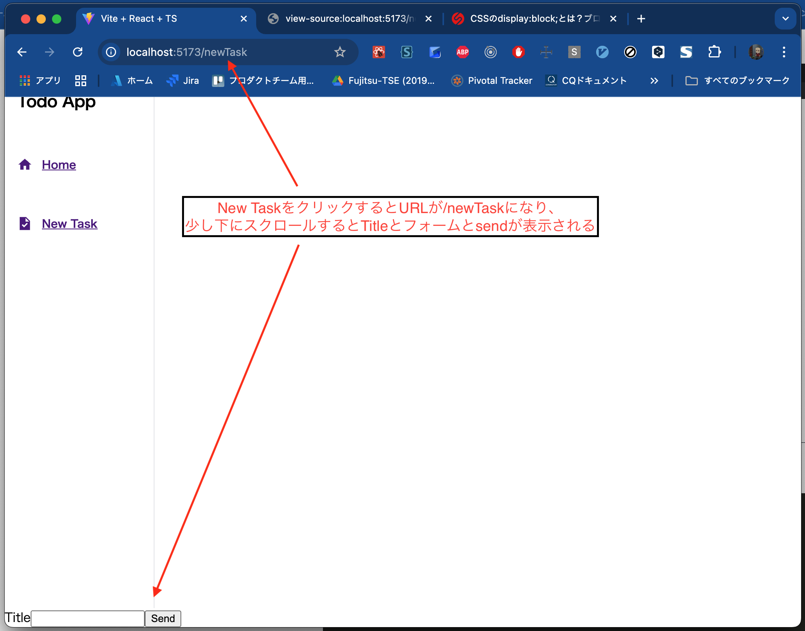

# 4日目

3日まででReactで作ったフロントエンドとSpring Bootで作ったバックエンドを連携させることができました。
しかし、タスクを表示することができましたが、タスクを追加する機能がまだありません。
4日目からはどんどん機能を追加してみましょう。

## タスクの追加画面を作る

いまClientのアプリケーションにはまだルーターの機能がありません。
例えば、 [http://localhost:5173/](http://localhost:5173/) にアクセスしてもHome画面が表示されていますし、
[http://localhost:5173/hogehoge](http://localhost:5173/hogehoge) にアクセスしてもHome画面が表示されます。

これはちょっとイケてないので、ルーターの機能を実装してみます。
ここでは [http://localhost:5173/](http://localhost:5173/) にアクセスするとHome画面が、
そして [http://localhost:5173/newTask](http://localhost:5173/newTask) にアクセスするとタスク管理画面が開くようにしてみましょう。

### ルーターの導入

ルーターの実装には [react-router-dom](https://reactrouter.com/) が必要なので、これを導入します。
これはルーティング機能もDOMとして宣言してしまうライブラリです。
これだけどあまりピンとこないと思いますので、どういう実装になるのかを実際に見てもらった方が早いと思います。

まずreact-router-domを導入します。

```shell
npm install react-router-dom@^5.3.4 @types/react-router-dom@^5.3.3
```

そして、App.tsxを以下のように編集してみましょう。

```typescript jsx
// App.tsx
import {BrowserRouter, Route, Switch} from 'react-router-dom'
import Home from './pages/Home'

function App() {
    return (
        <div className="App">
            <BrowserRouter>
                <Switch>
                    <Route path="/" exact render={() => <Home />} />
                </Switch>
            </BrowserRouter>
        </div>
    )
}

export default App
```

次にmain.tsxを以下のように編集してみましょう。

```typescript jsx
// main.tsx
import React from 'react'
import ReactDOM from 'react-dom/client'
import './index.css'
import {BrowserRouter} from 'react-router-dom'
import App from './App'
import TodoProvider from './context/TodoContext'

const root = ReactDOM.createRoot(document.getElementById('root') as HTMLElement)
root.render(
  <React.StrictMode>
    <TodoProvider>
      <BrowserRouter>
        <App />
      </BrowserRouter>
    </TodoProvider>
  </React.StrictMode>
)
```

この状態で [http://localhost:5173/](http://localhost:5173/) にアクセスするとHome画面が表示されます。ここはこれまでの動作と変わりません。
そこで [http://localhost:5173/hoge](http://localhost:5173/hoge) にアクセスすると、先程と代わって真っ白な画面になると思います。

つまりこれは`/`というパスだったらホームコンポーネントを表示するよという設定なわけです。

### ヘッダーの作り込み

ではヘッダーにメニューを作り込んでいきましょう。  
せっかくなので、ここでデザインも作り込んでいきます。

まずテストから。

```typescript jsx
// Header.test.tsx
import {cleanup, render, screen} from '@testing-library/react'  // 変更
import Header from '../../src/components/Header'

describe('Header', () => {
  afterEach(() => {
    cleanup()
  })

  it('ヘッダーの初期表示', () => {
    render(<Header />)
    expect(screen.getByText('Todo App')).toBeInTheDocument()
    expect(screen.getByText('Home').closest('a')).toHaveAttribute('href', '/')            // 追加
    expect(screen.getByText('New Task').closest('a')).toHaveAttribute('href', '/newTask') // 追加
  })
})
```

ヘッダーに`/`へのリンクと、`/newTask`へのリンクがあることを確認するテストを追加しました。

テストが書けたら実装も追加します。
今回はicon画像を使いたいので、[Styled Icons](https://styled-icons.dev/) を導入してから、Header.tsxを編集します。

```shell
npm install styled-icons
```

```typescript jsx
// Header.tsx
import styled from 'styled-components'
import {Link} from 'react-router-dom'
import {Task, Home} from 'styled-icons/material'

const Wrapper = styled.div`
  height: 100vh;
  width: 12rem;
  border-right-width: 1px;
  border-right-style: solid;
  border-right-color: #e5e7eb;
`

const H1 = styled.h1`
  padding: 1rem;
  font-size: 1.25rem;
  line-height: 1.75rem;
  letter-spacing: -0.025rem;
`

const Div = styled.div`
  display: flex;
  flex-direction: column;
  justify-content: flex-start;
  color: #6b7280;
`

const StyledLink = styled(Link)`
  padding: 1rem;
  &:hover {
    background-color: #f3f4f6;
    color: #374151;
  }
`

const StyledHome = styled(Home)`
  width: 1.25rem;
  margin-right: 0.75rem;
`

const StyledTask = styled(Task)`
  width: 1.25rem;
  margin-right: 0.75rem;
`

const H2 = styled.h2`
  font-size: 0.875rem;
  display: flex;
  align-items: center;
`

const Header = () => (
  <Wrapper data-testid="Header">
    <H1>Todo App</H1>
    <Div>
      <StyledLink to="/">
        <H2>
          <StyledHome />
          Home
        </H2>
      </StyledLink>
      <StyledLink to="/newTask">
        <H2>
          <StyledTask />
          New Task
        </H2>
      </StyledLink>
    </Div>
  </Wrapper>
)

export default Header
```

しかし、このテストはそもそもレンダーで失敗します。

```
  ● Header › ヘッダーの初期表示

    Invariant failed: You should not use <Link> outside a <Router>

      18 |     return <Provider store={store}>{children}</Provider>
      19 |   }
    > 20 |   return rtlRender(ui, {wrapper: Wrapper, ...renderOptions})
         |          ^
      21 | }
      22 |
      23 | export * from '@testing-library/react'
```

Routerに依存しているのでLinkがRouterに依存しているのにそれを無視してレンダリングしようとしたからですね。
というわけで、`Header.test.tsx`のレンダリングオプションを追加しましょう。また、結合テストの役割を果たす`Home.test.tsx`にも同様のレンダリングオプションを追加します。

```typescript jsx
// Header.test.tsx
import {cleanup, render, screen} from '@testing-library/react'
import Header from '../../src/components/Header'
import {BrowserRouter} from "react-router-dom";

describe('Header', () => {
  afterEach(() => {
    cleanup()
  })

  it('ヘッダーの初期表示', () => {
    render(<Header />, {wrapper: BrowserRouter})            // 修正
    expect(screen.getByText('Todo App')).toBeInTheDocument()
    expect(screen.getByText('Home').closest('a')).toHaveAttribute('href', '/')
    expect(screen.getByText('New Task').closest('a')).toHaveAttribute('href', '/newTask')
  })
})

```

```typescript jsx
// Home.test.tsx

// 中略

  it('画面構成', async () => {
    mock.onGet('/todos').reply(200, [])

    await act(() => {
      render(<Home />, {wrapper: BrowserRouter})  // 修正
    })

    expect(screen.queryByTestId('Header')).toBeTruthy()
    expect(screen.queryByTestId('TodoList')).toBeTruthy()
  })

// 中略

    await act(() => {
      render(<TodoProvider><Home /></TodoProvider>, {wrapper: BrowserRouter})  // 修正
    })

    expect(mock.history.get[0].url).toEqual('/todos')
    expect(screen.getByText('title')).toBeInTheDocument()
```

これでひとまずテストは通ったと思います。


メニューができて芋っぽさがなくなりました。しかし、New Taskをクリックすると真っ白な画面になってしまいます。

ここまでのソースは
[https://github.com/onebase-fujitsu/todo-app-vite/tree/feature/step7](https://github.com/onebase-fujitsu/todo-app-vite/tree/feature/step7)
に置いてあります。

### タスク作成画面の作成

では次にタスク作成画面を作成しましょう。

まず、タスク作成画面のテストを作成します。
`__test__/page`ディレクトリ配下に`NewTask.test.tsx`を作成しましょう。

```typescript jsx
// NewTask.test.tsx
import {cleanup, render, screen} from '@testing-library/react'
import {BrowserRouter} from 'react-router-dom'

describe('タスク作成画面', () => {

  afterEach(() => {
    cleanup()
  })

  it('画面構成', async () => {
    render(<NewTask />, {wrapper: BrowserRouter})

    expect(screen.queryByTestId('Header')).toBeTruthy()
    expect(screen.queryByTestId('NewTaskForm')).toBeInTheDocument()
  })
})
```

テスト内容は「画面構成がHeaderとタスクを入力するFormコンポーネントであること」を確認するテストにしました。
もちろん、NewTaskコンポーネントも、NewTaskFormコンポーネントもまだ無いためこのテストは失敗します。

まず、NewTaskFromコンポーネントを作成していきましょう。
`components`ディレクトリ配下に`NewTaskForm.tsx`を作成します。

```typescript jsx
// NewTaskFrom.tsx
const NewTaskForm = () => {

  return (
    <form data-testid="NewTaskForm" />
  )
}

export default NewTaskForm
```

いったん中身は空で大丈夫です。

その上で、`page`ディレクトリ配下に`NewTask.tsx`を作成します。

```typescript jsx
// NewTask.tsx
import Header from '../components/Header'
import NewTaskForm from '../components/NewTaskForm'

const NewTask = () => (
  <div data-testid="NewTask" className="flex">
    <Header/>
    <NewTaskForm/>
  </div>
)

export default NewTask
```

これでNewTask.test.tsxにimportを追加すると、いったんテストは通るようになったのではないでしょうか？

次にFormコンポーネントを作り込んでいきましょう。
NewTaskFormコンポーネントにはタスクの入力とテキストボックスと、サーバに送信するボタンがあると良さそうなので、それをテストしていきます。

```typescript jsx
// NewTaskForm.test.tsx
import {cleanup, fireEvent, render, screen} from '@testing-library/react'
import NewTaskForm from "../../src/components/NewTaskForm";


describe('NewEntryFormコンポーネント', () => {
  afterEach(() => {
    cleanup()
  })

  it("初期表示", () => {
    render(<NewTaskForm/>)
    expect(screen.queryByLabelText('Title')).toBeTruthy()
    expect(screen.getByTestId("TitleInput")).toHaveValue('')
    expect(screen.queryByText('Send')).toBeTruthy()
  })

  it("タスク名を編集できる", () => {
    render(<NewTaskForm/>)
    fireEvent.change(screen.getByTestId('TitleInput'), {target: {value: 'title text'}})
    expect(screen.getByTestId("TitleInput")).toHaveValue('title text')
  })
})
```

ではこれを実現するNewTaskFormを実装しましょう。

```typescript jsx
// NewTaskForm.tsx
import {useState} from 'react'

const NewTaskForm = () => {
  const [taskInput, setTaskInput] = useState('')

  return (
    <form data-testid="NewTaskForm">
      <label htmlFor="titleInput">Title
      <input id="titleInput" data-testid="TitleInput" type="text" value={taskInput}
             onChange={(event) => setTaskInput(event.target.value)}/>
      </label>
      <button type="button">
        Send
      </button>
    </form>
  )
}

export default NewTaskForm
```

こんな感じでしょうか。これでテストは通ると思います。

しかしこの時点ではまだ、NewTask画面がRouterに組み込まれていませんので、メニューをクリックしても白い画面のままです。
メニューに組み込んでいきましょう。

```typescript jsx
// App.tsx
import {Route, Routes} from 'react-router-dom'
import Home from './pages/Home'
import NewTask from './pages/NewTask'

const App = () => (
  <div className="App">
    <Routes>
      <Route path="/" element={<Home />} />
      <Route path="/newTask" element={<NewTask />} />
    </Routes>
  </div>
)

export default App
```

App.tsxにルーティング設定を追加しました。この状態でメニューをクリックすると画面が切り替わるようになったはずです。



フォームにデザインを適用してみます。

```typescript jsx
// NewTaskForm.tsx
import {useState} from 'react'
import styled from 'styled-components'

const Wrapper = styled.form`
  width: 100%;
  padding: 2rem;
`

const DivForm = styled.div`
  display: flex;
  flex-wrap: wrap;
  margin-left: -0.75rem;
  margin-right: -0.75rem;
  margin-bottom: 1.5rem;
`

const DivLabel = styled.div`
  width: 100%;
  padding-left: 0.75rem;
  padding-right: 0.75rem;
`

const Label = styled.label`
  display: block;
  text-transform: uppercase;
  letter-spacing: 0.025em;
  color: #374151;
  font-size: 0.75rem;
  font-weight: 700;
  margin-bottom: 0.5rem;
`
const Input = styled.input`
  appearance: none;
  display: block;
  width: 100%;
  color: #374151;
  border-width: 1px;
  border-color: #E5E7EB;
  border-style: solid;
  border-radius: 0.25rem;
  padding: 0.75rem 1rem;
  margin-bottom: 0.75rem;
  line-height: 1.25;
  &:focus {
    outline: 0;
    background-color: #ffffff;
    border-color: #6B7280;
  }
`
const Button = styled.button`
  box-shadow: 0 1px 5px 2px rgb(0 0 0 / 0.1);
  background-color: #4ADE80;
  &:hover {
    background-color: #A7F3D0;
  }
  &:focus {
    outline: 0;
  }
  color: #ffffff;
  font-weight: 700;
  padding: 0.5rem 1rem 0.5rem 1rem;
  border-radius: 0.25rem;
  border-style: none;
  cursor: pointer;
  font-family: inherit;
  font-size: 100%;
`
const NewTaskForm = () => {
  const [taskInput, setTaskInput] = useState('')

  return (
    <Wrapper data-testid="NewTaskForm">
      <DivForm>
        <DivLabel>
          <Label htmlFor="titleInput">Title
            <Input id="titleInput" data-testid="TitleInput" type="text" value={taskInput}
                   onChange={(event) => setTaskInput(event.target.value)}/>
          </Label>
        </DivLabel>
      </DivForm>
        <Button type="button">
          Send
        </Button>
    </Wrapper>
  )
}

export default NewTaskForm
```

```typescript jsx
/* NewTask.tsx */
import styled from 'styled-components'
import Header from '../components/Header'
import NewTaskForm from '../components/NewTaskForm'

const Div = styled.div`
  display: flex;
`

const NewTask = () => (
  <Div data-testid="NewTask" className="flex">
    <Header />
    <NewTaskForm />
  </Div>
)

export default NewTask

```

```css
/* index.css */
* {
    margin: 0;
    box-sizing: border-box;
}

a {
    color: inherit;
    text-decoration: inherit;
}
```


デザインが適用されてだいぶアプリっぽくなりましたね。

ここまでのソースは
[https://github.com/onebase-fujitsu/todo-app-vite/tree/feature/step8](https://github.com/onebase-fujitsu/todo-app-vite/tree/feature/step8)
に置いてあります。

## タスク作成機能の作成

### APIの作成
まずAPIへのリクエスト処理のテストと実装をやっていきましょう。

```typescript
// TodoApi.test.ts
import MockAdapter from 'axios-mock-adapter'
import axios from 'axios'
import {getTodos, postTodos} from '../../src/features/TodoApi'

describe('TodoApi', () => {
  
  // 中略
  it('post /todos', async () => {
    mock.onPost('/todos', {title: 'title'}).reply(201,
      {
        id: 1,
        title: 'title',
        completed: false
      })

    const response = await postTodos('title')

    expect(mock.history.post[0].url).toEqual('/todos')
    expect(mock.history.post[0].data).toEqual(JSON.stringify({title: 'title'}))
    expect(mock.history.post[0].headers?.['Content-Type']).toEqual("application/json")
    expect(mock.history.post[0].headers?.['X-Requested-With']).toEqual("XMLHttpRequest")
    expect(response.id).toEqual(1)
    expect(response.title).toEqual('title')
    expect(response.completed).toEqual(false)
  })
})
```

`postTodos()`はtitleをパラメータとしてもらって、それをJSONに整形して送信していることを確認するテストを書きました。
また、Headerに`Content-Type: application/json`が設定されていることを確認するテストも書いています。

```typescript
// TodoApi.ts
import axios from 'axios'

export interface Todo {
    id: number
    title: string
    completed: boolean
}

export const getTodos = async () => {
    const response = await axios.get<Todo[]>('/todos')
    return response.data
}

export const postTodos = async (title: string) => {
    const requestJson = {title}
    const headers = {
        'X-Requested-With': 'XMLHttpRequest',
        'Content-Type': 'application/json',
    }
    const response = await axios.post<Todo>(
        '/todos',
        JSON.stringify(requestJson),
        {headers},
    )
    return response.data
}
```

このテストを満たす実装はこのようになります。これでAPIを呼ぶ処理はできました。


### タスク作成フォームへの組み込み

次に、作成ボタンを押したらこれを呼び出す処理を書いていきましょう。


```typescript jsx
// NewTaskForm.test.tsx
import {cleanup, fireEvent, render, screen} from '@testing-library/react'
import NewTaskForm from "../../src/components/NewTaskForm";
import MockAdapter from 'axios-mock-adapter'
import axios from 'axios'


describe('NewEntryFormコンポーネント', () => {
  let mock: MockAdapter

  beforeEach(() => {
    mock = new MockAdapter(axios)
  })

  afterEach(() => {
    mock.reset()
    cleanup()
  })

  it("初期表示", () => {
    render(<NewTaskForm/>)
      
    expect(screen.queryByLabelText('Title')).toBeTruthy()
    expect(screen.getByTestId("TitleInput")).toHaveValue('')
    expect(screen.queryByText('Send')).toBeTruthy()
  })

  it("タスク名を編集できる", () => {
    render(<NewTaskForm/>)
    fireEvent.change(screen.getByTestId('TitleInput'), {target: {value: 'title text'}})
      
    expect(screen.getByTestId("TitleInput")).toHaveValue('title text')
  })

  it("作成ボタンを押したら、作成がリクエストされる",  () => {
    render(<NewTaskForm />)
    fireEvent.change(screen.getByTestId('TitleInput'), {
      target: {value: 'title text'},
    })
    fireEvent.click(screen.getByText('Send'))
      
    expect(mock.history.post[0].url).toEqual('/todos')
    expect(mock.history.post[0].data).toEqual(JSON.stringify({title: 'title text'}))
  })
})
```

タスク名入力欄に文字を入力して、Sendボタンをクリックしたら`/todos`にJSONをPOSTしていることを確認するテストを追加しました。

```typescript jsx
// NewTaskForm.tsx

// 中略

const NewTaskForm = () => {
    const [taskInput, setTaskInput] = useState('')
    const todoContext = useContext(TodoContext)

    const handleSend = () => {
        postTodos(taskInput)
            .then((res) =>
                todoContext?.setTodos([
                    ...todoContext.todos,
                    {
                        id: res.id,
                        title: res.title,
                        completed: res.completed,
                    },
                ]),
            )
            .catch(() => {})
    }

    return (
        <Wrapper data-testid="NewTaskForm">
            <DivForm>
                <DivLabel>
                    <Label htmlFor="titleInput">
                        Title
                        <Input
                            id="titleInput"
                            data-testid="TitleInput"
                            type="text"
                            value={taskInput}
                            onChange={(event) => setTaskInput(event.target.value)}
                        />
                    </Label>
                </DivLabel>
            </DivForm>
            <Button type="button" onClick={() => handleSend()}>
                Send
            </Button>
        </Wrapper>
    )
}

export default NewTaskForm
```

実装はこのようになります。buttonをonClickしたときにhandleSendを呼び出し、その中でpostTodosを呼び出す形にしています。
また、既存のTodoContextにサーバからの戻り値を追加する差分更新の設計にしています。 差分更新にしているというのが結構大事です。APIの設計については後述する[API設計](/agile-dev-guide/docs/practice/day5/#api設計)で解説します。


画面を描画して作成画面を開きSendボタンをクリックすると、タスクが送信されていることが分かります。

## タスク一覧の取得タイミングの変更

今の実装では、タスク一覧画面を開いたときにタスクを全件取得しています。
画面を開く度に毎回全件取得のAPIを呼び出すのは非効率です。
全件取得するのは最初の一回で十分で、あとは差分更新にしたほうが効率的な処理ができます。

HTTP通信のオーバーヘッドはメモリアクセスや、ディスクアクセスと比較して比べ物にならないほど大きいです。
良くないAPIを揶揄する言葉に「おしゃべりなAPI」というものがあります。
つまり、画面を描画するのになんどもなんどもAPIをコールする必要があるAPI設計は良くないということです。

さきほど、作成したタスクをstateに対して差分更新できるようにしたのも余計な通信を発生させないためです。
もし、`POST /todos`が戻り値がなかったら、クライアントはIDを知るためだけに全件取得のAPIを呼び出さないといけなくなってしまいます。

すでに、POSTに成功したときに差分更新をするように実装してあるので、
タスク一覧を開いたときに毎回全件取得をするという処理から、画面を開いたときに一回だけ全件取得するという処理に変更しましょう。

といっても、これは非常に簡単で、Home.tsxにあったuseEffectの処理をApp.tsxに写すだけです。

```typescript jsx
// App.tsx
import {Route, Routes} from 'react-router-dom'
import {useContext, useEffect} from 'react'
import Home from './pages/Home'
import NewTask from './pages/NewTask'
import {TodoContext} from './context/TodoContext'
import {getTodos} from './features/TodoApi'

const App = () => {
  const todoContext = useContext(TodoContext)

  useEffect(() => {
    const fetchData = async () => {
      const response = await getTodos()
      todoContext?.setTodos(response)
    }
    fetchData()
  }, [])

  return (
    <div className="App">
      <Routes>
        <Route path="/" element={<Home />} />
        <Route path="/newTask" element={<NewTask />} />
      </Routes>
    </div>
  )
}

export default App
```

```typescript jsx
// Home.tsx
import React from 'react'
import styled from 'styled-components'
import TodoList from '../components/TodoList'
import Header from '../components/Header'

const Div = styled.div`
  display: flex;
`

const Home = () => (
  <Div>
    <Header />
    <TodoList />
  </Div>
)

export default Home
```

Home.tsxがだいぶスッキリしました。

テストも合わせて修正してしまいましょう。

Home.tsxからロジックを移植されたので、  
Home.test.tsxのテストを移植しApp.tsx用のテストを新規作成しました。

```typescript jsx
// Home.test.tsx
import {cleanup, render, screen, waitFor} from '@testing-library/react'
import {BrowserRouter} from 'react-router-dom'
import Home from '../../pages/Home'

describe('Home画面', () => {

  afterEach(() => {
    cleanup()
  })

  it('画面構成', async () => {
    render(<Home />, {wrapper: BrowserRouter})

    await waitFor(() => expect(screen.queryByTestId('Header')).toBeTruthy())
    await waitFor(() => expect(screen.queryByTestId('TodoList')).toBeTruthy())
  })
})

```


```typescript jsx
// App.test.tsx
import axios from 'axios'
import MockAdapter from 'axios-mock-adapter'
import {render} from '@testing-library/react'
import {BrowserRouter} from 'react-router-dom'
import App from '../App'

describe('App', () => {
  let mock: MockAdapter

  beforeEach(() => {
    mock = new MockAdapter(axios)
  })

  afterEach(() => {
    mock.reset()
  })

  it('ホーム画面の初期表示', async () => {
    mock.onGet('/todos').reply(200, [
      {
        id: 1,
        title: 'title',
        completed: false,
      },
    ])
    render(<App />, {wrapper: BrowserRouter})

    expect(mock.history.get[0].url).toEqual('/todos')
  })
})
```

これでテストは通るようになったと思います。
ブラウザで動作を確認してみると、アプリケーションを開いた最初の一回だけ/todosにGETをしているのが確認でき、
メニューからページ遷移をしても/todosにGETはされないことが確認できるはずです。

ここまでのソースは
[https://github.com/onebase-fujitsu/todo-app-vite/tree/feature/step9](https://github.com/onebase-fujitsu/todo-app-vite/tree/feature/step9)
に置いてあります。

---

5日目に続きます

{}5日目{}