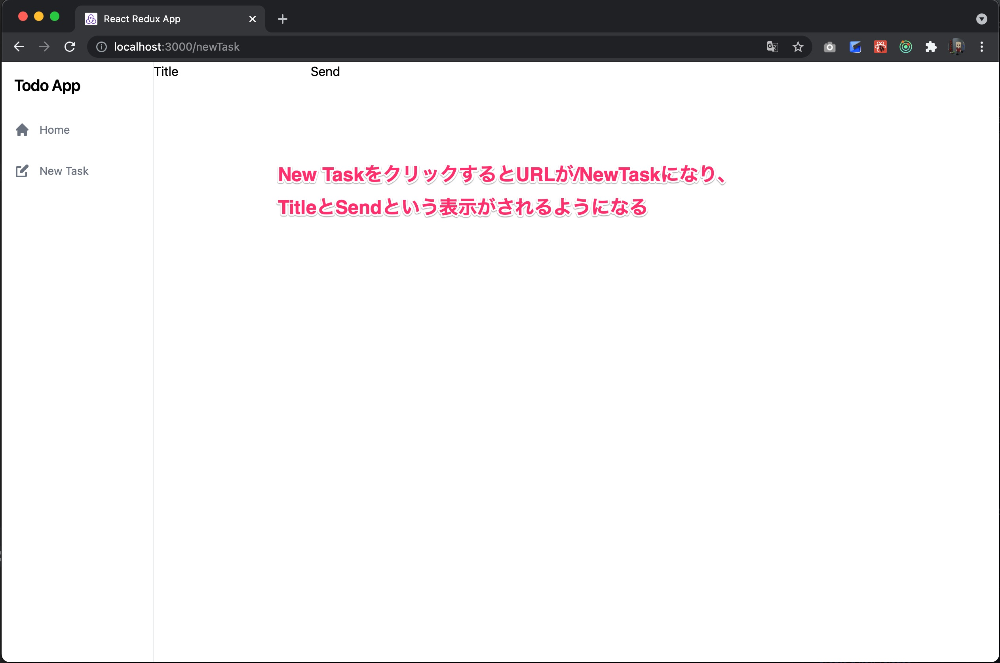

# 4日目

3日まででReact+Reduxで作ったフロントエンドとSpring Bootで作ったバックエンドを連携させることができました。
しかし、タスクを表示することができましたが、タスクを追加する機能がまだありません。
4日目からはどんどん機能を追加してみましょう。

## タスクの追加画面を作る

いまClientのアプリケーションにはまだルーターの機能がありません。
例えば、 [http://localhost:3000/](http://localhost:3000/) にアクセスしてもHome画面が表示されていますし、
[http://localhost:3000/hogehoge](http://localhost:3000/hogehoge) にアクセスしてもHome画面が表示されます。

これはちょっとイケてないので、ルーターの機能を実装してみます。
ここでは [http://localhost:3000/](http://localhost:3000/) にアクセスするとHome画面が、
そして [http://localhost:3000/newTask](http://localhost:3000/newTask) にアクセスするとタスク管理画面が開くようにしてみましょう。

### ルーターの導入

ルーターの実装には [react-router-dom](https://reactrouter.com/) が必要なので、これを導入します。
これはルーティング機能もDOMとして宣言してしまうライブラリです。
これだけどあまりピンとこないと思いますので、どういう実装になるのかを実際に見てもらった方が早いと思います。

まずreact-router-domを導入します。

```shell
npm install react-router-dom @types/react-router-dom
```

そして、App.tsxを以下のように編集してみましょう

```typescript jsx
// App.tsx
import {BrowserRouter, Route, Switch} from "react-router-dom";
import Home from './pages/Home'

function App() {
  return (
    <div className="App">
      <BrowserRouter>
        <Switch>
          <Route path="/" exact render={() => <Home/>} />
        </Switch>
      </BrowserRouter>
    </div>
  )
}

export default App
```

この状態で [http://localhost:3000/](http://localhost:3000/) にアクセスするとHome画面が表示されます。ここはこれまでの動作と変わりません。
そこで [http://localhost:3000/hoge](http://localhost:3000/hoge) にアクセスすると、先程と代わって真っ白な画面になると思います。

つまりこれは`/`というパスだったらホームコンポーネントを表示するよという設定なわけです。

### ヘッダーの作り込み

ではヘッダーにメニューを作り込んでいきましょう。
せっかくなので、ここでデザインも作り込んでいきます。

まずテストから。

```typescript jsx
// Header.test.tsx
import {cleanup, screen} from '@testing-library/react'  // 変更
import Header from '../../components/Header'
import { render } from '../../test-utils'   // 追加

describe('Header', () => {
  afterEach(() => {
    cleanup()
  })

  it('ヘッダーの初期表示', () => {
    render(<Header />)
    expect(screen.getByText('Todo App')).toBeInTheDocument()
    expect(screen.getByText('Home').closest('a')).toHaveAttribute('href', '/')            // 追加
    expect(screen.getByText('New Task').closest('a')).toHaveAttribute('href', '/newTask') // 追加
  })
})
```

ヘッダーに`/`へのリンクと、`/newTask`へのリンクがあることを確認するテストを追加しました。

テストが書けたら実装も追加します。
今回はicon画像を使いたいので、[HeroIcons](https://heroicons.com/) を導入してから、Header.tsxを編集します。

```shell
npm install @heroicons/react
```

```typescript jsx
// Header.tsx
import {Link} from "react-router-dom";
import {HomeIcon, PencilAltIcon} from "@heroicons/react/solid";

const Header = () => (
  <div data-testid="Header" className="h-screen w-48 border-r bg-white">
    <h1 className="font-semibold p-4 text-xl tracking-tight">Todo App</h1>
    <div className="h-3/4 flex flex-col justify-start text-gray-500">
      <Link to="/" className="p-4 hover:bg-gray-100 hover:text-gray-700 transition duration-200 ease-in">
        <h2 className="text-sm flex items-center">
          <HomeIcon className="w-5 mr-3"/>
          <span className="hover:text-black transition duration-200 ease-linear">Home</span>
        </h2>
      </Link>
      <Link to="/newTask" className="p-4 hover:bg-gray-100 hover:text-gray-700 transition duration-200 ease-in">
        <h2 className="text-sm flex items-center">
          <PencilAltIcon className="w-5 mr-3"/>
          <span className="hover:text-black transition duration-200 ease-linear">New Task</span>
        </h2>
      </Link>
    </div>
  </div>
)

export default Header
```

しかし、このテストはそもそもレンダーで失敗します。

```
  ● Header › ヘッダーの初期表示

    Invariant failed: You should not use <Link> outside a <Router>

      18 |     return <Provider store={store}>{children}</Provider>
      19 |   }
    > 20 |   return rtlRender(ui, {wrapper: Wrapper, ...renderOptions})
         |          ^
      21 | }
      22 |
      23 | export * from '@testing-library/react'
```

Routerに依存しているのでLinkがRouterに依存しているのにそれを無視してレンダリングしようとしたからですね。
というわけで、test-utils.jsxも編集してしまいましょう。

```javascript
// test-utils.jsx
import {render as rtlRender} from '@testing-library/react'
import {configureStore} from '@reduxjs/toolkit'
import {Provider} from 'react-redux'
import todoSlice from './stores/todoSlice'
import {BrowserRouter} from 'react-router-dom'

function render(
    ui,
    {
        preloadedState,
        store = configureStore({
            reducer: {todos: todoSlice.reducer},
            preloadedState,
        }),
        ...renderOptions
    } = {}
) {
    function Wrapper({children}) {
        return (
            <Provider store={store}>
                <BrowserRouter>{children}</BrowserRouter>
            </Provider>
        )
    }
    return rtlRender(ui, {wrapper: Wrapper, ...renderOptions})
}

export * from '@testing-library/react'
export {render}
```

これでひとまずテストは通ったと思います。


メニューができて芋っぽさがなくなりました。しかし、New Taskをクリックすると真っ白な画面になってしまいます。

ここまでのソースは
[https://github.com/Onebase-Fujitsu/todo-app-client/tree/step5](https://github.com/Onebase-Fujitsu/todo-app-client/tree/step5)
に置いてあります。

### タスク作成画面の作成

では次にタスク作成画面を作成しましょう。まず、タスク作成画面のテストを作成します。
page配下にNewTask.test.tsxを作成しましょう。

```typescript jsx
// NewTask.test.tsx
import {cleanup, screen} from '@testing-library/react'
import {render} from '../../test-utils'

describe('タスク作成画面', () => {

    afterEach(() => {
        cleanup()
    })

    it('画面構成', async () => {
        render(<NewTask />)

        expect(screen.queryByTestId('Header')).toBeTruthy()
        expect(screen.queryByTestId('NewTaskForm')).toBeInTheDocument()
    })
})
```

画面のテスト内容はHeaderとタスクを入力するFormコンポーネントで構成されていることというテストにしました。
もちろん、NewTaskコンポーネントも、NewTaskFormコンポーネントもまだ無いためこのテストは失敗します。

まず、NewTaskFromコンポーネントを作成していきましょう。
components配下にNewTaskForm.tsxを作成します。

```typescript jsx
// NewTaskFrom.tsx
const NewTaskForm = () => {

  return (
    <form data-testid="NewTaskForm" />
  )
}

export default NewTaskForm
```

いったん中身は空で大丈夫です。

その上で、page配下にNewTask.tsxを作成します。

```typescript jsx
// NewTask.tsx
import Header from '../components/Header'
import NewTaskForm from '../components/NewTaskForm'

const NewTask = () => (
  <div data-testid="NewTask" className="flex">
    <Header/>
    <NewTaskForm/>
  </div>
)

export default NewTask
```

これでNewTask.test.tsxにimportを追加すると、いったんテストは通るようになったのではないでしょうか？

次にFormコンポーネントを作り込んでいきましょう。
NewTaskFormコンポーネントにはタスクの入力とテキストボックスと、サーバに送信するボタンがあると良さそうなので、それをテストしていきます。

```typescript jsx
// NewTaskForm.test.tsx
import {cleanup, fireEvent, screen} from "@testing-library/react";
import {render} from "../../test-utils";
import NewTaskForm from "../../components/NewTaskForm";


describe('NewEntryFormコンポーネント', () => {
  afterEach(() => {
    cleanup()
  })

  it("初期表示", () => {
    render(<NewTaskForm/>)
    expect(screen.queryByLabelText('Title')).toBeTruthy()
    expect(screen.getByTestId("TitleInput")).toHaveValue('')
    expect(screen.queryByText('Send')).toBeTruthy()
  })

  it("タスク名を編集できる", () => {
    render(<NewTaskForm/>)
    fireEvent.change(screen.getByTestId('TitleInput'), {target: {value: 'title text'}})
    expect(screen.getByTestId("TitleInput")).toHaveValue('title text')
  })
})
```

ではこれを実現するNewTaskFormを実装しましょう。

```typescript jsx
// NewTaskForm.tsx
import {useState} from 'react'

const NewTaskForm = () => {
  const [taskInput, setTaskInput] = useState('')

  return (
    <form data-testid="NewTaskForm">
      <label htmlFor="titleInput">Title</label>
      <input id="titleInput" data-testid="TitleInput" type="text" value={taskInput}
             onChange={(event) => setTaskInput(event.target.value)}/>
      <button type="button">
        Send
      </button>
    </form>
  )
}

export default NewTaskForm
```

こんな感じでしょうか。これでテストは通ると思います。

しかしこの時点ではまだ、NewTask画面がRouterに組み込まれていませんので、メニューをクリックしても白い画面のままです。
メニューに組み込んでいきましょう。

```typescript jsx
// App.tsx
import {BrowserRouter, Route, Switch} from 'react-router-dom'
import Home from './pages/Home'
import NewTask from "./pages/NewTask";    // 追記

function App() {
  return (
    <div className="App">
      <BrowserRouter>
        <Switch>
          <Route path="/" exact render={() => <Home />} />
          <Route path="/newTask" exact render={() => <NewTask />} />    // 追記
        </Switch>
      </BrowserRouter>
    </div>
  )
}

export default App
```

App.tsxにルーティング設定を追加しました。この状態でメニューをクリックすると画面が切り替わるようになったはずです。



せっかくなのでフォームにデザインを適用してみます。

```typescript jsx
// NewTaskForm.tsx
import {useState} from 'react'

const NewTaskForm = () => {
  const [taskInput, setTaskInput] = useState('')

  return (
    <form data-testid="NewTaskForm" className="w-full p-8">
      <div className="flex flex-wrap -mx-3 mb-6">
        <div className="w-full px-3">
          <label
            className="block uppercase tracking-wide text-gray-700 text-xs font-bold mb-2"
            htmlFor="titleInput"
          >
            Title
          </label>
          <input
            className="appearance-none block w-full bg-gray-200 text-gray-700 border border-gray-200 rounded py-3 px-4 mb-3 leading-tight focus:outline-none focus:bg-white focus:border-gray-500"
            id="titleInput"
            data-testid="TitleInput"
            type="text"
            value={taskInput}
            onChange={(event) => setTaskInput(event.target.value)}
          />
        </div>
      </div>
      <div className="md:flex md:items-center">
        <div className="md:w-1/3">
          <button
            className="shadow bg-green-400 hover:bg-green-400 focus:shadow-outline focus:outline-none text-white font-bold py-2 px-4 rounded"
            type="button"
          >
            Send
          </button>
        </div>
      </div>
    </form>
  )
}

export default NewTaskForm
```


デザインが適用されてだいぶアプリっぽくなりましたね。

ここまでのソースは
[https://github.com/Onebase-Fujitsu/todo-app-client/tree/step6](https://github.com/Onebase-Fujitsu/todo-app-client/tree/step6)
に置いてあります。

## タスク作成機能の作成

### APIの作成
まずAPIへのリクエスト処理のテストと実装をやっていきましょう。

```typescript
// TodoApi.test.ts
import MockAdapter from 'axios-mock-adapter'
import axios from 'axios'
import {getTodos, postTodos} from '../../features/TodoApi'

describe('TodoApi', () => {
  
  // 中略
  it('post /todos', async () => {
    mock.onPost('/todos', {title: 'title'}).reply(201,
      {
        id: 1,
        title: 'title',
        completed: false
      })

    const response = await postTodos('title')

    expect(mock.history.post[0].url).toEqual('/todos')
    expect(mock.history.post[0].data).toEqual(JSON.stringify({title: 'title'}))
    expect(mock.history.post[0].headers['Content-Type']).toEqual("application/json")
    expect(mock.history.post[0].headers['X-Requested-With']).toEqual("XMLHttpRequest")
    expect(response.id).toEqual(1)
    expect(response.title).toEqual('title')
    expect(response.completed).toEqual(false)
  })
})
```

`postTodos()`はtitleをパラメータとしてもらって、それをJSONに整形して送信していることを確認するテストを書きました。
また、Headerに`Content-Type: application/json`が設定されていることを確認するテストも書いています。

```typescript
// TodoApi.ts
import axios from 'axios'
import {Todo} from '../stores/todoSlice'

export const getTodos = async () => {
  const response = await axios.get<Todo[]>('/todos')
  return response.data
}

export const postTodos = async (title: string) => {
  const requestJson = {title}
  const headers = {
    'X-Requested-With': 'XMLHttpRequest',
    'Content-Type': 'application/json',
  }
  const response = await axios.post<Todo>('/todos', JSON.stringify(requestJson), {headers})
  return response.data
}
```

このテストを満たす実装はこのようになります。これでAPIを呼ぶ処理はできました。

### Reducerへの登録

では次にReducerにこれを登録していきましょう。まずはテストから。

```typescript
// todoSlice.test.ts
import todoSlice, {getTodoAction, postTodoAction} from '../../stores/todoSlice'

describe('todo reducer', () => {
  
  // 中略
  
  it('post todo is pending', async () => {
    const action = {type: postTodoAction.pending.type}
    const state = todoSlice.reducer([], action)
    expect(state.length).toEqual(0)
  })

  it('post todo is fulfilled', async () => {
    const action = {
      type: postTodoAction.fulfilled.type,
      payload:
        {
          id: 2,
          title: 'hoge',
          completed: false,
        },
    }

    const initialState = [{
      id: 1,
      title: 'title',
      completed: false
    }]
    const state = todoSlice.reducer(initialState, action)
    expect(state.length).toEqual(2)
    expect(state[0].id).toEqual(1)
    expect(state[0].title).toEqual('title')
    expect(state[0].completed).toEqual(false)
    expect(state[1].id).toEqual(2)
    expect(state[1].title).toEqual('hoge')
    expect(state[1].completed).toEqual(false)
  })

  it('post todo is rejected', async () => {
    const action = {type: postTodoAction.rejected.type}
    const state = todoSlice.reducer([], action)
    expect(state.length).toEqual(0)
  })
})
```

3件のテストを追加しました。
getのテストと違って、成功したときに**既存のStateにサーバからの戻り値を追加する差分更新のテストにしています。**
差分更新にしているというのが結構大事です。APIの設計については後述します。

```typescript
// todoSlice.ts
import {createAsyncThunk, createSlice} from '@reduxjs/toolkit'
import {getTodos, postTodos} from '../features/TodoApi'

export interface Todo {
  id: number
  title: string
  completed: boolean
}

export const getTodoAction = createAsyncThunk<Todo[]>(
  'get /todos',
  async (): Promise<Todo[]> => getTodos()
)

export const postTodoAction = createAsyncThunk<Todo, {title: string}>(
  'post /todos',
  async (arg): Promise<Todo> => postTodos(arg.title)
)

export const todoSlice = createSlice({
  name: 'todos',
  initialState: [] as Todo[],
  reducers: {},
  extraReducers: (builder) => {
    builder.addCase(getTodoAction.fulfilled, (state, action) => action.payload)
    builder.addCase(postTodoAction.fulfilled, (state, action) => [...state, action.payload])
  },
})

export default todoSlice
```

これを満たす実装はこのようになります。


**Reducerの書き方について**

StateはImmutableであり変更不可です。ReducerであってもStateを直接更新してはいけません。必ず新しいStateを作成して返す必要があります。

つまり、**`(state, action) => state.push(action.payload)`のような記述は厳禁**ですので気をつけてください。


### タスク作成フォームへの組み込み

最後に、作成ボタンを押したらこれを呼び出す処理を書いていきましょう。


```typescript jsx
// NewTaskForm.test.tsx
import {cleanup, fireEvent, screen} from '@testing-library/react'
import MockAdapter from "axios-mock-adapter";
import axios from "axios";
import NewTaskForm from '../../components/NewTaskForm'
import {render} from '../../test-utils'

describe('NewEntryFormコンポーネント', () => {
  let mock: MockAdapter

  beforeEach(() => {
    mock = new MockAdapter(axios)
  })

  afterEach(() => {
    mock.reset()
    cleanup()
  })

  it('初期表示', () => {
    render(<NewTaskForm />)
    expect(screen.queryByLabelText('Title')).toBeTruthy()
    expect(screen.getByTestId('TitleInput')).toHaveValue('')
    expect(screen.queryByText('Send')).toBeTruthy()
  })

  it('タスク名を編集できる', () => {
    render(<NewTaskForm />)
    fireEvent.change(screen.getByTestId('TitleInput'), {
      target: {value: 'title text'},
    })
    expect(screen.getByTestId('TitleInput')).toHaveValue('title text')
  })

  it("作成ボタンを押したら、作成がリクエストされる", async () => {
    render(<NewTaskForm />)
    fireEvent.change(screen.getByTestId('TitleInput'), {
      target: {value: 'title text'},
    })
    fireEvent.click(screen.getByText('Send'))
    expect(mock.history.post[0].url).toEqual('/todos')
    expect(mock.history.post[0].data).toEqual(JSON.stringify({title: 'title text'}))
  })
})
```

タスク名入力欄に文字を入力して、Sendボタンをクリックしたら`/todos`にJSONをPOSTしていることを確認するテストを追加しました。

```typescript jsx
// NewTaskForm.tsx
import {useState} from 'react'
import {useDispatch} from "react-redux";
import {AppDispatch} from "../stores/store";
import {postTodoAction} from "../stores/todoSlice";

const NewTaskForm = () => {
  const [taskInput, setTaskInput] = useState('')
  const dispatch: AppDispatch = useDispatch()

  return (
    <form data-testid="NewTaskForm" className="w-full p-8">
      <div className="flex flex-wrap -mx-3 mb-6">
        <div className="w-full px-3">
          <label
            className="block uppercase tracking-wide text-gray-700 text-xs font-bold mb-2"
            htmlFor="titleInput"
          >
            Title
          </label>
          <input
            className="appearance-none block w-full bg-gray-200 text-gray-700 border border-gray-200 rounded py-3 px-4 mb-3 leading-tight focus:outline-none focus:bg-white focus:border-gray-500"
            id="titleInput"
            data-testid="TitleInput"
            type="text"
            value={taskInput}
            onChange={(event) => setTaskInput(event.target.value)}
          />
        </div>
      </div>
      <div className="md:flex md:items-center">
        <div className="md:w-1/3">
          <button
            className="shadow bg-green-400 hover:bg-green-400 focus:shadow-outline focus:outline-none text-white font-bold py-2 px-4 rounded"
            type="button"
            onClick={() => dispatch(postTodoAction({title: taskInput}))}
          >
            Send
          </button>
        </div>
      </div>
    </form>
  )
}

export default NewTaskForm
```

実装はこのようになります。buttonをonClickしたときにpostTodoActionをdispatchするだけですね。


画面を描画して作成画面を開きSendボタンをクリックすると、タスクが送信されていることが分かります。

## タスク一覧の取得タイミングの変更

今の実装では、タスク一覧画面を開いたときにタスクを全件取得しています。
画面を開く度に毎回全件取得のAPIを呼び出すのは非効率です。
全件取得するのは最初の一回で十分で、あとは差分更新にしたほうが効率的な処理ができます。

HTTP通信のオーバーヘッドはメモリアクセスや、ディスクアクセスと比較して比べ物にならないほど大きいです。
良くないAPIを揶揄する言葉に「おしゃべりなAPI」というものがあります。
つまり、画面を描画するのになんどもなんどもAPIをコールする必要があるAPI設計は良くないということです。

さきほど、作成したタスクをstateに対して差分更新できるようにしたのも余計な通信を発生させないためです。
もし、`POST /todos`が戻り値がなかったら、クライアントはIDを知るためだけに全件取得のAPIを呼び出さないといけなくなってしまいます。

すでに、POSTに成功したときに差分更新をするように実装してあるので、
タスク一覧を開いたときに毎回全件取得をするという処理から、画面を開いたときに一回だけ全件取得するという処理に変更しましょう。

といっても、これは非常に簡単で、Home.tsxにあったuseEffectの処理をApp.tsxに写すだけです。

```typescript jsx
// App.tsx
import {useDispatch} from "react-redux";
import {useEffect} from "react";
import {BrowserRouter, Route, Switch} from 'react-router-dom'
import Home from './pages/Home'
import NewTask from './pages/NewTask'
import {AppDispatch} from "./stores/store";
import {getTodoAction} from "./stores/todoSlice";

function App() {
  const dispatch: AppDispatch = useDispatch()

  useEffect(() => {
    dispatch(getTodoAction())
  })

  return (
    <div className="App">
      <BrowserRouter>
        <Switch>
          <Route path="/" exact render={() => <Home />} />
          <Route path="/newTask" exact render={() => <NewTask />} />
        </Switch>
      </BrowserRouter>
    </div>
  )
}

export default App
```

```typescript jsx
// Home.tsx
import Header from '../components/Header'
import TodoList from '../components/TodoList'

const Home = () => (
  <div data-testid="Home" className="flex">
    <Header/>
    <TodoList/>
  </div>
)

export default Home
```

Home.tsxがだいぶスッキリしました。テストも合わせて修正してしまいましょう。

```typescript jsx
// Home.test.tsx
import {cleanup, screen} from '@testing-library/react'
import {render} from '../../test-utils'
import Home from '../../pages/Home'

describe('Home画面', () => {
  afterEach(() => {
    cleanup()
  })

  it('画面構成', () => {
    render(<Home />)
    expect(screen.queryByTestId('Header')).toBeTruthy()
    expect(screen.queryByTestId('TodoList')).toBeTruthy()
  })
})
```

```typescript jsx
// App.test.tsx
import axios from "axios";
import MockAdapter from "axios-mock-adapter";
import {render} from "../test-utils";
import App from "../App";

describe('App', () => {
  let mock: MockAdapter

  beforeEach(() => {
    mock = new MockAdapter(axios)
  })

  afterEach(() => {
    mock.reset()
  })

  it('ホーム画面の初期表示', async () => {
    mock.onGet('/todos').reply(200, [
      {
        id: 1,
        title: 'title',
        completed: false,
      },
    ])
    const initialState = {todos: []}
    render(<App />, {preloadedState: initialState})

    expect(mock.history.get[0].url).toEqual('/todos')
  })
})
```

これでテストは通るようになったと思います。
ブラウザで動作を確認してみると、アプリケーションを開いた最初の一回だけ/todosにGETをしているのが確認でき、
メニューからページ遷移をしても/todosにGETはされないことが確認できるはずです。

ここまでのソースは
[https://github.com/Onebase-Fujitsu/todo-app-client/tree/step7](https://github.com/Onebase-Fujitsu/todo-app-client/tree/step7)
に置いてあります。

---

5日目に続きます

5日目