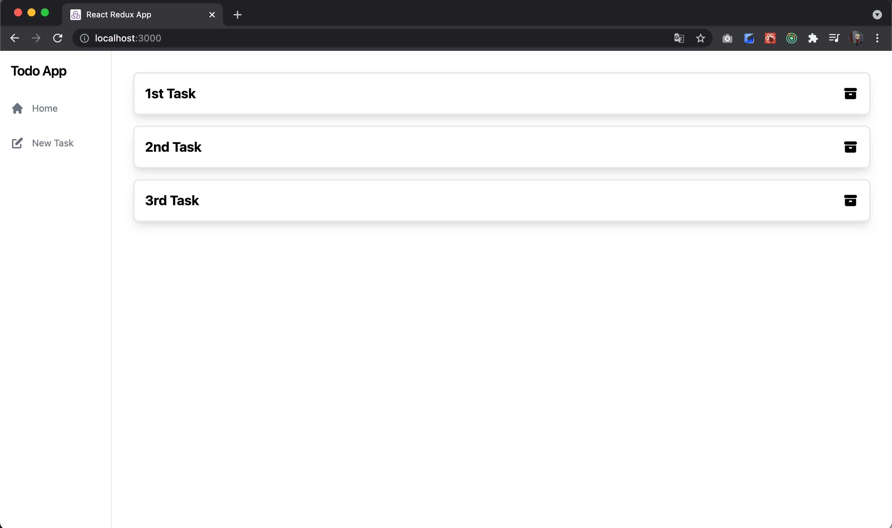

# 5日目

ではTodoを作成するバックエンドAPIを作成していきましょう。

## タスク作成バックエンドAPI

### テスト

まず、サーバのテストを書いてみましょう。
`POST /todos`に対してJSONをボディにセットして、リクエストしたときの、 レスポンスコードとレスポンスデータを確認するテストを書いてみます。

```kotlin
// TodoControllerTest.kt
package com.fujitsu.todoappserver.controller

import com.fasterxml.jackson.module.kotlin.jacksonObjectMapper
import com.fasterxml.jackson.module.kotlin.readValue
import com.fujitsu.todoappserver.model.Todo
import org.assertj.core.api.Assertions.assertThat
import org.json.JSONObject
import org.junit.jupiter.api.Test
import org.springframework.beans.factory.annotation.Autowired
import org.springframework.boot.test.context.SpringBootTest
import org.springframework.boot.test.web.client.TestRestTemplate
import org.springframework.http.*

@SpringBootTest(webEnvironment = SpringBootTest.WebEnvironment.RANDOM_PORT)
class TodoControllerTest {
    @Autowired
    lateinit var restTemplate: TestRestTemplate

    @Test
    fun タスク一覧を取得できる() {
        val header = HttpHeaders()
        header.contentType = MediaType.APPLICATION_JSON
        val response = restTemplate.exchange("/todos", HttpMethod.GET, HttpEntity(null, header), String::class.java)
        val mapper = jacksonObjectMapper()
        val articles: List<Todo> = mapper.readValue(response.body!!)
        assertThat(response.statusCode).isEqualTo(HttpStatus.OK)
        assertThat(articles.size).isEqualTo(0)
    }

    @Test
    fun タスクを新規作成できる() {
        val newTodoJson = JSONObject()
        newTodoJson.put("title", "test title")
        val header = HttpHeaders()
        header.contentType = MediaType.APPLICATION_JSON
        val postResponse = restTemplate.exchange(
            "/todos",
            HttpMethod.POST,
            HttpEntity(newTodoJson.toString(), header),
            String::class.java
        )
        val mapper = jacksonObjectMapper()
        val todo: Todo = mapper.readValue(postResponse.body!!)
        assertThat(postResponse.statusCode).isEqualTo(HttpStatus.CREATED)
        assertThat(todo.id).isEqualTo(1)
        assertThat(todo.title).isEqualTo("test title")
        assertThat(todo.completed).isEqualTo(false)
    }
}
```

これは先日書いた`Get /Todos`のテストと同等なので大丈夫でしょう。

### 実装

これも先日実装した`Get /Todos`とほぼ同等ですので、コードだけ示します。

#### Model

```kotlin
// NewTodo.kt
package com.fujitsu.todoappserver.model

data class NewTodo(
    val title: String,
)
```

#### Controller層

```kotlin
// TodoControllerInterface.kt
package com.fujitsu.todoappserver.controller

import com.fujitsu.todoappserver.model.NewTodo  // 追加
import com.fujitsu.todoappserver.model.Todo

interface TodoControllerInterface {
    fun getTodos(): List<Todo>
    fun createTodo(newTodo: NewTodo): Todo  // 追加
}
```

```kotlin
// TodoController.kt
package com.fujitsu.todoappserver.controller

import com.fujitsu.todoappserver.model.NewTodo
import com.fujitsu.todoappserver.model.Todo
import org.springframework.http.HttpStatus
import org.springframework.web.bind.annotation.*

@RestController
class TodoController(private val todoService: TodoControllerInterface) {
    @GetMapping("/todos")
    @ResponseStatus(HttpStatus.OK)
    fun getTodos(): List<Todo> {
        return todoService.getTodos()
    }

    // 追加
    @PostMapping("/todos")
    @ResponseStatus(HttpStatus.CREATED)
    fun createTodo(@RequestBody newTodo: NewTodo): Todo {
        return todoService.createTodo(newTodo)
    }
}
```

#### Service層

```kotlin
// TodoServiceInterface.kt
package com.fujitsu.todoappserver.service

import com.fujitsu.todoappserver.model.NewTodo  // 追加
import com.fujitsu.todoappserver.model.Todo

interface TodoServiceInterface {
    fun getTodos(): List<Todo>
    fun createTodo(newTodo: NewTodo): Todo      // 追加
}
```

```kotlin
// TodoService.kt
package com.fujitsu.todoappserver.service

import com.fujitsu.todoappserver.controller.TodoControllerInterface
import com.fujitsu.todoappserver.model.NewTodo  // 追加
import com.fujitsu.todoappserver.model.Todo
import org.springframework.stereotype.Service

@Service
class TodoService(private val todoRepository: TodoServiceInterface) : TodoControllerInterface {
    override fun getTodos(): List<Todo> {
        return todoRepository.getTodos()
    }

    // 追加
    override fun createTodo(newTodo: NewTodo): Todo {
        return todoRepository.createTodo(newTodo)
    }
}
```

##### Repository層

```kotlin
// TodoRepository.kt
package com.fujitsu.todoappserver.repository

import com.fujitsu.todoappserver.model.NewTodo  // 追加
import com.fujitsu.todoappserver.model.Todo
import com.fujitsu.todoappserver.service.TodoServiceInterface
import org.springframework.jdbc.core.JdbcTemplate
import org.springframework.jdbc.support.GeneratedKeyHolder
import org.springframework.stereotype.Repository
import java.sql.ResultSet
import java.sql.Statement

@Repository
class TodoRepository(val jdbcTemplate: JdbcTemplate) : TodoServiceInterface {
    override fun getTodos(): List<Todo> {
        return jdbcTemplate.query(
            """select id, title, completed from todo"""
        ) { rs: ResultSet, _: Int ->
            Todo(
                rs.getInt("id"),
                rs.getString("title"),
                rs.getBoolean("completed")
            )
        }
    }

    // 追加
    override fun createTodo(newTodo: NewTodo): Todo {
        val keyHolder = GeneratedKeyHolder()
        jdbcTemplate.update({ connection ->
            val statement = connection.prepareStatement(
                """insert into todo(title, completed) values (?, false)""", Statement.RETURN_GENERATED_KEYS
            )
            statement.setString(1, newTodo.title)
            statement
        }, keyHolder)
        return Todo(
            keyHolder.keys!!["id"] as Int,
            newTodo.title,
            false
        )
    }
}
```

リポジトリは少しテクニカルなことをしていて、insert文を実行したときにインクリメントされた`id`を返すようにしていて、 それを使って、戻り値を返すようにしています。

こうすると、データを作成した後にサイドselect文を発行する必要がなくなりレスポンスが早くなります。

### 再実行可能なテスト

さて、実装は完了したのでテストを動かして検証していきたいわけですが、このテストは問題なく動いているでしょうか？ このテストはデータベースの状態に強く依存していて、動く人もいれば動かない人もいます。
もし、運良くテストが動いた人も、もう一度全件テストを動かすと失敗するはずです。

これはテストを実行する度に、todo_dbに対してデータの追加を行っているからで、 一度todoテーブルに対してデータを追加すると、2回目以降はidが1にはならないからです。 つまり、これは再現可能なテストになっていません。

この問題に対処するにはテストを実行する度にDBをリセットしてしまえばいいので、その設定をしてみましょう。

まず、src/test配下に`resources`ディレクトリを作成し、その中に`clear_db.sql`を作成します。

```sql
/* clear_db.sql */
truncate table todo restart identity cascade;
```

やっている内容は単純でtodoテーブルの内容をtruncateすると共に、idのシーケンスをリセットしています。 そして、テストを実行する度にこのSQLを実行したらいいわけですが、これもアノテーションを付与するだけで簡単に実現できます。

```kotlin
// TodoControllerTest.kt
package com.fujitsu.todoappserver.controller

import com.fasterxml.jackson.module.kotlin.jacksonObjectMapper
import com.fasterxml.jackson.module.kotlin.readValue
import com.fujitsu.todoappserver.model.Todo
import org.assertj.core.api.Assertions.assertThat
import org.json.JSONObject
import org.junit.jupiter.api.Test
import org.springframework.beans.factory.annotation.Autowired
import org.springframework.boot.test.context.SpringBootTest
import org.springframework.boot.test.web.client.TestRestTemplate
import org.springframework.http.*
import org.springframework.test.context.jdbc.Sql    // 追加

@SpringBootTest(webEnvironment = SpringBootTest.WebEnvironment.RANDOM_PORT)
@Sql(scripts = ["/clear_db.sql"])       // 追加
class TodoControllerTest {
    @Autowired
    lateinit var restTemplate: TestRestTemplate

    @Test
    fun タスク一覧を取得できる() {
        val header = HttpHeaders()
        header.contentType = MediaType.APPLICATION_JSON
        val response = restTemplate.exchange("/todos", HttpMethod.GET, HttpEntity(null, header), String::class.java)
        val mapper = jacksonObjectMapper()
        val articles: List<Todo> = mapper.readValue(response.body!!)
        assertThat(response.statusCode).isEqualTo(HttpStatus.OK)
        assertThat(articles.size).isEqualTo(0)
    }

    @Test
    fun タスクを新規作成できる() {
        val newTodoJson = JSONObject()
        newTodoJson.put("title", "test title")
        val header = HttpHeaders()
        header.contentType = MediaType.APPLICATION_JSON
        val postResponse = restTemplate.exchange(
            "/todos",
            HttpMethod.POST,
            HttpEntity(newTodoJson.toString(), header),
            String::class.java
        )
        val mapper = jacksonObjectMapper()
        val todo: Todo = mapper.readValue(postResponse.body!!)
        assertThat(postResponse.statusCode).isEqualTo(HttpStatus.CREATED)
        assertThat(todo.id).isEqualTo(1)
        assertThat(todo.title).isEqualTo("test title")
        assertThat(todo.completed).isEqualTo(false)
    }
}
```

これでテストは動くはずです。データを追加できるようになったため、データを追加した後Getでレスポンスデータを確認するテストを追記しても良いでしょう。

ここまでのサーバのソースコードは
[https://github.com/Onebase-Fujitsu/todo-app-server/tree/step3](https://github.com/Onebase-Fujitsu/todo-app-server/tree/step3)
においてあります。

## タスク画面のデザインの適用


現在クライアントを連携させると、NewTask画面で追加したタスクがHome画面に追加できていることがわかります。 しかし、デザインがまだ適用されていないので、デザインを適用してみましょう。

```typescript jsx
// TodoList.tsx
import React from 'react'
import styled from 'styled-components'
import {TodoContext} from '../context/TodoContext'

const Ul = styled.ul`
  width: 100%;
  padding: 2rem;
  display: flex;
  flex-direction: column;
`

const Li = styled.li`
  width: 100%;
  display: flex;
  justify-content: center;
  align-items: center;
  padding-bottom: 1rem;
`

const Div =styled.div`
  width: 100%;
  display: flex;
  border-width: 2px;
  border-style: solid;
  border-color: #E5E7EB;
  border-radius: 0.5rem;
  padding: 1rem;
  box-shadow: 0 1px 5px 2px rgb(0 0 0 / 0.1);
`

const Label = styled.label`
  display: inline-flex;
  align-items: center;
  margin-right: 1rem;
`

const Input = styled.input`
  height: 1.25rem;
  width: 1.25rem;
  color: #4B5563;
`
const P = styled.p`
  font-size: 1.25rem;
  line-height: 1.75rem;
  font-weight: 700;
`
const TodoList = () => {
  const todoContext = React.useContext(TodoContext)
  return (
    <Ul data-testid="TodoList">
      {todoContext?.todos.map((todo) => (
        <Li key={todo.id}>
          <Div>
            <Label>
              <Input type="checkbox" defaultChecked={todo.completed}/>
            </Label>
            <P>{todo.title}</P>
          </Div>
        </Li>
      ))}
    </Ul>
  )
}

export default TodoList
```

タスクリストにデザインを適用してみました。



ここまでのクライアントのソースコードは
[https://github.com/Onebase-Fujitsu/todo-app-client/tree/step8](https://github.com/Onebase-Fujitsu/todo-app-client/tree/step8)
に置いてあります。

## API設計

さて、ここまで`/todos`に対するGETの処理やPOSTの処理を実装しましたが、 ここで少し箸休めにAPIの設計について簡単に説明しようと思います。

とはいえAPI設計だけで本一冊書けるぐらいに奥が深い内容で、ここでは本当にさわりを紹介する程度にとどめます。 現代のWebアプリケーション開発に置いてAPI設計スキルはほぼ必須で避けて通ることはできませんので、
[Web API: The Good Parts](https://www.oreilly.co.jp/books/9784873116860/) 等の書籍を各自読みましょう。

### いいAPIの設計とは

4日目に以下のような文書を記載しました。

 HTTP通信のオーバーヘッドはメモリアクセスや、ディスクアクセスと比較して比べ物にならないほど大きいです。 良くないAPIを揶揄する言葉に「おしゃべりなAPI」というものがあります。
つまり、画面を描画するのになんどもなんどもAPIをコールする必要があるAPI設計は良くないということです。 

これはよくある悪いAPIの設計の話なのですが、逆にいいAPIとはなんでしょうか？

いいAPIの定義は人によって様々だと思いますが、筆者は **「開発者がドキュメントを見なくても自然に使えるAPI」** がいいAPIだと思っています。 自然に使えるというのは **つまりWeb標準に従っているAPI**
ということです。つまりRESTのアーキテクチャに従って設計しなさいということになります。

### リソース志向設計

RESTのキーとなる概念は**論理的に分割されたリソースをHTTPメソッド(GET/POST/PUT/DELETE)で操作する**ということです。
RESTではURL部分を「リソース」とみなし、HTTPメソッドとURLの組み合わせを「なにを(リソース)」「どうする(メソッド)」という形式で捉えます。

#### リソース

リソースとはURLで表現されるAPIによって操作される対象のことです。 たとえば、今回のアプリケーションであればTodoがリソースに当たります。

#### メソッド

HTTPのメソッドは主に5つです。

|メソッドの種類|役割|
|:--|:--|
|GET|リソースの取得|
|POST|リソースの新規作成|
|PATCH|リソースの一分更新|
|PUT|リソースの置き換え|
|DELETE|リソースの削除|

これらのメソッドを使って、リソースに対する操作を表現していきます。 例えば今回のタスク管理アプリケーションですと、以下のようになります。

- GET /todos
  - Todoのリストを取得する
- GET /todos/1
  - Todo#1を取得する
- POST /todos
  - 新規のTodoを作成する
- PUT /todos/2
  - Todo#2を更新する
- DELETE /todos/3
  - Todo#3を削除する

RESTはHTTPメソッドを活用することで、`/todos`というエンドポイントに対して主要な機能をもたせることができます。 リソースに対する命令をHTTPのメソッドで表現するという形です。
こうすることで、エンドポイントの命名規則など意識する必要ありませんし、URL 構造は明白かつ整然としたものとなります。

Todoに関連データがあった場合はどうでしょうか。例えば1つのTodoには複数のタスクから構成されるといったリソースを考えてみましょう。 その場合は以下のように表現されるのが自然です。

- GET /todos/1/tasks
  - Todo#1に紐づくタスクのリストを取得する
- GET /todos/1/tasks/5
  - Todo#1に紐づくタスク#5を取得する
- POST /todos/1/tasks
  - Todo#1に紐づくタスクを新規作成する
- PUT /todos/1/tasks/4
  - Todo#1に紐づくタスク#4を更新する
- PATCH /todos/1
  - Todo#1のリソースを部分的に更新する
- DELETE /todos/1/tasks/2
  - Todo#1に紐づくタスク#2を削除する

### パラメータ

クライアントからサーバに対してAPIリクエストをする際に、クライアントからサーバに渡すことができるパラメータは3つあります。

- パスパラメータ
- クエリパラメータ
- リクエストボディ

それぞれどのように使うのが適当かについて説明していきましょう。

#### クエリパラメータ

クエリパラメータはクエリという名前の示すとおり、**リソースの絞り込みに使う** ものです。

```
GET /todos?completed=false
```

このようにURLに`?`続くかたちでパラメータを与えることができます。 ここで大事なのは絞り込みの用途で使われるべきであるということです。

`GET /todos`というAPIはTodo一覧を返すわけですが、その一覧の要素をクエリパラメータを使って絞り込む用途で使います。
`GET /todos?completed=false`という命令は/todosの中から未完了のものだけをリストで返してほしいという命令になるわけです。

取得リソースの絞り込みにつかうため、必然的に**GETメソッド以外ではクエリパラメータを使うことはありません。**

#### パスパラメータ

**パスパラーメタはリソースの指定をおこなう** ためのものです。 先程、`GET /todos/1`という例をだしましたが、これはTodo#1を取得するという命令でした。 このurlに含まれる`1`
というのはクライアントが指定できるパラメータで、 汎用的に書くとつまり`GET /todos/${id}`という形で記述することができます。 パスに入れることで、特定のリソースに対する命令であることを明確にしていることがわかると思います。

クエリパラメータは原則GETメソッドでしか使えませんでしたが、パスパラメータはどのようなメソッドでも使うことができます。 パスパラメータが設定されているエンドポイントにおいて、パスパラメータは原則必須になるという特徴も覚えておいてください。
つまり`GET /todos/`のような宣言は許可されません。

#### リクエストボディ

**リクエストボディはリソースの作成や、置換を行う際に、その内容を記載するものです。**

例えば、`POST /todos`のAPIを実行たときのリクエストボディは以下のようになっていました。

```json
{
  "title": "Sample Title"
}
```

基本的にはJSON形式を使うことが一般的です。JSON文書であればClientもServerも取り扱いです。 また、ファイルのアップロードなどを取り扱う場合はmultipart/form-dataといった形式が取られます。

### レスポンス設計

#### レスポンスステータス

APIにおいてとても大事なことはHTTPSレスポンスステータスコードをフル活用することです。 HTTPレスポンスステータスコードが何かわからない方もWebブラウザで404 Not
Foundが表示されたことがあるのを見たことがない人はいないと思います。

APIがクライアントにレスポンスを返すときに適切なステータスコードを返すようにする必要があります。

|ステータスコード|意味|
|:--|:--|
|200 OK|リクエスト成功|
|201 CREATED|リクエストに成功し、リソースを作成|
|204 NO CONTENT|リクエストは成功、返すコンテンツはない|
|400 BAD REQUEST|リクエストの形式エラー(クライアントのリクエストの誤り)|
|401 UNAUTHORIZED|未承認エラー|
|403 FORBIDDEN|権限エラー|
|404 NOT FOUND|リソースがない|
|500 Internal Server Error|サーバーエラー|

よく使われるのはこの辺になります。ステータスコードを適切に返すことで、 クライアントはレスポンスボディをみなくても、リクエストが成功したのか、失敗したときなぜ失敗したのかがわかるようになります。

どういったステータスコードがあるのかは
[https://developer.mozilla.org/ja/docs/Web/HTTP/Status](https://developer.mozilla.org/ja/docs/Web/HTTP/Status)
をみて、適切なものを選ぶようにしてください

#### レスポンスデータの設計

##### リストを返すエンドポイント
レスポンスデータは基本的にJSONで返すようにします。少し前まではXMLも使われることが多かったですが、今はJSON一択でよいです。 たとえば、`GET /todos`
にアクセスした場合、このエンドポイントはリストを返すエンドポイントですので、以下のようなレスポンスを返すように設計すると良いです。

```json
[
  {
    "id": 1,
    "title": "todo title#1",
    "completed": false
  },
  {
    "id": 2,
    "title": "todo title#2",
    "completed": false
  },
  {
    "id": 3,
    "title": "todo title#3",
    "completed": false
  }
]
```

リストのエンドポイントを設計する際にエンベロープにくるむべきかそうしないべきかは議論が分かれるところです。 エンベロープとは以下のようなものです。

```json
{
  "todos": [
    {
      "id": 1,
      "title": "todo title#1",
      "completed": false
    },
    {
      "id": 2,
      "title": "todo title#2",
      "completed": false
    },
    {
      "id": 3,
      "title": "todo title#3",
      "completed": false
    }
  ]
}
```

しかし、筆者はエンベロープは不要と考えています。クライアントはTodoのリストを取得したくて、`GET /todos`にアクセスしているのですから、
リストがTodoのリストであることは自明であるためです。

##### オブジェクトを返すエンドポイント
`GET /todos/1`というように特定のリソースを取得するようなエンドポイントの場合は、
配列ではなくオブジェクトを返すのが適当です。
即ち、いかのようなレスポンスボディを返すと良いです。

```json
{
  "id": 1,
  "title": "todo title#1",
  "completed": false
}
```

#### レスポンス設計の難しさ

では、Todoのリストが空だった場合はどういったレスポンスを返すべきでしょうか？
404を返すべきでしょうか？200で空のリストを返すべきでしょうか？

これも議論が分かれるところですが、筆者はレスポンスステータス200で空の配列を返すべきだと考えています。

では`GET /todos/13`というリクエストに対して、該当するTodoがない場合はどうでしょう？

これは筆者は404を返すのが適当かなと思います。リソースを指定して取得してきてるリクエストに対して、そのリソースがないと返すのが自然なためです。

では`GET /todos?id=13`というリクエストに対して、該当するTodoがない場合はどうでしょうか？
404 Not Foundを返すのが適当でしょうか？400 Bad Requestを返すのが適当でしょうか？200で空の配列を返すのが正しいでしょうか？

これも難しいところではありますが、200で空の配列を返すのが正しいと考えます。
リクエスト自体は正しいのですが、クエリの結果配列が空になってしまったという考え方になります。

このようにGETリクエスト一つとっても条件に応じて様々な考慮が必要になります。

### クライアントに忖度しない

APIのレスポンスデータを設計するにあたって一つ大事なポイントにクライアントに忖度しないというのがあります。
これはどういうことかというと、**一般的なデータ表現で、多くの情報を一度に返す**ということです。

#### 一般的なデータ形式を使う

例えば、クライアントの画面でTodoの作成日付を「2021年11月10日　13時20分」のように出力するという要件があったとします。
このとき、サーバはどういったデータ表現で日時情報を表すべきでしょうか？

```json
[
  {
    "id": 1,
    "title": "todo title#1",
    "completed": false,
    "createdAt": "2021年11月10日　13時20分"
  }
]
```

このようなJSONのレスポンスデータ設計は不適切です。というのも、Viewはアプリケーションの中でも特に変更の頻度が大きい部分です。
もし、このようなJSONレスポンスをしてしまうと、日付の表示形態を変更したいとなったときに、クライアントだけでなくサーバも影響を受けて変更しないといけなくなります。
データをうけてどのように表示するかを担うのはViewの部分。即ちClientになります。サーバはそれに忖度してはいけません。
例えば日時情報であればRFC 3339で定義されている`2021-11-10T04:20:00Z`ないし`2021-11-10T13:20:00+09:00`のようなフォーマットで返すべきです。

```json
[
  {
    "id": 1,
    "title": "todo title#1",
    "completed": false,
    "createdAt": "2021-11-10T04:20:00Z"
  }
]
```

#### 多くの情報を一度に返す
また、多くの情報を一度に返すとはどういうことかというと、画面に表示するかどうかに関わらずリソースに関わる情報を返すということです。
前述したように画面を描画するにあたって多くのAPIリクエストを必要とする**おしゃべりなAPI**は良くないAPIです。

HTTPのオーバーヘッドはとにかく大きいため、パフォーマンス向上のためにはいかにHTTP通信の回数を減らす方が大事になってきます。
画面を見るのは人間ですが、**JSONを処理するのは人間ではなくプログラム**です。
画面を描画するにあたって必要がなければ、プログラムで使わなければいいだけです。
プログラム相手に遠慮する必要はありません。多くの情報を一度に返しましょう。

### Swagger(OAS3.0)

APIの仕様記述の標準仕様に [Swagger](https://swagger.io/) があります。
SwaggerはAPI仕様定義のデファクトスタンダードで、JSONないしYAMLでAPIの仕様を記述することができます。
Swaggerの仕様については以下のリンクを参照してください。

[https://swagger.io/specification/](https://swagger.io/specification/)

APIの設計をするにあたって、[Swagger Editor](https://github.com/swagger-api/swagger-editor) を活用すると良いでしょう。
Dockerをインストールした上で、以下のコマンドを起動するとSwagger Editorを起動することができます。

```shell
docker pull swaggerapi/swagger-editor
docker run -d -p 80:8080 swaggerapi/swagger-editor
```


バックエンドの開発にあたっては、**Swagger Editorをつかって仕様を最初に設計を行い。チーム内でレビューないし合意をとってから開発するプロセスを強く推奨します。**
例として、今回のTodoアプリケーションのバックエンドAPI構成例を以下に記載します。

[openapi.yaml](openapi.yaml)

```YAML
openapi: 3.0.1
info:
  title: Todo App
  description: This is the backend API definition for the task management application.
  termsOfService: https://onebase-fujitsu.github.io/agile-dev-guide/
  license:
    name: Creative Commons BY-NC-SA 4.0
    url: https://creativecommons.org/licenses/by-nc-sa/4.0/
  version: 1.0.0
servers:
  - url: https://localhost:8080
tags:
  - name: todos
    description: API for managing todo
paths:
  /todos:
    get:
      tags:
        - todos
      summary: Get all todo list
      operationId: getTodos
      responses:
        200:
          description: OK
          content:
            application/json:
              schema:
                type: array
                items:
                  $ref: '#/components/schemas/Todo'
              example:
                [
                  {
                    id: 1,
                    title: "Tado Title#1",
                    completed: false
                  }
                ]
    post:
      tags:
        - todos
      summary: Add a new todo
      operationId: addTodos
      requestBody:
        description: Pet object that needs to be added to the store
        content:
          application/json:
            schema:
              type: object
              properties:
                title:
                  type: string
            example:
              {
                title: "Todo Title"
              }
        required: true
      responses:
        201:
          description: Created
          content:
            application/json:
              schema:
                $ref: '#/components/schemas/Todo'
              example:
                {
                  id: 1,
                  title: "Tado Title#1",
                  completed: false
                }
        400:
          description: Bad Request
  /todos/{id}:
    patch:
      tags:
        - todos
      summary: patch todo
      parameters:
        - name: id
          in: path
          schema:
            type: integer
            format: int32
          required: true
      requestBody:
        content:
          application/json:
            schema:
              type: object
              properties:
                title:
                  type: string
                completed:
                  type: boolean
            example:
              {
                completed: true
              }
      responses:
        204:
          description: Resource Updated
        400:
          description: Bad Request
        404:
          description: Resource Not Found
    delete:
      tags:
        - todos
      summary: delete todo
      parameters:
        - name: id
          in: path
          schema:
            type: integer
            format: int32
          required: true
      responses:
        204:
          description: Resource Deleted
        400:
          description: Bad Request
        404:
          description: Resource Not Found
components:
  schemas:
    Todo:
      type: object
      properties:
        id:
          type: integer
          format: int64
        title:
          type: string
        completed:
          type: boolean

```

APIの設計とSwaggerの仕様をきちんと理解することは非常に大事で、APIを外部に公開する際はこのSwaggerのyamlを公開することになります。
変な仕様書を公開するとかえって外部の開発者の混乱を招くことになります。Swagger(OAS3.0)以外の形式でAPI仕様を公開すべきではありません。
[Swagger UI](https://swagger.io/tools/swagger-ui/) のようにSwaggerの仕様を見やすく、そして使いやすく公開するためのツールもあります。

**APIの設計は標準仕様をよく目を通し、仕様に則ったものを作りましょう。**
設計したAPI仕様を読み、そしてAPIを使うのは一般のエンドユーザではなく開発者です。
開発者自身が使いやすくないAPIを作ってしまうと、とても外部の開発者に使ってもらうことは叶いません。
まずは、**開発者自身が使いやすいAPIを目指しましょう。**

---

6日目に続きます

6日目