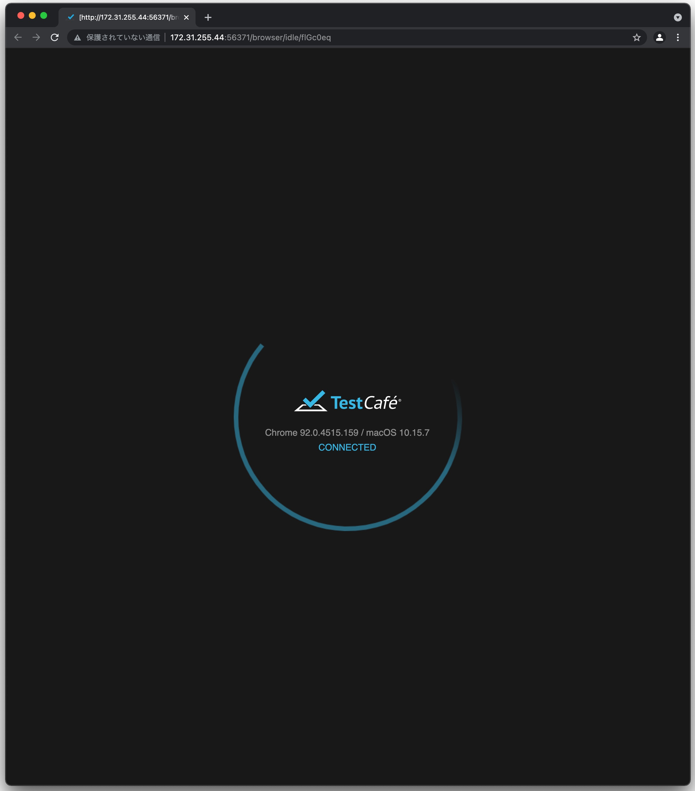

# 6日目

クライアントとサーバを連携させてタスクを作成することができるようになったので、シナリオテストを作成していきましょう。

## モノレポの作成

まず、これまで別に管理していたクライアントとサーバを一纏めにしたリポジトリを作りましょう。

```shell
mkdir todo-app
cd todo-app
git init
git submodule add https://github.com/Onebase-Fujitsu/todo-app-server.git server
git submodule add https://github.com/Onebase-Fujitsu/todo-app-client.git client
```

submoduleを追加できたたらserverとclientの依存ライブラリの解決をしておいてください。

```shell
cd client
npm install
```

```shell
cd server
./gradlew build
```

## e2eテストの環境構築

まずe2eテスト用の環境を作成していきましょう。

```shell
mkdir e2e
cd e2e
mkdir test
touch test/test.js 
npm init
```

`npm init`コマンドを実行すると、設定ダイアログが表示されるので、いったんすべて何も設定せずEnterを押下してpackage.jsonを作成。
その後、e2eテストライブラリのtestcafeを導入します。

```shell
npm install --save-dev testcafe
```

インストールが完了したら、package.jsonを以下のように編集します。

```json
{
  "name": "todo-app",
  "version": "1.0.0",
  "description": "",
  "main": "test/test.js",
  "scripts": {
    "test": "./node_modules/.bin/testcafe 'chrome' ./test"
  },
  "author": "",
  "license": "ISC",
  "devDependencies": {
    "testcafe": "^1.16.0"
  }
}
```

編集が完了したらe2eディレクトリで以下のコマンドを実行してみましょう。
Chromeが起動し画像のような画面が一瞬起動して閉じると環境の準備は完了です。

```shell
npm run test
```




ここまでのリポジトリは
[https://github.com/Onebase-Fujitsu/todo-app/tree/step1](https://github.com/Onebase-Fujitsu/todo-app/tree/step1)
においてあります。

## e2eテストの作成

では早速e2eテストを作成していきましょう。まず、トップページが表示されることを確認しましょう。
test.jsを以下のように変更します。

```javascript
// test.js
import { Selector } from 'testcafe';

fixture `test target`
    .page `http://localhost:3000`;

test('タスク一覧画面を見ることができる', async t => {
    await t
        .expect(Selector('body').withText('Todo App').exists).ok()
        .expect(Selector('a').withText("Home").exists).ok()
        .expect(Selector('a').withText("New Task").exists).ok()
})
```

そして**clientアプリとserverアプリを起動した状態で**`npm run test`コマンドを実行してみてください。
問題なければ、テストが成功するはずです。

```
onebase@Onebase-Maguro e2e % npm run test

> todo-app@1.0.0 test
> ./node_modules/.bin/testcafe 'chrome' ./test

 Running tests in:
 - Chrome 93.0.4577.82 / macOS 10.15.7

 test target
 ✓ タスク一覧画面を見ることができる


 1 passed (1s)
```

テストが通ったらさらにテストを追加して、タスクが追加できることを確認しましょう。

```javascript
// test.ts
import { Selector } from 'testcafe';

fixture `test target`
    .page `http://localhost:3000`;

test('タスク一覧画面を見ることができる', async t => {
    await t
        .expect(Selector('body').withText('Todo App').exists).ok()
        .expect(Selector('a').withText("Home").exists).ok()
        .expect(Selector('a').withText("New Task").exists).ok()
})

test('タスクを作成することができる', async t => {
    await t
        .click(Selector('a').withText("New Task"))
        .expect(Selector('input').exists).ok()
        .expect(Selector('button').withText("SEND").exists).ok()
        .typeText(Selector('input'), 'e2e test title', {replace: true})
        .click(Selector('button').withText("SEND"))
        .click(Selector('a').withText("Home"))
        .expect(Selector('ul').child().nth(-1).textContent).contains('e2e test title')
})
```

これも実行すると問題なく通るはずです。

