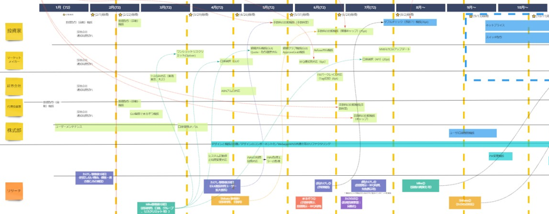

# プロダクトロードマップ

## 概要
プロダクトロードマップとは、プロダクトのビジョンを実現するための道のり（戦略）を明らかにするものです。
プロダクトのビジョンに向かって開発を進める手助けとなるような連続したゴールで構成し、時間ともにどのように進化していくかの見込みを示します。

プロダクトロードマップでは、複数の時間軸（現在、近い未来、遠い未来）で以下のような内容を整理します。
- アウトカム
- 解決する課題
- 成功の指標

> **時間軸の例**
> - 現在、3ヶ月後（ユーザーテストの開始）、7ヶ月後（本番運用の開始）
> - 現在、1ヶ月後、4ヶ月後（3ヶ月単位での予算確保に合わせて計画）

## なぜプロダクトロードマップ?
プロダクトロードマップは、変化が大きいプロダクトにおいて、3ヶ月後、半年後、1年後などの未来でプロダクトがどのようになっているかの意識を合わせるために使います。
関係者にプロダクトがいつどのような状態にする計画でいるかを共有することで、方向性について早い段階で会話をして意識を統一しながらビジネスニーズと優先順位に沿ったプロダクトを作り続けるのに役立ちます。
また、他チームとの作業の依存関係に課題を発見したり、直近の目標を可視化することでチームのモチベーションを維持したりすることができます。

## プロダクトロードマップのポイント
- ロードマップデザインの原則
  - ビジョンを実現するために計画している方向性を伝える

    プロダクトのあるべき姿（ビジョン）に到達することが重要であり、それに向けてどのように進めていくかを順序立てて関係者に伝えるようにします。
    複数の時間軸で何を優先していくかを明示すること。また、ビジョンやゴールなどとの関係がわかるようにするための情報を合わせて説明すると理解しやすくなります。

  - 不確実性と変化を想定し、学習と応答の度に最適化する

    プロダクトのあるべき姿に到達するまでの道のりは固定ではなく、また、初めに決めた通りに進めるのは困難です。
    プロダクトロードマップで可視化した戦略は、プロダクトの変化と得た学びをもって随時見直していきます。

  - アウトプットではなく、期待される、あるいは望ましいアウトカムに立脚した作業を組み立てる

    「追加する機能」にのみ着目して「ビジネスの視点やユーザーに対してもたらしたい結果」が抜ける、ということがないように注意が必要です。
    アウトカムを明確にすることで、ビジョン・ゴールに向けてどのような結果を求めていて、そのためにどのような機能・ソリューションを提供するかということをロジカルに説明でき、様々な関係者と共通の理解を生み出しやすくなります。
    また、アウトカムを中心に意思統一をすることで、それに向けた機能やソリューションは、チーム内でより柔軟に決断することができます。
    （ただし、エンドユーザーへの通知・紹介・問合せ対応などのために、具体的な機能の内容を関係者に共有することも必要です）

  - ロードマップの更新と共有がしやすいようにする

    ロードマップの内容は関係
    プロダクトのあるべき姿（ビジョン）に到達することが重要であり、それに向けてどのように進めていくかを順序立てて関係者に伝えるようにします。

- 測定可能な指標の設定

  

  プロダクトが正しい軌道に乗っているかどうかを確認ために、明確な目標と指標を持つ必要があります。
  重要なビジネス目標に対してどの程度うまくやっているかを評価するのに役立つ指標を設定します。
  良い指標を設定できると、そのために何をすべきかのアクションにつなげることができます。
  指標を設定する際はゴールやアクションに繋がることを意識し、その測定結果がただの数字にならないように注意します。
