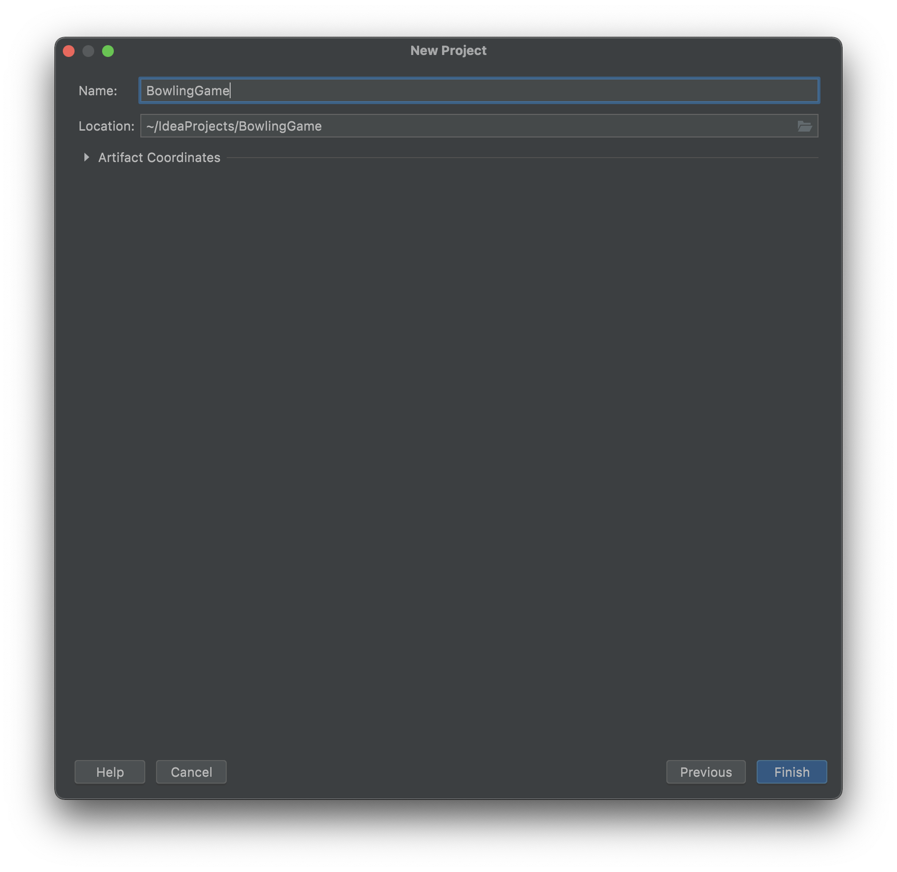
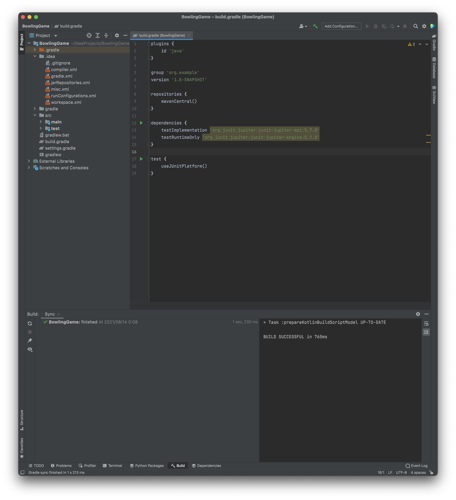

# ボウリングゲーム

最初の一歩ではウォーミングアップとしてFizzBuzzを書いてみました。
ここでは少しだけ難易度を上げたより実践的な例としてボウリングのスコア計算のプログラムを書いてみましょう。

これも [BowlingGameKata](http://butunclebob.com/ArticleS.UncleBob.TheBowlingGameKata) というRobert C.Martinという著名なソフトウェア開発者が提唱されてる、
とても有名な問題です。ここではJavaで書いてみますが、お好きな言語で挑戦されてみてください。

## ボウリングのルール

ボウリングのルールを知っているという方はここは読み飛ばしてもらって大丈夫です。

ボウリングはボールを10本のピンめがけて投げ、より多くのピンを倒すことを目的としたゲームです。
10フレームまであり、1フレームあたり最大2投して10本のピンをできるだけ多く倒します。

ボウリングのスコアは基本的には10フレーム目までに倒したピンの本数なのですが、いくつか特殊な条件があります。

各フレームの最初の投球で1度に10本すべて倒しきるとストライクになります。
ストライクを出すと倒した10点に加えて、次の2投分で倒したピンの本数がボーナスとして加算されます。
ストライクを出すとそのフレームは終わり2投目はありません。

また、各フレームの2投目で10本倒し切ると、スペアになります。
スペアを出すと倒した10点に加えて、次の1投で倒したピンの本数がボーナスとして加算されます。

最後の10フレーム目だけ特殊で10フレーム目でストライクを出すと追加で2投、スペアを出すと追加で1投することができます。
つまり、10フレーム目だけストライクかスペアを出すと3投することができ、出せなければ2投でおわります。

詳しくは [ボウリングのスコア計算](http://www.tokibow.com/tbchp/score.htm) を見てみてください。

## プロジェクトの作成

ここはFizzBuzzと同じです。プロジェクト名はBowlingGameにして新規Gradleプロジェクトを作ってください。






## ボウリングゲームの構造

まずボウリングのゲームをクラスで表現してみましょう。


classDiagram
Game "1" --> "10" Frame
Frame "1" --> "1..3" Throw


簡単なクラス図を書いてみました。ゲームは10のフレームオブジェクトからなり、
1フレームは1~3投のThrowオブジェクトからなりますね。

## Frameクラス

### 最初のテスト

では最初のテストを書いてみましょう。
Throwクラスはどんな振る舞いを持つでしょうか？
プレイヤーが倒したピンの本数を保持するぐらいですね（つまりPOJOになる）。
単に本数を保持するだけであればこのクラスに"振る舞い"は特にないですね。
振る舞いがないのであれば、依存関係チェーンを１つ上がってFrameに着目して見ましょう。

フレームオブジェクトはスコアを保持していて、倒したピンの本数や、フレームがストライクだったとか、
スペアだったのかとを教えてくれるというようなメソッドがあるとなんとなく良さそうです。

```java
// FrameTest.java
import org.junit.jupiter.api.Test;

import static org.assertj.core.api.AssertionsForClassTypes.assertThat;

public class FrameTest {
    @Test
    public void ピンを倒してなければそのフレームのスコアは0() {
        Frame f = new Frame();
        assertThat(f.getScore()).isEqualTo(0);
    }

    @Test
    public void ピンを1回倒したらその本数がスコアになる() {
        Frame f = new Frame();
        f.add(5);
        assertThat(f.getScore()).isEqualTo(5);
    }
}
```

まずは単純に倒したピンの本数をスコアとして保持してくれるというテストを書いてみました。
この時点ではFrameクラスもadd()メソッドも、getScore()メソッドもないので当然失敗します。

### 最初の実装

これを満たす最小限の実装を考えてみましょう。

```java
// Frame.java
public class Frame {
    private int score = 0;

    public int getScore() {
        return this.score;
    }

    public void add(int pins) {
        score += pins;
    }
}
```

こんな漢字のFrame.javaを作ってみました。これでとりあえずテストは通りますね。

## ストライクとスペアはどうする？

### クラスの構造
さて、Frameにスコアを保持することはできましたが、こうするとストライクやスペアのスコアをどうするかは難しい課題です。
異なるFrame同士をまとめるのはGameオブジェクトということになりますが、
GameはFrameに依存していて、FrameもまたGameに依存することになります。


classDiagram
    Game --> Frame
    Frame --> Game
    Frame --> Throw


クラス図で書くとこうなってしまいます。これはいただけないですね。GameとFrameが密結合になってしまっています。
これを解決する方法としてはFrameを連結リストにしてしまうという方法がありますね。
つまりFrameに前後のフレームへのポインタを保持しておいて、Frameのスコアを計算するときは、
後のフレームのピンの本数を連結リストを辿って取得するという方法ですね。


graph LR
    Frame1 --> Frame2
    Frame2 --> Frame3
    Frame3 --> Frame4
    Frame4 --> ...


こうすると、結構複雑なプログラムになりそうな気がしますね。
例えばストライクを3連続出したとすると、最初のフレームのFrameのスコアを計算するのに、
次のFrameを連結リストから辿って、そのFrameがストライクだったら、更に次のFrameを連結リストから辿って、
そのFrameの1投目のスコアを取ってきて...というロジックになります。

いったん、ここまでの作業を中断してGame側で投球を管理するようにしてみましょう。
もし、Gameを作業するなかでFrameの連結リストへの必要性が出てきたら、改めて考えてみることにしましょう。

### Gameの最初のテスト

Gameのテストを書いてみました。といっても先のFrameのテストとやってることは変わりませんね。
テストのタイトルと、クラス名や変数名が変わっただけです。

```java
// GameTest.java
import org.junit.jupiter.api.Test;

import static org.assertj.core.api.AssertionsForClassTypes.assertThat;

public class GameTest {
    @Test
    public void ピンを倒してなければゲームのスコアは0() {
        Game game = new Game();
        assertThat(game.getScore()).isEqualTo(0);
    }

    @Test
    public void ピンを1回倒したらそれがゲームのスコアになる() {
        Game game = new Game();
        game.add(5);
        assertThat(game.getScore()).isEqualTo(5);
    }
}
```

### Gameの最初の実装

テストが失敗するのを確認したらGameクラスを実装してみます。これもFrameと同じですね。

```java
// Game.java
public class Game {
    private int score = 0;

    public int getScore() {
        return this.score;
    }

    public void add(int pins) {
        score += pins;
    }
}
```

### 最後までゲームをやりきる

今のテストはボールを1回投げたテストしかありませんが、すでにボールを複数回投げることにも対応してそうですね。
テストを補強して最後までゲームをやりきってみましょう。

```java
// GameTest.java
import org.junit.jupiter.api.Test;

import static org.assertj.core.api.AssertionsForClassTypes.assertThat;

public class GameTest {
    @Test
    public void すべて0本だったら最終スコアは0() {
        Game game = new Game();
        for (int i = 0; i < 20; i++) {
            game.add(0);
        }
        assertThat(game.getScore()).isEqualTo(0);
    }

    @Test
    public void ピンを毎回1本倒したらゲームのスコアは20() {
        Game game = new Game();
        for (int i = 0; i < 20; i++) {
            game.add(1);
        }
        assertThat(game.getScore()).isEqualTo(20);
    }
}
```

ボールを20回投げるようになりました。問題なくテストが通りますね。

### スペアのテスト

では早速スペアをやってみましょう。まずテストを書いてみます。

```java
// GameTest.java
import org.junit.jupiter.api.Test;

import static org.assertj.core.api.AssertionsForClassTypes.assertThat;

public class GameTest {
    @Test
    public void すべて0本だったら最終スコアは0() {
        Game game = new Game();
        for (int i = 0; i < 20; i++) {
            game.add(0);
        }
        assertThat(game.getScore()).isEqualTo(0);
    }

    @Test
    public void ピンを毎回1本倒したらゲームのスコアは20() {
        Game game = new Game();
        for (int i = 0; i < 20; i++) {
            game.add(1);
        }
        assertThat(game.getScore()).isEqualTo(20);
    }

    @Test
    public void スペアを1回だすと次の投球がボーナスとして加算される() {
        Game game = new Game();
        game.add(5);
        game.add(5);
        game.add(3);
        for (int i = 0; i < 17; i++) {
            game.add(0);
        }
        assertThat(game.getScore()).isEqualTo(16);
    }
}
```

テストとしてはこんな感じになります。
毎回Gameのインスタンスを作ったり、同じ投球をたくさん繰り返すのがちょっと大変になってきましたね。
また、Gameに対してaddするというメソッド名もチグハグな感じがします。
軽くリファクタリングしてみましょう。

```java
// GameTest.java
import org.junit.jupiter.api.BeforeEach;
import org.junit.jupiter.api.Test;

import static org.assertj.core.api.AssertionsForClassTypes.assertThat;

public class GameTest {
    private Game game;

    @BeforeEach
    public void setUp() {
        game = new Game();
    }

    private void rollsMany(int times, int pins) {
        for (int i = 0; i < times; i++) {
            game.roll(pins);
        }
    }

    @Test
    public void すべて0本だったら最終スコアは0() {
        rollsMany(20, 0);
        assertThat(game.getScore()).isEqualTo(0);
    }

    @Test
    public void ピンを毎回1本倒したらゲームのスコアは20() {
        rollsMany(20, 1);
        assertThat(game.getScore()).isEqualTo(20);
    }

    @Test
    public void スペアを1回だすと次の投球がボーナスとして加算される() {
        game.roll(5);
        game.roll(5);
        game.roll(3);
        rollsMany(17, 0);
        assertThat(game.getScore()).isEqualTo(16);
    }
}
```

テストをこのように変更してみました。
add()メソッドはroll()メソッドに名前を変更しました。
また、rollsManyというプライベート関数を使って簡単にたくさん投球ができるようにしました。
さらに@BeforeEachでテストの前にGameのインスタンスを作るという書き方にしてみました。

これでテストを実行すると最後のスペアのテストだけ失敗します。
早速これを実装してみましょう。

### スペアの実装

今、Gameの実装はこの様になってます。

```java
// Game.java
public class Game {
    private int score = 0;

    public int getScore() {
        return this.score;
    }

    public void roll(int pins) {
        score += pins;
    }
}
```

よくよく見てみると、roll()がスコアの計算をしていて、名前にあってませんね。
さらにgetScore()はスコアを取得するところですが、本来はここでスコアを計算すべきなように見えます。
ちょっとここでGameクラスについてもリファクタリングしてみましょう。

いったん、スペアのテストをコメントアウトします。

```java
// GameTest.java
import org.junit.jupiter.api.BeforeEach;
import org.junit.jupiter.api.Test;

import static org.assertj.core.api.AssertionsForClassTypes.assertThat;

public class GameTest {
    private Game game;

    @BeforeEach
    public void setUp() {
        game = new Game();
    }

    private void rollsMany(int times, int pins) {
        for (int i = 0; i < times; i++) {
            game.roll(pins);
        }
    }

    @Test
    public void すべて0本だったら最終スコアは0() {
        rollsMany(20, 0);
        assertThat(game.getScore()).isEqualTo(0);
    }

    @Test
    public void ピンを毎回1本倒したらゲームのスコアは20() {
        rollsMany(20, 1);
        assertThat(game.getScore()).isEqualTo(20);
    }

//    @Test
//    public void スペアを1回だすと次の投球がボーナスとして加算される() {
//        game.roll(5);
//        game.roll(5);
//        game.roll(3);
//        rollsMany(17, 0);
//        assertThat(game.getScore()).isEqualTo(16);
//    }
}
```

ではGameをリファクタリングしてみましょう。
これを修正するためにはroll()を純粋に倒したピンの本数を記録するためのメソッドにしてしまって、
getScore()でスコアの計算をするように変更すると良さそうですね。

```java
// Game.java
public class Game {
    private int rolls[] = new int[21];
    private int currentRoll = 0;

    public int getScore() {
        int score = 0;
        for (int i = 0; i < rolls.length; i++) {
            score += rolls[i];
        }
        return score;
    }

    public void roll(int pins) {
        rolls[currentRoll++] = pins;
    }
}
```

できましたね。元あったテストはパスしましたし、スペアのテストのコメントアウトを外しましょう。
では早速、スペアの実装に入ってみましょう。

```java
// Game.java
public class Game {
    private int rolls[] = new int[21];
    private int currentRoll = 0;

    public int getScore() {
        int score = 0;
        for (int i = 0; i < rolls.length; i++) {
            if (rolls[i] + rolls[i+1] == 10) { // spare
                score += rolls[i+1];
            }
            score += rolls[i];
        }
        return score;
    }

    public void roll(int pins) {
        rolls[currentRoll++] = pins;
    }
}
```

まずこんな処理を書いてみました。一見すると良さそうな気がしますね。
でもこのように書いてしまうと、例えば1フレーム目の2投目と2フレーム目の1投目が合計10だと、スペアの判定になってしまいます。
それは実装したい処理ではありませんよね。
ストライクやスペアの実装にはフレームの概念が必要だということが分かります。

再びリファクタリングしてみましょう。また、スペアを確認するテストをコメントアウトしてください。

```java
// Game.java
public class Game {
    private int rolls[] = new int[21];
    private int currentRoll = 0;

    public int getScore() {
        int score = 0;
        int i = 0;
        for (int frame = 0; frame < 10; frame++) {
            score += rolls[i] + rolls[i+1];
            i += 2;
        }
        return score;
    }

    public void roll(int pins) {
        rolls[currentRoll++] = pins;
    }
}
```

getScore()メソッドの実装をこのようにしてみました。
iという各フレームの1投目の位置を保持する変数を作ってみました。
各フレームのスコアはi番目の倒した本数と、i+1番目の倒した本数の合計になりますね。

これで元々のテストはパスしましたので、再度スペアの実装に挑んでみましょう。スペアを確認するテストのコメントアウトを外してください。

```java
// Game.java
public class Game {
    private int rolls[] = new int[21];
    private int currentRoll = 0;

    public int getScore() {
        int score = 0;
        int i = 0;
        for (int frame = 0; frame < 10; frame++) {
            if (rolls[i] + rolls[i + 1] == 10) { // spare
                score += 10 + rolls[i + 2];
            } else {
                score += rolls[i] + rolls[i + 1];
            }
            i += 2;
        }
        return score;
    }

    public void roll(int pins) {
        rolls[currentRoll++] = pins;
    }
}
```

getScore()をこのような実装にしてみました。
スペアのときはi番目の次の次の配列を参照して加算するというふうにしてみました。

これでスペアの計算ができましたね！テストもパスすることができました！！
スペアの実装はこれで終わりでしょうか？

iという変数名はこの関数を書いていない人が見たときに何の役割を担ってる変数なのかパッと見でわからないですし、
spareを判定するところにコメントがありますが、そもそもコメントがないと読めないような処理というのは微妙ですよね。
ということでリファクタリングをしてみましょう。

まずiをわかりやすい別の名前にします。

```java
// Game.java
public class Game {
    private int rolls[] = new int[21];
    private int currentRoll = 0;

    public int getScore() {
        int score = 0;
        int frameIndex = 0;
        for (int frame = 0; frame < 10; frame++) {
            if (rolls[frameIndex] + rolls[frameIndex + 1] == 10) { // spare
                score += 10 + rolls[frameIndex + 2];
            } else {
                score += rolls[frameIndex] + rolls[frameIndex + 1];
            }
            frameIndex += 2;
        }
        return score;
    }

    public void roll(int pins) {
        rolls[currentRoll++] = pins;
    }
}
```

frameIndexという名前に変わりました。スペアの判定はどうしましょうか？
ここではisSpare()のようなboolean値を返すプライベートメソッドを作ると良さそうですね。

```java
// Game.java
public class Game {
    private int rolls[] = new int[21];
    private int currentRoll = 0;

    public int getScore() {
        int score = 0;
        int frameIndex = 0;
        for (int frame = 0; frame < 10; frame++) {
            if (isSpare(frameIndex)) {
                score += 10 + rolls[frameIndex + 2];
            } else {
                score += rolls[frameIndex] + rolls[frameIndex + 1];
            }
            frameIndex += 2;
        }
        return score;
    }

    public void roll(int pins) {
        rolls[currentRoll++] = pins;
    }

    private boolean isSpare(int frameIndex) {
        return rolls[frameIndex] + rolls[frameIndex] == 10;
    }
}
```

このようにしてみました。変数名もわかりやすくなりましたし、スペアを取ったときの処理分岐もひと目で分かるようになりました！

ここまで来ると、Frameの連結リストにしなくてもなんとなくGameでスコアを保持しておけば実装できそうだという目星がつきますよね。
Frame.javaとFrameTest.javaは消しちゃいましょう。

### ストライクのテスト

では今度はストライクのテストを書いてみましょう。


```java
// GameTest.java
import org.junit.jupiter.api.BeforeEach;
import org.junit.jupiter.api.Test;

import static org.assertj.core.api.AssertionsForClassTypes.assertThat;

public class GameTest {
    private Game game;

    @BeforeEach
    public void setUp() {
        game = new Game();
    }

    private void rollsMany(int times, int pins) {
        for (int i = 0; i < times; i++) {
            game.roll(pins);
        }
    }

    @Test
    public void すべて0本だったら最終スコアは0() {
        rollsMany(20, 0);
        assertThat(game.getScore()).isEqualTo(0);
    }

    @Test
    public void ピンを毎回1本倒したらゲームのスコアは20() {
        rollsMany(20, 1);
        assertThat(game.getScore()).isEqualTo(20);
    }

    @Test
    public void スペアを1回だすと次の投球がボーナスとして加算される() {
        game.roll(5);
        game.roll(5);
        game.roll(3);
        rollsMany(17, 0);
        assertThat(game.getScore()).isEqualTo(16);
    }

    @Test
    public void ストライクを1回出すと次の投球と更に次の投球がボーナスとして加算される() {
        game.roll(10);
        game.roll(3);
        game.roll(4);
        rollsMany(16, 0);
        assertThat(game.getScore()).isEqualTo(24);
    }
}
```

こんな感じにしてみました。こうしてみると、

```
game.roll(5);
game.roll(5);
```

がスペアを意味していたり、

```
game.roll(10);
```

がストライクを意味しているというのは少しソースコードからは読み取りづらいですね。ここもリファクタリングしてみましょう。

```java
import org.junit.jupiter.api.BeforeEach;
import org.junit.jupiter.api.Test;

import static org.assertj.core.api.AssertionsForClassTypes.assertThat;

public class GameTest {
    private Game game;

    @BeforeEach
    public void setUp() {
        game = new Game();
    }

    private void rollsMany(int times, int pins) {
        for (int i = 0; i < times; i++) {
            game.roll(pins);
        }
    }

    private void rollSpare() {
        game.roll(5);
        game.roll(5);
    }

    private void rollStrike() {
        game.roll(10);
    }

    @Test
    public void すべて0本だったら最終スコアは0() {
        rollsMany(20, 0);
        assertThat(game.getScore()).isEqualTo(0);
    }

    @Test
    public void ピンを毎回1本倒したらゲームのスコアは20() {
        rollsMany(20, 1);
        assertThat(game.getScore()).isEqualTo(20);
    }

    @Test
    public void スペアを1回だすと次の投球がボーナスとして加算される() {
        rollSpare();
        game.roll(3);
        rollsMany(17, 0);
        assertThat(game.getScore()).isEqualTo(16);
    }

    @Test
    public void ストライクを1回出すと次の投球と更に次の投球がボーナスとして加算される() {
        rollStrike();
        game.roll(3);
        game.roll(4);
        rollsMany(16, 0);
        assertThat(game.getScore()).isEqualTo(24);
    }
}
```

こうすると良さそうですね。では早速実装してみましょう。

### ストライクの実装

スペアができたので、ストライクも同じように実装できそうですよね。

```java
// Game.java
public class Game {
    private int rolls[] = new int[21];
    private int currentRoll = 0;

    public int getScore() {
        int score = 0;
        int frameIndex = 0;
        for (int frame = 0; frame < 10; frame++) {
            if (rolls[frameIndex] == 10) { // Strike
                score += 10 + rolls[frameIndex+1] + rolls[frameIndex+2];
                frameIndex += 1;
            } else if (isSpare(frameIndex)) {
                score += 10 + rolls[frameIndex + 2];
                frameIndex += 2;
            } else {
                score += rolls[frameIndex] + rolls[frameIndex + 1];
                frameIndex += 2;
            }
        }
        return score;
    }

    public void roll(int pins) {
        rolls[currentRoll++] = pins;
    }

    private boolean isSpare(int frameIndex) {
        return rolls[frameIndex] + rolls[frameIndex] == 10;
    }
}
```

こんな感じで実装できました。テストもパスできましたね。
これもストライクの判定処理を切り出すリファクタリングをやってみましょう。

```java
public class Game {
    private int rolls[] = new int[21];
    private int currentRoll = 0;

    public int getScore() {
        int score = 0;
        int frameIndex = 0;
        for (int frame = 0; frame < 10; frame++) {
            if (isStrike(frameIndex)) {
                score += 10 + rolls[frameIndex+1] + rolls[frameIndex+2];
                frameIndex += 1;
            } else if (isSpare(frameIndex)) {
                score += 10 + rolls[frameIndex + 2];
                frameIndex += 2;
            } else {
                score += rolls[frameIndex] + rolls[frameIndex + 1];
                frameIndex += 2;
            }
        }
        return score;
    }

    public void roll(int pins) {
        rolls[currentRoll++] = pins;
    }

    private boolean isSpare(int frameIndex) {
        return rolls[frameIndex] + rolls[frameIndex] == 10;
    }

    private boolean isStrike(int frameIndex) {
        return rolls[frameIndex] == 10;
    }
}
```

良さそうですね。最後の仕上げをしていきましょう。

## テストを補完

ストライクを1回とるテストとスペアを1回とるテストはできました。
複数回とるテストがありませんので、これを書いてみましょう。

ボウリングはスコアの上限が300であることが知られていますので、これを確認するテストを追加しましょう。

```java
// GameTest.java
import org.junit.jupiter.api.BeforeEach;
import org.junit.jupiter.api.Test;

import static org.assertj.core.api.AssertionsForClassTypes.assertThat;

public class GameTest {
    private Game game;

    @BeforeEach
    public void setUp() {
        game = new Game();
    }

    private void rollsMany(int times, int pins) {
        for (int i = 0; i < times; i++) {
            game.roll(pins);
        }
    }

    private void rollSpare() {
        game.roll(5);
        game.roll(5);
    }

    private void rollStrike() {
        game.roll(10);
    }

    @Test
    public void すべて0本だったら最終スコアは0() {
        rollsMany(20, 0);
        assertThat(game.getScore()).isEqualTo(0);
    }

    @Test
    public void ピンを毎回1本倒したらゲームのスコアは20() {
        rollsMany(20, 1);
        assertThat(game.getScore()).isEqualTo(20);
    }

    @Test
    public void スペアを1回だすと次の投球がボーナスとして加算される() {
        rollSpare();
        game.roll(3);
        rollsMany(17, 0);
        assertThat(game.getScore()).isEqualTo(16);
    }

    @Test
    public void ストライクを1回出すと次の投球と更に次の投球がボーナスとして加算される() {
        rollStrike();
        game.roll(3);
        game.roll(4);
        rollsMany(16, 0);
        assertThat(game.getScore()).isEqualTo(24);
    }

    @Test
    public void すべてストライクを出すとスコアが300になる() {
        rollsMany(12, 10);
        assertThat(game.getScore()).isEqualTo(300);
    }
}
```

もう実装はすでに連続ストライクや連続スペアに対応できてるので、テストはそのままパスします。
これでボウリングのスコア計算のプログラムは完成しましたね！おめでとうございます！！

---

## Kataとは？

どうでしたでしょうか。テスト駆動開発でプログラムを作る流れは分かりましたでしょうか？
さてこの問題は「BowlingGameKata」という有名な問題だという話は冒頭でしました。
この「Kata」ってなんでしょう？

そうこれは空手や柔道の「形」からきています。
プログラミングのお作法は1度やったらすぐに身につくというものではありません。
何度も何度もやって体になじませていくのが大事です。

BowlingGameKataはテスト駆動開発の形として有名な問題です。
他にも有名なKataとして [CodeKata](http://codekata.com/) があります。
様々なプログラミングの練習問題がここには掲載されています。

時間を見つけて取り組んでみるといいでしょう。仲間を見つけて一緒にやってみるのもいいかもしれません。
同じ型でも繰り返すことで自分のプログラミングスキルの向上していることが体感できるはずです。