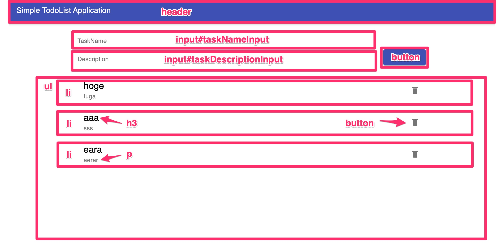

# E2Eテスト

## E2Eテストとは

ここまでソフトウェアの単体テストやインテグレーションテストのやり方を見てきました。
しかし、ServerやClientがきちんと連携してシステムが正しく振る舞うことができるかどうかはまだわかりません。
そこで実施するのがE2E(End to End)テストというシステム全体の通しテストです。受け入れテストと呼ばれる場合もあります。

今回のサンプルアプリケーションはWebアプリケーションですが、一般ユーザと同じようにブラウザの画面操作を行い、
システムの挙動が期待通りになっているかを確認していきます。

このE2Eテストも自動化して行うことがとても大事です。
システムの機能追加や改修を行う度に自動テストも見直し修正していって、ソフトウェアと一緒に育てていきます。

## E2Eテストツール

E2Eテストの自動化ツールには様々なものがあります。いくつか紹介します。


**E2Eツールの選定について**

ソフトウェアと一緒にテストスクリプトを育てていく関係で、後からのツールの変更はかなり難しいものになります。
また、テストスクリプトはE2Eテストツール毎に互換はありません。
後からでも変更はやろうと思えばできますが、かなりリスクの高いものになるという認識を持ってください。

**最初にプロジェクトの特性を見極めて適切なE2Eテストツールを選定することが大事です。**


### Selenium

[https://www.selenium.dev/](https://www.selenium.dev/)

ブラウザ自動操作ツールの元祖。ブラウザテストフレームワークの王道とも言えるツールです。
プログラミングライブラリが豊富で、JavaやC#、Python、Rubyなどでテストスクリプトを書くことができます。
あと、Seleniumは厳密にはE2Eテストツールでなく自動操作ツールなので、スクレイピングなの用途にもよく使われます。

デメリットとしては、処理の度にWaitコマンドで待ち時間をスクリプト側で制御する必要があるところや、
UI変更に弱く、変更が多い画面に不向きで修正コストが大きいところがあります。
あとパフォーマンスがそこまで良くない印象です。

あとはWebDriverのインストールが必要だったり、設定項目が多いというのも問題としてあります。
これはローカル環境だと自由に設定できるので問題ないのですが、
**CI/CDパイプライン上でE2Eテストをするときに大きなネックになることが多い**ので、採用は慎重にしてください。


**CI/CDパイプラインでのネックとは**

使用するCI/CDパイプラインによっては使用できる仮想マシンの環境に制約があります。
例えばgitlab CIは自由にDocker Imageをpullしてその上で、CI/CDスクリプトを実行できるため自由度が高いですが、
Azure Pipelinesでは [Azureが提供しているVM Image](https://docs.microsoft.com/ja-jp/azure/devops/pipelines/agents/hosted?view=azure-devops) しか使用することができません。

セットアップのスクリプトを組むこともできますが、その分パイプラインの実行に時間がかかるようになってしまうため要注意です。


### Cypress

[https://www.cypress.io/](https://www.cypress.io/)

ブラウザの裏でNode.jsのサーバープロセスを動かし、ブラウザ上のテストランナーとやり取りすることで、
ブラウザ外の操作（例えばファイルシステムや、ネットワークのコントロールといった）ができます。
導入も非常に簡単ですし、操作速度も非常に高速です。
また、SeleniumのようにWaitコマンドを使わなくてもよしなにやってくれるのはいいところです。

また、後述のTestcafeと違って良いところはテストスクリプトのアサーションライブラリに
Javascriptのテストではとても一般的に使用されている、MochaやChaiを使用できることです。

デメリットとしてはテストスクリプト言語がJavascriptに固定されること、
また、複数ブラウザウィンドウを同時操作するということもできないので、チャットのように2つのウィンドウを同時に操作みたいなテストケースには対応できません。
以前はChromeのみでしたが、FirefoxやEdgeにも対応しました。

### Testcafe

[https://testcafe.io/](https://testcafe.io/)

これもCypressと同じくNode.jsで動くテストランナーです。
Testcafeは2016年頃登場した、比較的新しいツールで、CypressとTestcafeは特徴がよく似ているためよく比較されます。

[BrowserStack](https://www.browserstack.com/) に対応しているのはCypressにはない大きな利点です。
ブラウザ互換性を担保する必要があるプロジェクトでは重宝するでしょう。
また2021年の2月にリリースされたv1.10.0複数ブラウザウィンドウテストがサポートされたこともCypressには無い大きな利点になります。

デメリットとしてはアサーションライブラリが独自のものになるため、習得にはすこし時間がかかることです。

### mabl

[https://www.mabl.com/](https://www.mabl.com/)

AIを使った受け入れテストの自動化が可能という触れ込みです。
Chromeの拡張機能をつかってブラウザ操作を記憶してテストスクリプトを作成するイメージになります。

非エンジニアが受け入れテストを作る場合に重宝されると思います。

### Autify

[https://autify.com/ja](https://autify.com/ja)

これもmoblと同じくノーコードでテストスクリプトを作成するツールです。
こちらも非エンジニアが受け入れテストを作る場合に重宝されるでしょう。

### E2Eテストツールの選定

他にもE2Eテストツールには様々なものがありますが、ツールをどのように選定するかの判断はとても難しいです。
プロダクトやプロジェクトの特性にもよるため、一概にこれというものがありません。

一つ大きな選定のポイントとして、ノーコードで受け入れテストを作成・管理したいか、
スクリプトを組んできめ細やかで自由度の高いテストを組みたいかというポイントがあると思います。

ツールも日進月歩で進化しておりこれがいいというものはありませんが、
前述の通り後からの変更はかなり大変ですので、プロジェクトで慎重に吟味して決定してください。

## サンプルアプリケーション

もし、前のテストダブルの節でリポジトリをクローンされていない方は以下のコマンドを実行してください。

```shell
git clone -b https://github.com/Onebase-Fujitsu/simple-todo-app.git
```

このアプリケーションはシンプルなタスク管理アプリケーションになります。
[アプリケーションの詳細な説明はこちら]() で解説してありますので、ご一読ください。

ルートのディレクトリにe2eというディレクトリがありますので、まず以下のコマンドを実行してみてください。

e2eテストの起動(Mac/Linuxの場合)
```shell
cd e2e
npm install
npm run test
```

e2eテストの起動(Windowsの場合)
```shell
chdir e2e
npm install
npm run test
```

`npm run test`コマンドを実行するとChromeのウィンドウが一瞬開いてすぐ閉じると思います。
もしChromeをインストールされていない方は [こちらからChromeをインストール](https://www.google.com/intl/ja_jp/chrome/) して試してみてください。


この画面が出たらこのセクションを始める準備は大丈夫です。

## testcafeによるE2Eテスト

e2eディレクトリ配下のpackage.jsonをみてみましょう。

```json
{
  "name": "e2e-test",
  "version": "1.0.0",
  "description": "",
  "main": "test/test.js",
  "scripts": {
    "test": "./node_modules/.bin/testcafe 'chrome' ./test"
  },
  "author": "",
  "license": "ISC",
  "devDependencies": {
    "testcafe": "^1.15.2"
  }
}
```

testcafeだけ入れてある極々シンプルなものになっています。
test用のスクリプトをみると`"test": "./node_modules/.bin/testcafe 'chrome' ./test"`となっていますね。
chromeを他のブラウザに変更すると他のブラウザでテストすることもできます。
また、いちいち自動操作の画面が出てきて煩わしいというかたは`chrome`の部分を`chrome:headless`に変更すると、
ヘッドレスクロームでE2Eテストを実行できますので覚えておいてください。

さて、testディレクトリにはtest.jsファイルがありますが、このファイルはまだ空でなにも記載されてません。
ここにテストを書いていくことになります。

### テストのシナリオを考えよう

E2Eテストを作るときに一番最初にやることは受け入れテストのシナリオを考えることです。
プロダクトバックログにはプロダクトとして実装してほしい内容が簡潔に記載されているはずです。
要はそれをシナリオテストとして担保できるようにしていきます。

ここではシナリオをこのようにしてみることにしてみました。

```
1. ブラウザを開いてhttp://localhost:3030を開くと、タイトルバーと、タスクの作成UIが表示される
2. タイトルと説明を入れて保存を押すと、タスク一覧にタスクが追加される
3. 作成したタスクをクリックすると完了済みの状態になる
4. 完了済みのタスクを再度クリックすると未完了状態になる
5. ゴミ場ボタンをクリックするとタスクが表示されなくなる
```

その上でこのClientのHTMLの構造をみてみましょう。


実際の画面と照らし合わせるとこんな感じです。




このHTML文書の構造はE2Eテストを書く上でとても大事です。
というのもTestcafeではSelectorという命令をつかって要素を指定していきます。
**「どこに何があって」「どうすれば要素を一意に特定できるか」を考えながら書く**のがとても大事です。


それではこのシナリオテストを順番に実装していってみましょう。

### 最初のテスト

```javascript
// test.js
import { Selector } from 'testcafe';

fixture `test target`
    .page `http://localhost:3000`;

test('test name', async t => {
})
```

まずこれがtestcafeを用いたE2Eテストスクリプトの雛形になります。
では、早速以下を確認するテストを書いてみましょう。

- タイトルバーがあること
- インプットが2つあること
- インプットが2つとも空であること
- タスクの作成ボタンが有ること

これはTestcafeに限った話ではないのですが、**公式のリファレンスを見ながら書くこと** はとても大事です。 
リファレンスは必ず見ましょう。

[https://testcafe.io/documentation/402632/reference](https://testcafe.io/documentation/402632/reference)

```javascript
// test.js
import { Selector } from 'testcafe';

fixture `test target`
    .page `http://localhost:3000`;

test('タスク一覧画面を見ることができる', async t => {
    await t
        .expect(Selector('body').withText('Simple TodoList Application').exists).ok()
        .expect(Selector('input#taskNameInput').exists).ok()
        .expect(Selector('input#taskNameInput').value).eql('')
        .expect(Selector('input#taskDescriptionInput').exists).ok()
        .expect(Selector('input#taskDescriptionInput').value).eql('')
        .expect(Selector('button').withText("SAVE").exists).ok()
})
```

最初のテストコードのテストコードはこんな感じになります。
早速テストを動かしてみてください。無事通ると思います。

内容はコードの通りでそんなに難しいことは書いてませんが、上から順番に以下の内容をテストしています。

1. body要素のなかにSimple TodoList Applicationというテキストが含まれていること
2. taskNameInputというIDを持つinput要素が存在すること
3. taskNameInputというIDを持つinput要素は今何も入力されていないこと
4. taskDescriptionInputというIDを持つinput要素が存在すること
5. taskDescriptionInputというIDを持つinput要素は今何も入力されていないこと
6. SAVEというテキストを含むbutton要素が存在すること

ざっとこんな感じです。Javascriptに慣れいない方でもなんとなく何やってるかはコードを見るだけでも想像できるのではないでしょうか？

### 2番目のテスト

では次に`2. タイトルと説明を入れて保存を押すと、タスク一覧にタスクが追加される`をテストしてみましょう。
ここでは以下の内容をテストしてきます。

- タスクタイトル入力欄に文字を入力できる
- タスク説明入力欄に文字を入力できる
- SAVEボタンをクリックする
- タスク一覧の末尾に入力したタスクが追加される

これも1番目のテストと同じように書けますので、もしリファレンスをみて自力で実装できそうであれば、やってみてください。

```javascript
import { Selector } from 'testcafe';

fixture `test target`
    .page `http://localhost:3000`;

test('タスク一覧画面を見ることができる', async t => {
    await t
        .expect(Selector('body').withText('Simple TodoList Application').exists).ok()
        .expect(Selector('input#taskNameInput').exists).ok()
        .expect(Selector('input#taskNameInput').value).eql('')
        .expect(Selector('input#taskDescriptionInput').exists).ok()
        .expect(Selector('input#taskDescriptionInput').value).eql('')
        .expect(Selector('button').withText("SAVE").exists).ok()
})

test('タスクを作成することができる', async t => {
    await t
        .typeText(Selector('input#taskNameInput'), 'title', {replace: true})
        .expect(Selector('input#taskNameInput').value).eql('title')
        .typeText(Selector('input#taskDescriptionInput'), 'description', {replace: true})
        .expect(Selector('input#taskDescriptionInput').value).eql('description')
        .click(Selector('button').withText("SAVE"))
        .expect(Selector('ul').child().nth(-1).find('h3').withText('title').exists).ok()
        .expect(Selector('ul').child().nth(-1).find('p').withText('description').exists).ok()
        .expect(Selector('ul').child().nth(-1).find('button').exists).ok()
})
```

2番目のテストコードはこのようにしてみました。

`typeText()`は文字通り文字入力を実行する命令です。また、`click()`が画面の要素をクリックする命令です。
これもやってることはそんなに難しくないと思います。

最初に文字入力をおこなって、それがちゃんとテキストフィードに反映されていることを確認。
2番めの入力欄でも文字入力を行って、その確認をしてから、作成ボタンをクリックしています。

その後はタスクが作成されていることの確認です。
ここでタスクを新規に作成したとき、作成されたタスクは一覧の一番下に表示されるので、それをうまくSelectorで指定したいです。

そこで`Selector('ul').child().nth(-1)`という記述でulタグの子要素(つまりli要素)で、最も最後の要素を指定しています。
その中のh3要素のテキストとp要素のテキストが入力した通りのものであることと、ゴミ箱ボタンが有ることを評価しているというわけです。

ここまで大丈夫でしょうか？

### 3番目のテスト

つぎに`3. 作成したタスクをクリックすると完了済みの状態になる`に取り組んでみましょう。
完了済みの状態はh3タグとpタグの属性値で表現されているということを踏まえて次のテストを書いてみてください。

```javascript
import { Selector } from 'testcafe';

fixture `test target`
    .page `http://localhost:3000`;

test('タスク一覧画面を見ることができる', async t => {
    await t
        .expect(Selector('body').withText('Simple TodoList Application').exists).ok()
        .expect(Selector('input#taskNameInput').exists).ok()
        .expect(Selector('input#taskNameInput').value).eql('')
        .expect(Selector('input#taskDescriptionInput').exists).ok()
        .expect(Selector('input#taskDescriptionInput').value).eql('')
        .expect(Selector('button').withText("SAVE").exists).ok()
})

test('タスクを作成することができる', async t => {
    await t
        .typeText(Selector('input#taskNameInput'), 'title', {replace: true})
        .expect(Selector('input#taskNameInput').value).eql('title')
        .typeText(Selector('input#taskDescriptionInput'), 'description', {replace: true})
        .expect(Selector('input#taskDescriptionInput').value).eql('description')
        .click(Selector('button').withText("SAVE"))
        .expect(Selector('ul').child().nth(-1).find('h3').withText('title').exists).ok()
        .expect(Selector('ul').child().nth(-1).find('p').withText('description').exists).ok()
        .expect(Selector('ul').child().nth(-1).find('button').exists).ok()
})

test('タスク完了することができる', async t => {
    await t
        .click(Selector('ul').child().nth(-1))
        .expect(Selector('ul').child().nth(-1).find('h3').withAttribute('style', 'text-decoration: line-through;').exists).ok()
        .expect(Selector('ul').child().nth(-1).find('p').withAttribute('style', 'text-decoration: line-through;').exists).ok()
})
```

一例としてはこんな感じでしょうか。
リストの最後の要素をクリックして、そのあとh3要素のstyle属性にtext-decoration: line-throughが設定されているh3要素が存在していること、
同じくp要素が存在していることを確認しています。

### 4番目のテスト

3番目のテストができていたら`4. 完了済みのタスクを再度クリックすると未完了状態になる`はできたも同然ですね。

```javascript
import { Selector } from 'testcafe';

fixture `test target`
    .page `http://localhost:3000`;

test('タスク一覧画面を見ることができる', async t => {
    await t
        .expect(Selector('body').withText('Simple TodoList Application').exists).ok()
        .expect(Selector('input#taskNameInput').exists).ok()
        .expect(Selector('input#taskNameInput').value).eql('')
        .expect(Selector('input#taskDescriptionInput').exists).ok()
        .expect(Selector('input#taskDescriptionInput').value).eql('')
        .expect(Selector('button').withText("SAVE").exists).ok()
})

test('タスクを作成することができる', async t => {
    await t
        .typeText(Selector('input#taskNameInput'), 'title', {replace: true})
        .expect(Selector('input#taskNameInput').value).eql('title')
        .typeText(Selector('input#taskDescriptionInput'), 'description', {replace: true})
        .expect(Selector('input#taskDescriptionInput').value).eql('description')
        .click(Selector('button').withText("SAVE"))
        .expect(Selector('ul').child().nth(-1).find('h3').withText('title').exists).ok()
        .expect(Selector('ul').child().nth(-1).find('p').withText('description').exists).ok()
        .expect(Selector('ul').child().nth(-1).find('button').exists).ok()
})

test('タスク完了することができる', async t => {
    await t
        .click(Selector('ul').child().nth(-1))
        .expect(Selector('ul').child().nth(-1).find('h3').withAttribute('style', 'text-decoration: line-through;').exists).ok()
        .expect(Selector('ul').child().nth(-1).find('p').withAttribute('style', 'text-decoration: line-through;').exists).ok()
})

test('タスクを未完了に戻すことができる', async t => {
    await t
        .click(Selector('ul').child().nth(-1))
        .expect(Selector('ul').child().nth(-1).find('h3').withAttribute('style', 'text-decoration: none;').exists).ok()
        .expect(Selector('ul').child().nth(-1).find('p').withAttribute('style', 'text-decoration: none;').exists).ok()
})
```

### 最後のテスト

最後に`5. ゴミ場ボタンをクリックするとタスクが表示されなくなる`に取り組んでみましょう。
これも最初はリファレンスを見ながら自力で書いてみてください。

```javascript
import { Selector } from 'testcafe';

fixture `test target`
    .page `http://localhost:3000`;

test('タスク一覧画面を見ることができる', async t => {
    await t
        .expect(Selector('body').withText('Simple TodoList Application').exists).ok()
        .expect(Selector('input#taskNameInput').exists).ok()
        .expect(Selector('input#taskNameInput').value).eql('')
        .expect(Selector('input#taskDescriptionInput').exists).ok()
        .expect(Selector('input#taskDescriptionInput').value).eql('')
        .expect(Selector('button').withText("SAVE").exists).ok()
})

test('タスクを作成することができる', async t => {
    await t
        .typeText(Selector('input#taskNameInput'), 'title', {replace: true})
        .expect(Selector('input#taskNameInput').value).eql('title')
        .typeText(Selector('input#taskDescriptionInput'), 'description', {replace: true})
        .expect(Selector('input#taskDescriptionInput').value).eql('description')
        .click(Selector('button').withText("SAVE"))
        .expect(Selector('ul').child().nth(-1).find('h3').withText('title').exists).ok()
        .expect(Selector('ul').child().nth(-1).find('p').withText('description').exists).ok()
        .expect(Selector('ul').child().nth(-1).find('button').exists).ok()
})

test('タスク完了することができる', async t => {
    await t
        .click(Selector('ul').child().nth(-1))
        .expect(Selector('ul').child().nth(-1).find('h3').withAttribute('style', 'text-decoration: line-through;').exists).ok()
        .expect(Selector('ul').child().nth(-1).find('p').withAttribute('style', 'text-decoration: line-through;').exists).ok()
})

test('タスクを未完了に戻すことができる', async t => {
    await t
        .click(Selector('ul').child().nth(-1))
        .expect(Selector('ul').child().nth(-1).find('h3').withAttribute('style', 'text-decoration: none;').exists).ok()
        .expect(Selector('ul').child().nth(-1).find('p').withAttribute('style', 'text-decoration: none;').exists).ok()
})

test('タスクを削除することができる', async t => {
    await t
        .click(Selector('ul').child().nth(-1).find('button'))
        .expect(Selector('ul').child().nth(-1).find('h3').withText('title').exists).notOk()
        .expect(Selector('ul').child().nth(-1).find('p').withText('description').exists).notOk()
})
```

存在しないことを確認したいので、作成したときに書いたテストの最後を`.ok()`から`.notOk()`に変更するだけです！

以上で予定していたシナリオをすべてスクリプトに書くことができました！お疲れさまです！

## まとめ

[完成したテストを含むリポジトリはこちら](https://github.com/Onebase-Fujitsu/simple-todo-app/tree/e2etest) で公開しています。

また、[テストスクリプトファイルはこちら](https://github.com/Onebase-Fujitsu/simple-todo-app/blob/e2etest/e2e/test/test.js) です。

testcafeによるE2Eテストはいかがでしょうか？
新しく出てきたライブラリですので多少覚えることは多いかもしれませんが、
手続き的に操作と評価を書くだけですので、やってることは非常に単純だということがおわかりいただけたのではないかと思います。

testcafeの素晴らしい所はなにより導入が簡単というところで、`npm install -D testcafe`コマンド一発で導入が完了します。
headlessモードのChromeで動かせば、CI/CDパイプライン上でも簡単に動かすことができますし、
たとえheadlessモードであっても、テストに失敗したときはその時の様子のスクリーンショットを残すことができたりとかなり強力です。

ぜひ試してみてください。また、冒頭にも書いたように様々なE2Eテストツールがありますので、
色々試してみて自分のプロジェクトにあったテストツールを探してみましょう。