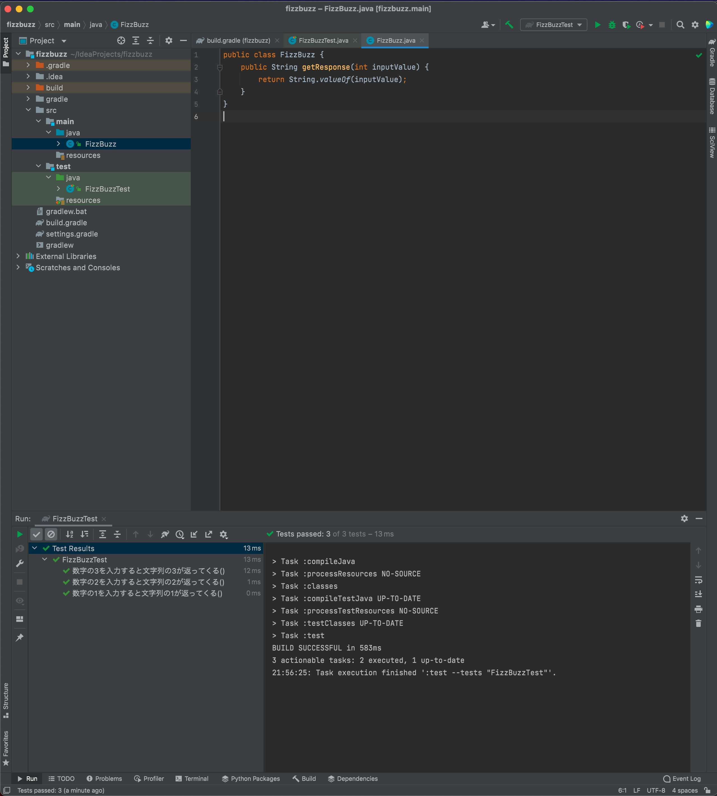

# ウォーミングアップ

ここではテスト駆動開発の手法で極々簡単なコンソールアプリケーションを作ってみようと思います。
開発言語はここではJavaを使用しますが、
これから挙げる例題はいずれも有名な問題を題材に取り上げますので、お好きな言語で挑戦されてみてください。

## テスト駆動開発とは

さて、実践に入る前にテスト駆動開発についておさらいしておきましょう。
テスト駆動開発とは文字通り**プロダクトの振る舞いをテストするコードを先に実装してから、プロダクトを実装する**開発プロセスです。


TDDでは最初に失敗するテストを書きます。
そして、そのテストをパスする最小限の実装を行います。
それをひたすら繰り返して、仕様を満たすコードを実現していきます。
そして最後にリファクタリングというコードを綺麗にするプロセスを経て、プロダクトを作成していきます。

## FizzBuzz

まずウォーミングアップとしてFizzBuzzのアプリケーションを一緒に作ってみましょう。
FizzBuzzは英語圏でよく行われる簡単な言葉遊びです。
FizzBuzzのルールは以下のとおりです。

* 整数値の入力を受け付け、文字列を返す
* 入力値が3の倍数だったらFizzを返す
* 入力値が5の倍数だったらBuzzを返す
* 入力値が3の倍数であり5の倍数ならFizzBuzzを返す
* 入力値が3の倍数でも5の倍数でもないときはその数値を文字列で返す

簡単ですね。１から順番にカウントアップしていくと、「1, 2, Fizz, 4, Buzz, Fizz, 7, 8, Fizz, Buzz, 11, Fizz, 13, 14, FizzBuzz, 16.....」
となるようなイメージです。では早速この関数をTDDで作ってみましょう。

もし途中でわからなくなったら [完成](#完成) のセクションに完成したコードを公開してますので、
そちらを見てみてください。

### プロジェクトの作成

兎にも角にもまずは新規のプロジェクトを作ってみましょう。
この例ではIntelliJ IDEAを使用してますが、皆さんの使い慣れたIDEを使ってもらって大丈夫です。


まず、新規のGradleプロジェクトを作りましょう。


名前はfizzbuzzにしてプロジェクトを作成。


はい、ここまででプロジェクトの雛形はできました。ここまでは特に難しいところはないかと思います。
さて、ここでbuild.gradleファイルを見てみましょう。

```java : build.gradle
dependencies {
    testImplementation 'org.junit.jupiter:junit-jupiter-api:5.7.0'
    testRuntimeOnly 'org.junit.jupiter:junit-jupiter-engine:5.7.0'
}
```

testImplementation 'org.junit.jupiter:junit-jupiter-api:5.7.0'という記述が勝手にできているかと思います。
このプロジェクトではJUnit5系を使いますということですね。

では早速テストを書いてみましょう。

### 最初のテスト

では最初のテストを書いてみましょう。test/java配下にFizzBuzzTest.javaというファイルを作ってから、
以下を記述します。

```java
// FizzBuzzTest.java
import org.junit.jupiter.api.Assertions;
import org.junit.jupiter.api.Test;

public class FizzBuzzTest {
    @Test
    void 数字の1を入力すると文字列の1が返ってくる() {
        FizzBuzz fb = new FizzBuzz();
        Assertions.assertEquals(fb.getResponse(1), "1");
    }
}
```

テストを書いたら早速実行してみましょう。失敗するはずです。
まだFizzBuzzクラスもgetResponseという関数も作っていないのだから当たり前ですよね。


もしIDEではなくテキストエディタを使われいるようでしたら、以下のコマンドを叩いてテストを実行してみてください。

LinuxやMacOSの場合
```shell
./gradlew test
```

Windowsの場合
```shell
bradlew.bat test
```

### 最初の実装

このテストを満たす最小の実装を考えます。
テスト駆動開発において大事なのは、**テストで実装した内容を満たす最小の実装を考えること**です。
このあと3の倍数だとか5の倍数だとかでてきますが、ここではその考慮をしてはいけません。
ここでは1を入力したら1という文字列を返すことだけを考えましょう。

src/java配下にFizzBuzz.javaを作ります。

```java
// FizzBuzz.java
public class FizzBuzz {
    public String getResponse(int inputValue) {
        return "1";
    }
}
```


こうですね！なにも考えずに"1"を返すだけ。テストも通りました！
**最初のテストと最初の実装ができましたね！**

### 2番目のテスト

この実装では何を入力しても"1"が返ってきてしまいます。
まずは入力した数値を文字列として返すということを実装してみましょう。

```java
// FizzBuzzTest.java
import org.junit.jupiter.api.Assertions;
import org.junit.jupiter.api.Test;

public class FizzBuzzTest {
    @Test
    void 数字の1を入力すると文字列の1が返ってくる() {
        FizzBuzz fb = new FizzBuzz();
        Assertions.assertEquals(fb.getResponse(1), "1");
    }

    @Test
    void 数字の2を入力すると文字列の2が返ってくる() {
        FizzBuzz fb = new FizzBuzz();
        Assertions.assertEquals(fb.getResponse(2), "2");
    }

    @Test
    void 数字の3を入力すると文字列の3が返ってくる() {
        FizzBuzz fb = new FizzBuzz();
        Assertions.assertEquals(fb.getResponse(3), "3");
    }
}
```


先のテストに2つテストを追加しました。追加したテストが失敗しているのがわかると思います。
ではこれを満たす実装を考えてみてください。

### 2番目の実装

```java
// FizzBuzz.java
public class FizzBuzz {
    public String getResponse(int inputValue) {
        return String.valueOf(inputValue);
    }
}
```


1ではなくinputValueを文字列に変換して返すようにしました。
これでテストが通るようになりましたね。

### 3番目のテスト

ではFizzの実装をしてみましょう。
Fizzは3の倍数を入力したときに返すので、それを確認するテストを書いてみましょう。

```java
// FizzBuzzTest.java
import org.junit.jupiter.api.Assertions;
import org.junit.jupiter.api.Test;

public class FizzBuzzTest {
    @Test
    void 数字の1を入力すると文字列の1が返ってくる() {
        FizzBuzz fb = new FizzBuzz();
        Assertions.assertEquals(fb.getResponse(1), "1");
    }

    @Test
    void 数字の2を入力すると文字列の2が返ってくる() {
        FizzBuzz fb = new FizzBuzz();
        Assertions.assertEquals(fb.getResponse(2), "2");
    }

    @Test
    void 数字の3の倍数を入力すると文字列のFizzが返ってくる() {
        FizzBuzz fb = new FizzBuzz();
        Assertions.assertEquals(fb.getResponse(3), "Fizz");
        Assertions.assertEquals(fb.getResponse(6), "Fizz");
        Assertions.assertEquals(fb.getResponse(9), "Fizz");
        Assertions.assertEquals(fb.getResponse(12), "Fizz");
        Assertions.assertEquals(fb.getResponse(15), "Fizz");
    }
}
```

もともとあった3のの入力をしたときのテストを消して、代わりに３の倍数の確認をするテストを書きました。

### 3番目の実装

さっそくこれを満たす実装を考えてみましょう。
3の倍数のときにFizzを返して、
それ以外のときは数字の文字列を返すようにしたら良さそうですよね？

```java
// FizzBuzz.java
public class FizzBuzz {
    public String getResponse(int inputValue) {
        if (inputValue % 3 == 0) {
            return "Fizz";
        }
        return String.valueOf(inputValue);
    }
}
```

これで3番めのテストを満たす実装を書くことができました。

### 4番目のテスト

同じようにBuzzの挙動を確認するテストを書いてみましょう。

```java
// FizzBuzzTest.java
import org.junit.jupiter.api.Assertions;
import org.junit.jupiter.api.Test;

public class FizzBuzzTest {
    @Test
    void 数字の1を入力すると文字列の1が返ってくる() {
        FizzBuzz fb = new FizzBuzz();
        Assertions.assertEquals(fb.getResponse(1), "1");
    }

    @Test
    void 数字の2を入力すると文字列の2が返ってくる() {
        FizzBuzz fb = new FizzBuzz();
        Assertions.assertEquals(fb.getResponse(2), "2");
    }

    @Test
    void 数字の3の倍数を入力すると文字列のFizzが返ってくる() {
        FizzBuzz fb = new FizzBuzz();
        Assertions.assertEquals(fb.getResponse(3), "Fizz");
        Assertions.assertEquals(fb.getResponse(6), "Fizz");
        Assertions.assertEquals(fb.getResponse(9), "Fizz");
        Assertions.assertEquals(fb.getResponse(12), "Fizz");
        Assertions.assertEquals(fb.getResponse(15), "Fizz");
    }
    
    @Test
    void 数字の5の倍数を入力すると文字列のBuzzが返ってくる() {
        FizzBuzz fb = new FizzBuzz();
        Assertions.assertEquals(fb.getResponse(5), "Buzz");
        Assertions.assertEquals(fb.getResponse(10), "Buzz");
        Assertions.assertEquals(fb.getResponse(15), "Buzz");
        Assertions.assertEquals(fb.getResponse(20), "Buzz");
        Assertions.assertEquals(fb.getResponse(25), "Buzz");
    }
}
```

ここで15の入力を確認するテストを見てみると、
Fizzを期待していたり、Buzzを期待していたりで、矛盾していることが分かります。
これはテストが微妙ですね。

ちょっとテストの書き方を変えてみましょう。まず、build.gradleファイルを開いて
`testImplementation 'org.assertj:assertj-core:3.8.0'`という一行を書き加えてみてください。

```java : build.gradle
dependencies {
    testImplementation 'org.junit.jupiter:junit-jupiter-api:5.7.0'
    testImplementation 'org.assertj:assertj-core:3.8.0'
    testRuntimeOnly 'org.junit.jupiter:junit-jupiter-engine:5.7.0'
}
```

JUnit5ではアサーションライブラリをユーザが自由に選択して入れれるようになっています。
アッサーションライブラリというのは、値が正しいかを検証するライブリです。
ここではassertJというライブラリを追加しました。

テストを書き直してみます。こんな感じで書いてみましょう。

```java
// FizzBuzzTest.java
import org.junit.jupiter.api.Test;

import static org.assertj.core.api.AssertionsForClassTypes.assertThat;

public class FizzBuzzTest {
    @Test
    void 数字の1を入力すると文字列の1が返ってくる() {
        FizzBuzz fb = new FizzBuzz();
        assertThat(fb.getResponse(1)).isEqualTo("1");
    }

    @Test
    void 数字の2を入力すると文字列の2が返ってくる() {
        FizzBuzz fb = new FizzBuzz();
        assertThat(fb.getResponse(2)).isEqualTo("2");
    }

    @Test
    void 数字の3の倍数を入力すると文字列のFizzが返ってくる() {
        FizzBuzz fb = new FizzBuzz();
        assertThat(fb.getResponse(3)).isEqualTo("Fizz");
        assertThat(fb.getResponse(6)).isEqualTo("Fizz");
        assertThat(fb.getResponse(9)).isEqualTo("Fizz");
        assertThat(fb.getResponse(12)).isEqualTo("Fizz");
        assertThat(fb.getResponse(15)).contains("Fizz");
    }

    @Test
    void 数字の5の倍数を入力すると文字列のBuzzが返ってくる() {
        FizzBuzz fb = new FizzBuzz();
        assertThat(fb.getResponse(5)).isEqualTo("Buzz");
        assertThat(fb.getResponse(10)).isEqualTo("Buzz");
        assertThat(fb.getResponse(15)).contains("Buzz");
    }
}
```

assertJのいいところは期待値をメソッドチェーンで書くことができるところですね。
15の入力については、Fizzという文字列を含んでいる、Buzzという文字列を含んでいるというテストになりました。
これを実装してみましょう。

### 4番目の実装

Buzzの挙動を実装してみましょう。

```java
// FizzBuzz.java
public class FizzBuzz {
    public String getResponse(int inputValue) {
        if (inputValue % 3 == 0) {
            return "Fizz";
        }
        if (inputValue % 5 == 0) {
            return "Buzz";
        }
        return String.valueOf(inputValue);
    }
}
```

いったんこのように書いてみました。
一見良さそうですが、これはテストを通るでしょうか？

動かしてみると分かりますが、これは通りません。
3の倍数のときFizzを返してしまうので、15のときに”Fizz”が返ってしまいます。

```java
// FizzBuzz.java
public class FizzBuzz {
    public String getResponse(int inputValue) {
        if (inputValue == 15) {
            return "FizzBuzz";
        }
        if (inputValue % 3 == 0) {
            return "Fizz";
        }
        if (inputValue % 5 == 0) {
            return "Buzz";
        }
        return String.valueOf(inputValue);
    }
}
```

それを踏まえていったん、15のときはFizzBuzzを返すようにしてみました。
これだと今のテストは通りますね！

### 最後のテスト

いよいよ佳境です。3と5の倍数の挙動のテストを書いてみましょう。

```java
// FizzBuzzTest.java
import org.junit.jupiter.api.Test;

import static org.assertj.core.api.AssertionsForClassTypes.assertThat;

public class FizzBuzzTest {
    @Test
    void 数字の1を入力すると文字列の1が返ってくる() {
        FizzBuzz fb = new FizzBuzz();
        assertThat(fb.getResponse(1)).isEqualTo("1");
    }

    @Test
    void 数字の2を入力すると文字列の2が返ってくる() {
        FizzBuzz fb = new FizzBuzz();
        assertThat(fb.getResponse(2)).isEqualTo("2");
    }

    @Test
    void 数字の3の倍数を入力すると文字列のFizzが返ってくる() {
        FizzBuzz fb = new FizzBuzz();
        assertThat(fb.getResponse(3)).isEqualTo("Fizz");
        assertThat(fb.getResponse(6)).isEqualTo("Fizz");
        assertThat(fb.getResponse(9)).isEqualTo("Fizz");
        assertThat(fb.getResponse(12)).isEqualTo("Fizz");
        assertThat(fb.getResponse(15)).contains("Fizz");
    }

    @Test
    void 数字の5の倍数を入力すると文字列のBuzzが返ってくる() {
        FizzBuzz fb = new FizzBuzz();
        assertThat(fb.getResponse(5)).isEqualTo("Buzz");
        assertThat(fb.getResponse(10)).isEqualTo("Buzz");
        assertThat(fb.getResponse(15)).contains("Buzz");
    }

    @Test
    void 数字の3と5の倍数を入力すると文字列のFizzBuzzが返ってくる() {
        FizzBuzz fb = new FizzBuzz();
        assertThat(fb.getResponse(15)).contains("FizzBuzz");
        assertThat(fb.getResponse(30)).contains("FizzBuzz");
        assertThat(fb.getResponse(45)).contains("FizzBuzz");
        assertThat(fb.getResponse(60)).contains("FizzBuzz");
    }
}
```

FizzBuzzを確認するテストを書きました。ここまで書くともう慣れてきましたよね？

### 最後の実装

早速これを満たす実装を書いてみましょう。

```java
// FizzBuzz.java
public class FizzBuzz {
    public String getResponse(int inputValue) {
        if (inputValue % 3 == 0 && inputValue % 5 == 0) {
            return "FizzBuzz";
        }
        if (inputValue % 3 == 0) {
            return "Fizz";
        }
        if (inputValue % 5 == 0) {
            return "Buzz";
        }
        return String.valueOf(inputValue);
    }
}
```

これはもう説明不要で大丈夫でしょう！3と5の倍数のときはFizzBuzzを返すプログラムができました。

### リファクタリング

いったんFizzBuzzの要件を満たすプログラムはできたように見えます。
これで終わりでしょうか？

そう、テスト駆動開発では最後にリファクタリングというプログラムを見直し、
洗練させるプロセスが入ります。このプログラムは簡単なものなので、サクッと直してしまいましょう。
ここで大事なのは**テストは直さず実装をきれいする**ということです。
テストを直してしまうと、プログラムの挙動が変わってしまう可能性が出てきてしまいます。
プログラムの挙動を変えないように実装を良くするのがリファクタリングです。

```java
// FizzBuzz.java
public class FizzBuzz {
    public String getResponse(int inputValue) {
        if (inputValue % 15 == 0) {
            return "FizzBuzz";
        } else if (inputValue % 3 == 0) {
            return "Fizz";
        } else if (inputValue % 5 == 0) {
            return "Buzz";
        } else {
            return String.valueOf(inputValue);
        }
    }
}
```

リファクタリングの一例としてはこんな感じでしょうか。

---

## 完成

以上でFizzBuzzプログラムの実装が終わりました。
はじめてのテスト駆動開発うまくできましたか？

完成したソースコードは [こちらで公開してあります](https://github.com/Onebase-Fujitsu/fizzbuzz)。迷ったときに見てみてください。

FizzBuzzはとても有名な問題なので様々な実装方法があります。興味があれば調べてみてください。

では次にちょっと難易度を上げた問題に取り組んでみましょう。

ボウリングゲーム