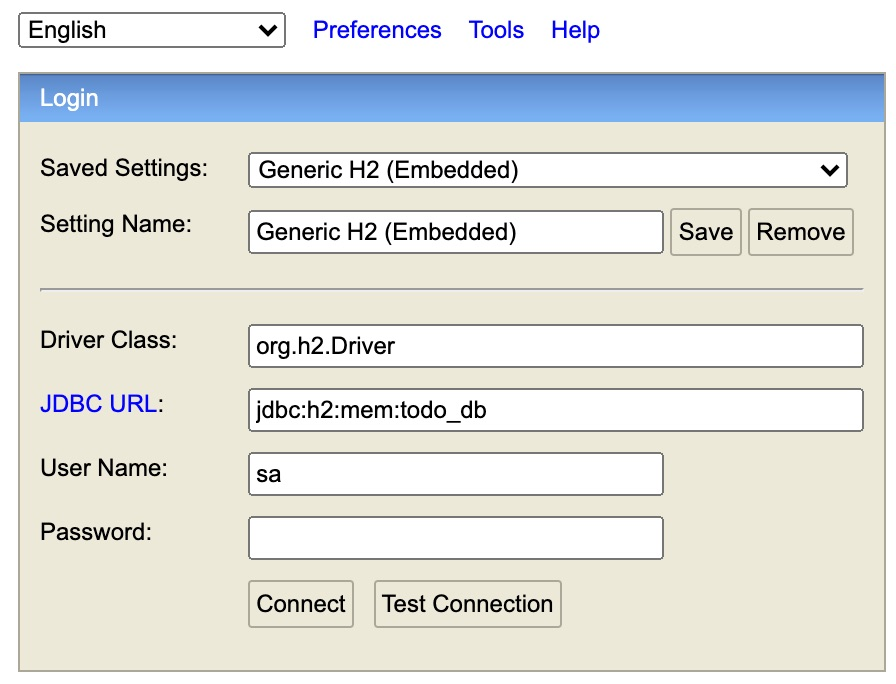

# テストダブル

テスト駆動開発の開発の流れがわかってきたところで、次にテストダブルを使用したテストについて学んでいきましょう。

## テストダブルとは

テスト対象となるクラスやメソッドが、ほかのクラスに依存していないケースはほとんどありません。
依存しているクラスもまた、ほかのクラスに依存しています。

ソフトウェアは多数のクラスが依存し合って動作するため、クラス単体の動作を保証するよりも、ソフトウェア全体の動作を保証するほうが価値が高くなります。
一方、テスト対象クラス以外の問題を原因として、ユニットテストが失敗する可能性があることは大きなデメリットです。

テストが失敗したときには、最初にテスト対象クラスに問題があると考えるため、原因の分析に余計な時間がかかります。
また、依存する機能が外部サービスや乱数、システム時間など、期待する結果を予測できない場合には検証の精度を落とさざるを得ません。

そこで、依存する機能がユニットテストで扱いづらい場合や、ユニットテストの独立性を高めたい場合には、依存するオブジェクトを「代役」で置き換える方法が有効です。
この代役となるオブジェクトはスタブやモックとして知られ、総称してテストダブル（TestDouble）と呼ばれます。

テストダブルには様々なパターンがあります

|テストダブル|役割|具体例|
|:--|:--|:--|
|Stub|テスト対象の依存オブジェクトに予測可能な振る舞いをする|依存コンポーネントから取得できる値が変化したとき、テスト対象の挙動がどう変化するか確認するテスト|
|Spy|テスト対象から依存オブジェクトへの呼び出しを監視する|テスト対象が既に実装された依存コンポーネントを呼び出した値や回数を検証するテスト|
|Mock|テスト対象から依存オブジェクトへの呼び出しを検証する|テスト対象が依存コンポーネントに入力した内容を検証するテスト|
|Fake|テストの範囲内で本物と同じように動作する|データベースを使用するテストの場合、膨大な時間がかかる場合がある。フェイクとして同機能をインメモリデータベースで実装しテストを高速化する。|
|Dummy|内部のパラメータや状態がなんであってもテストに影響を及ぼさない代替オブジェクト|テストに関係はないがコンストラクタに与える値が足りない、その値を埋めるために作成する。|


## テストダブルを実現するライブラリ

テストダブルを実現するライブラリも様々なものがあります。
Javaですと [Mockito](https://site.mockito.org/)、 [EasyMock](https://easymock.org/) 、
[jMock](http://jmock.org/) あたりでしょうか。
Javascriptだと [Sinon.js](https://sinonjs.org/) や [testdouble.js](https://github.com/testdouble/testdouble.js/) が有名です。


## サンプルアプリケーション

さて、ここからは具体的なアプリケーションをつかってテストの実装をやってみましょう。

サンプルアプリケーションは [ここ](https://github.com/Onebase-Fujitsu/simple-todo-app) で公開してあります。

[https://github.com/Onebase-Fujitsu/simple-todo-app](https://github.com/Onebase-Fujitsu/simple-todo-app)

まずはリポジトリをローカルにCloneしてみましょう。
CloneしたらTerminalを2つ立ち上げて、フロントエンドとバックエンドを起動してみてください。
実行にはJavaの実行環境と、Node.jsの実行環境が必要です。

リポジトリのClone
```shell
git clone https://github.com/Onebase-Fujitsu/simple-todo-app.git
```

フロントエンドの起動(Mac/Linuxの場合)
```shell
cd client
npm install
npm run start
```

フロントエンドの起動(Windowsの場合)
```shell
chdir client
npm install
npm run start
```

バックエンドの起動(Mac/Linuxの場合)
```shell
cd sever
SERVER_PORT=8080 ./gradlew bootRun
```

バックエンドの起動(Windowsの場合)
```shell
chdir server
SERVER_PORT=8080
gradlew.bat bootRun
```

まずは、このアプリケーションを動かしてみましょう。このアプリケーションはシンプルなToDo管理アプリケーションです。
Clientは [React](https://ja.reactjs.org/) で作っていて、開発言語に [Typescript](https://www.typescriptlang.org/) を使用しています。
またUIライブラリに [Material-UI](https://material-ui.com/) を採用しています。

Serverは [Spring Boot](https://spring.io/) で作っており、開発言語は [Java](https://www.java.com/ja/) です。
DBは [H2 Database](https://www.h2database.com/html/main.html) を組み込んでいてインメモリで動かしています。
またDBのマイグレーションツールの [Flyway](https://flywaydb.org/) を使用しているのが一つポイントです。またDBをインメモリで動かしてますので、Serverアプリケーションを終了する度にデータは揮発します。

ServerとClientを起動した状態で、Webブラウザで [http://localhost:3000](http://localhost:3000) にアクセスするとこのような画面が表示されるはずです。


タスク名や説明を入力してSaveをクリックすると、タスクが保存されますし、
ブラウザをリロードしても状態が保存されていることがわかると思います。


タスクを完了したり、ゴミ箱ボタンをクリックすると削除したりすることができます。

ServerのAPIの仕様は [OpenAPI Specification(OAS) 3.0](https://swagger.io/specification/) で公開してあります。
OASはAPIの標準仕様で以前はSwaggerという名前で呼ばれていたので、そちらのほうが馴染みある方も多いかもしれません。

Serverを起動した状態で [http://localhost:8080/v3/api-docs](http://localhost:8080/v3/api-docs) にアクセスするとOAS3.0の仕様を取得できます。
また、このServerはSwagger UIも提供しているため [http://localhost:8080/swagger-ui/](http://localhost:8080/swagger-ui/) にアクセスするとGUIで仕様を確かめたり、APIを実際に叩いてみたりすることができます。


また、DBはServerを起動した状態で [http://localhost:8080/h2-console/](http://localhost:8080/h2-console) にアクセスするとログイン用のコンソールが表示されます。



実環境用のDBは`jdbc:h2:mem:todo_db`で、User名は`sa`、パスワードはなしでDBに接続できます。
テスト中のDBの状態を確認したい場合は、任意の箇所にブレークポイントを設定して、`jdbc:h2:mem:todo_test_db`に接続してみましょう。
コンソールにログインしたら任意のSQLを実行できる画面が表示されます。
組み込みのインメモリで動かしている関係でこの方法でしかDBの状態を確認する方法がありませんので、気をつけてください。

さて、[ここの配下](https://github.com/Onebase-Fujitsu/simple-todo-app/tree/main/server/src/test) を見てもらえると分かりますが、このアプリケーションにはテストが実装されていません。
ということで一緒にハンズオン形式でテストを実装してみましょう。

## Mockitoを使ったControllerのユニットテスト

Spring Bootアプリケーションを新規に作るときは [spring initializr](https://start.spring.io/) を使うんですが、
テストのために必要な様々なライブラリはデフォルトでついてきます。

[build.gradle](https://github.com/Onebase-Fujitsu/simple-todo-app/blob/main/server/build.gradle)
を見ると以下のような設定パラメータを見ることができます。

```gradle
dependencies {
	implementation 'org.springframework.boot:spring-boot-starter-jdbc:2.5.3'
	implementation 'org.springframework.boot:spring-boot-starter-web:2.5.3'
	implementation 'com.h2database:h2:1.4.200'
	implementation 'org.flywaydb:flyway-core:7.12.1'
	implementation 'io.springfox:springfox-boot-starter:3.0.0'
	testImplementation 'org.springframework.boot:spring-boot-starter-test:2.5.3'
}
```

この中の`testImplementation 'org.springframework.boot:spring-boot-starter-test:2.5.3'`がSpring Bootアプリケーションに必要な様々な機能を提供しているライブラリです。
テストダブルを使ったテストを実現するライブラリ`Mockito`もこの中に含まれています。

### バックエンドの構造

さて、次にバックエンドの作りを見てみましょう。
バックエンドは極々一般的な3層アーキテクチャになっています。


classDiagram
class TodoAppController{
  TodoAppService todoAppService
  getAllTasks() List~Task~
  createTask(NewTask newTask) void
  finishTask(int taskId) void
  revertTask(int taskId) void
  deleteTask(int taskId) void
}
class TodoAppControllerInterface{
  getAllTasks() List~Task~
  createTask(NewTask newTask) void
  finishTask(int taskId) void
  revertTask(int taskId) void
  deleteTask(int taskId) void
}
class TodoAppService{
  TodoAppRepository todoAppRepository
  ClockService clockService
  getAllTasks() List~Task~
  createTask(NewTask newTask) void
  finishTask(int taskId) void
  revertTask(int taskId) void
  deleteTask(int taskId) void
}
class TodoAppServiceInterface{
getAllTasks() List~Task~
createTask(NewTask newTask, Instant now) void
finishTask(int taskId, Instant now) void
revertTask(int taskId, Instant now) void
deleteTask(int taskId, Instant now) void
}
class TodoAppRepository{
  JdbcTemplate jdbcTemplate
  getAllTasks() List~Task~
  createTask(NewTask newTask, Instant now) void
  finishTask(int taskId, Instant now) void
  revertTask(int taskId, Instant now) void
  deleteTask(int taskId, Instant now) void
}
class ClockServiceInterface{
  now() Instant
}
class ClockService{
  now() Instant
}
TodoAppController ..> TodoAppControllerInterface
TodoAppService ..|> TodoAppControllerInterface
TodoAppService ..> TodoAppServiceInterface
TodoAppRepository ..|> TodoAppServiceInterface
TodoAppService ..> ClockServiceInterface
ClockService ..|> ClockServiceInterface


TodoAppControllerはTodoAppControllerInterfaceに依存していて、TodoAppServiceはTodoAppServiceInterfaceに依存しています。
そしてTodoAppServiceがTodoAppControllerInterfaceの実装をしており、同様にTodoAppRepositoryがTodoAppServiceInterfaceの実装をしています。
これは [依存性逆転の原則(DIP)]() に従ったものです。
抽象に依存するようにして結合度を下げています。これについては後述します。

また、TodoAppServiceはClockServiceInterfaceにも依存しています。now()は現在時刻を返す実装になっています。
Controllerの各メソッドは対応するServiceのメソッドを呼び出し、now()で現在時刻を取得して、DBの更新処理をよびだすという作りになっています。

### 最初のテスト

では早速getAllTask()のテストを書いていきましょう。
getAllTasks()はタスクを全件取得するメソッドです。
まずはタスクが0件のときに空の配列を返すということを確認するテストを書いていきましょう。

`server\src\test\java\com.example.todoApp`配下に`controller`パッケージを新規に作成し`TodoAppControllerUnitTest.java`を作りましょう。

```java
// TodoAppControllerUnitTest.java
package com.example.todoApp.controller;
import org.junit.jupiter.api.Test;
import org.junit.jupiter.api.extension.ExtendWith;
import org.springframework.test.context.junit.jupiter.SpringExtension;

@ExtendWith(SpringExtension.class)
public class TodoAppControllerUnitTest {
    
}
```
まずは雛形。
`@ExtendWith(SpringExtension.class)`という見慣れない記述がありますが、これはJUnit5上でSpring TestContext Frameworkを使用できるようにしているクラスです。
最初はおまじないだと思ってください。

さて、実際のプロダクトの実装ではServiceは実装されているのですが、ここで実装したいのはControllerの単体テストです。
ちゃんとControllerがServiceを呼んでいるよねという確認や、Serviceからの戻り値に応じた返却をしているよねという検証をしたいです。
ということで、ここでは本物のTodoAppServiceではなく、Serviceの代わりに成り代わって呼び出しの検証や、戻り値を設定できるオブジェクトを使ったテストがしたいです。

そこで使われるのが **依存性注入(Dependency Injection)** という仕組みです。よくDIと言われます。
文字通り依存しているオブジェクトを注入する仕組みです。

百聞は一見にしかずといいますので、まずは以下のコードを書いてみてください。

```java
// TodoAppControllerUnitTest.java
package com.example.todoApp.controller;
import org.junit.jupiter.api.Test;
import org.junit.jupiter.api.extension.ExtendWith;
import org.mockito.InjectMocks;
import org.mockito.Mock;
import org.springframework.test.context.junit.jupiter.SpringExtension;

@ExtendWith(SpringExtension.class)
public class TodoAppControllerUnitTest {
  @Mock
  private TodoAppControllerInterface appService;

  @InjectMocks
  private TodoAppController appController;
}
```

`@Mock`と`@InjectMocks`というアノテーションが出てきました。
これは共にMockitoの機能になります。

`@Mock`はモックオブジェクトを作る宣言です。
ここではTodoAppServiceのモックを作っています。

`@InjectMocks`は`@Mock`で作成したモックオブジェクトを注入する対象です。
ですので、上の記述はTodoAppControllerInterfaceのモックインスタンス`appService`を注入したTodoAppControllerクラスのインスタンス、`appController`を作成しています。

ではこれでどういう事ができるか実際にテストを書いてみましょう。

```java
// TodoAppControllerUnitTest.java
package com.example.todoApp.controller;
import com.example.todoApp.model.Task;
import org.junit.jupiter.api.Test;
import org.junit.jupiter.api.extension.ExtendWith;
import org.mockito.InjectMocks;
import org.mockito.Mock;
import org.springframework.test.context.junit.jupiter.SpringExtension;

import java.util.Collections;
import java.util.List;

import static org.assertj.core.api.AssertionsForClassTypes.assertThat;
import static org.mockito.Mockito.*;

@ExtendWith(SpringExtension.class)
public class TodoAppControllerUnitTest {
  @Mock
  private TodoAppControllerInterface appService;

  @InjectMocks
  private TodoAppController appController;

  @Test
  public void タスクが取得できなかったら空のタスクリストを返す() {
    when(appService.getAllTasks()).thenReturn(Collections.emptyList());
    List<Task> tasks = appController.getAllTasks();
    verify(appService, times(1)).getAllTasks();
    assertThat(tasks.size()).isEqualTo(0);
  }
}
```

最初のテストができました。このテストはもうパスするのですが（実装終わってるので当たり前ですね...）、1行づつ解説していきます。

まず、`when(appService.getAllTasks()).thenReturn(Collections.emptyList());`という記述がでてきました。
これはMockしているappServiceインスタンスのgeAllTasks()メソッドをが呼ばれたときに、何の値を返すかを設定しています。
ここではgetAllTasks()が呼ばれたらからの配列を返すよと宣言しています。

準備が終わったので、実際にappControllerのgetAllTasks()をその次の行で呼んでますね。

次に`verify(appService, times(1)).getAllTasks();`という処理が出てきました。
これはappServiceのgetAllTasks()が1回呼ばれていることを検証する処理です。
実装を見るとわかるのですが、TodoAppControllerのgetAllTasks()ではTodoAppServiceのgetAllTasks()を一回だけ呼び出してその返却値を返すという単純な処理になっています。
もし複数回appServiceのgetAllTasks()が呼ばれているとおかしいですよね。
verifyを使うことで呼ばれた回数を検証することができます。

最後にassertThatでappControllerの戻り値を確認してます。Mockオブジェクトが空の配列を返すように設定しましたが、
その設定通り空の配列が返ってきていることをここで検証できます。

こうしたMockitoを使った単体テストを書くと、**高速で再現性の高いテストを書くことができます。**
例えば実際のプロダクトコードを使ってしまうと、DB直接アクセスしてしまって、
実際のDBの状態に影響されてしまいます。

でもモックを使って依存するオブジェクトをモッキングしてしまえば、戻り値もなにもかもテストでコントロールできるわけです！

### 2番目のテスト

では本当にモックは戻り値を予測可能な振る舞いにしているかどうかをもう一つテストを書いてみましょう。

```java
// TodoAppControllerUnitTest.java
package com.example.todoApp.controller;
import com.example.todoApp.model.Task;
import org.junit.jupiter.api.Test;
import org.junit.jupiter.api.extension.ExtendWith;
import org.mockito.InjectMocks;
import org.mockito.Mock;
import org.springframework.test.context.junit.jupiter.SpringExtension;

import java.time.OffsetDateTime;
import java.util.Collections;
import java.util.List;

import static org.assertj.core.api.AssertionsForClassTypes.assertThat;
import static org.mockito.Mockito.*;

@ExtendWith(SpringExtension.class)
public class TodoAppControllerUnitTest {
  @Mock
  private TodoAppControllerInterface appService;

  @InjectMocks
  private TodoAppController appController;

  @Test
  public void タスクが取得できなかったら空のタスクリストを返す() {
    when(appService.getAllTasks()).thenReturn(Collections.emptyList());
    List<Task> tasks = appController.getAllTasks();
    verify(appService, times(1)).getAllTasks();
    assertThat(tasks.size()).isEqualTo(0);
  }

  @Test
  public void 複数のタスクをリストで返す() {
    when(appService.getAllTasks()).thenReturn(List.of(
            new Task(1, "hoge", "fuga", false, OffsetDateTime.parse("2021-08-19T15:00:00+09:00"), OffsetDateTime.parse("2021-08-19T16:00:00+09:00")),
            new Task(2, "foo", "bar", true, OffsetDateTime.parse("2021-08-20T15:00:00+09:00"), OffsetDateTime.parse("2021-08-20T16:00:00+09:00"))));
    List<Task> tasks = appController.getAllTasks();
    verify(appService, times(1)).getAllTasks();
    assertThat(tasks.size()).isEqualTo(2);
    assertThat(tasks.get(0).id).isEqualTo(1);
    assertThat(tasks.get(0).title).isEqualTo("hoge");
    assertThat(tasks.get(0).description).isEqualTo("fuga");
    assertThat(tasks.get(0).isDone).isEqualTo(false);
    assertThat(tasks.get(0).createdAt).isEqualTo(OffsetDateTime.parse("2021-08-19T15:00:00+09:00"));
    assertThat(tasks.get(0).updatedAt).isEqualTo(OffsetDateTime.parse("2021-08-19T16:00:00+09:00"));

    assertThat(tasks.get(1).id).isEqualTo(2);
    assertThat(tasks.get(1).title).isEqualTo("foo");
    assertThat(tasks.get(1).description).isEqualTo("bar");
    assertThat(tasks.get(1).isDone).isEqualTo(true);
    assertThat(tasks.get(1).createdAt).isEqualTo(OffsetDateTime.parse("2021-08-20T15:00:00+09:00"));
    assertThat(tasks.get(1).updatedAt).isEqualTo(OffsetDateTime.parse("2021-08-20T16:00:00+09:00"));
  }
}
```

2つ目のテストを書きました。ちょっと長いですがやってることは1つ目のテストと大して変わりません。
1行目でappServiceのgetAllTasks()メソッドが2件のTaskインスタンスのリストを返すようにしています。
このテスト動かしてみるとちゃんとパスすることが確認できるでしょう。テストで戻り値をコントロールできていることが分かりますね。

### 例外のテスト

TodoAppControllerのgetAllTasks()ではDBアクセスに失敗したときに例外をスローするようにしています。
MockitoやJUnitを使わない場合、このような例外のテストは非常に大変です。
実際に異常が発生する状況を再現してテストをする必要がありますし、そもそもそういった状況を再現することすら難しい場合も多くあります。

これもMockitoを使うと簡単に例外を発生させることができますし、また検査対象が例外をスローしたことを検証することも簡単にできます。

```java
// TodoAppControllerUnitTest.java
package com.example.todoApp.controller;
import com.example.todoApp.model.Task;
import org.junit.jupiter.api.Test;
import org.junit.jupiter.api.extension.ExtendWith;
import org.mockito.InjectMocks;
import org.mockito.Mock;
import org.springframework.dao.DataAccessException;
import org.springframework.test.context.junit.jupiter.SpringExtension;
import org.springframework.web.server.ResponseStatusException;

import java.time.OffsetDateTime;
import java.util.Collections;
import java.util.List;

import static org.assertj.core.api.AssertionsForClassTypes.assertThat;
import static org.junit.jupiter.api.Assertions.assertThrows;
import static org.mockito.Mockito.*;

@ExtendWith(SpringExtension.class)
public class TodoAppControllerUnitTest {
  @Mock
  private TodoAppControllerInterface appService;

  @InjectMocks
  private TodoAppController appController;

  @Test
  public void タスクが取得できなかったら空のタスクリストを返す() {
    when(appService.getAllTasks()).thenReturn(Collections.emptyList());
    List<Task> tasks = appController.getAllTasks();
    verify(appService, times(1)).getAllTasks();
    assertThat(tasks.size()).isEqualTo(0);
  }

  @Test
  public void 複数のタスクをリストで返す() {
    when(appService.getAllTasks()).thenReturn(List.of(
            new Task(1, "hoge", "fuga", false, OffsetDateTime.parse("2021-08-19T15:00:00+09:00"), OffsetDateTime.parse("2021-08-19T16:00:00+09:00")),
            new Task(2, "foo", "bar", true, OffsetDateTime.parse("2021-08-20T15:00:00+09:00"), OffsetDateTime.parse("2021-08-20T16:00:00+09:00"))));
    List<Task> tasks = appController.getAllTasks();
    verify(appService, times(1)).getAllTasks();
    assertThat(tasks.size()).isEqualTo(2);
    assertThat(tasks.get(0).id).isEqualTo(1);
    assertThat(tasks.get(0).title).isEqualTo("hoge");
    assertThat(tasks.get(0).description).isEqualTo("fuga");
    assertThat(tasks.get(0).isDone).isEqualTo(false);
    assertThat(tasks.get(0).createdAt).isEqualTo(OffsetDateTime.parse("2021-08-19T15:00:00+09:00"));
    assertThat(tasks.get(0).updatedAt).isEqualTo(OffsetDateTime.parse("2021-08-19T16:00:00+09:00"));

    assertThat(tasks.get(1).id).isEqualTo(2);
    assertThat(tasks.get(1).title).isEqualTo("foo");
    assertThat(tasks.get(1).description).isEqualTo("bar");
    assertThat(tasks.get(1).isDone).isEqualTo(true);
    assertThat(tasks.get(1).createdAt).isEqualTo(OffsetDateTime.parse("2021-08-20T15:00:00+09:00"));
    assertThat(tasks.get(1).updatedAt).isEqualTo(OffsetDateTime.parse("2021-08-20T16:00:00+09:00"));
  }

  @Test
  public void DBアクセスエラーを検知したときResponseStatusExceptionを投げる() {
    when(appService.getAllTasks()).thenThrow(new DataAccessException("..."){ });
    assertThrows(ResponseStatusException.class, () -> {
      appController.getAllTasks();
    });
  }
}
```

最後に1件テストを追加しました。
`when(appService.getAllTasks()).thenThrow(new DataAccessException("..."){ });`
appServiceのgetAllTasks()というメソッドが呼ばれたときに、DataAccessException例外をスローしなさいと宣言してます。
それを検証しているのが`assertThrows()`です。appControllerのgetAllTasks()を呼んだときにResponseStatusExceptionがスローされているかどうかを検証しています。

例外も思うどおりコントロールできていることがわかるでしょう。

### 引数のテスト

TodoAppControllerInterfaceのgetAllTasks()はパラメータがなかったですが、その他のメソッドには引数が必要です。
Controllerが引数を正しくセットしてServiceのメソッドを呼んでいるかの検証もできます。

引数の検証にはCaptorを使います。実際にテストを書いてみましょう。

```java
// TodoAppControllerUnitTest.java
package com.example.todoApp.controller;
import com.example.todoApp.model.NewTask;
import com.example.todoApp.model.Task;
import org.junit.jupiter.api.Test;
import org.junit.jupiter.api.extension.ExtendWith;
import org.mockito.ArgumentCaptor;
import org.mockito.Captor;
import org.mockito.InjectMocks;
import org.mockito.Mock;
import org.springframework.dao.DataAccessException;
import org.springframework.test.context.junit.jupiter.SpringExtension;
import org.springframework.web.server.ResponseStatusException;

import java.time.OffsetDateTime;
import java.util.Collections;
import java.util.List;

import static org.assertj.core.api.AssertionsForClassTypes.assertThat;
import static org.junit.jupiter.api.Assertions.assertThrows;
import static org.mockito.Mockito.*;

@ExtendWith(SpringExtension.class)
public class TodoAppControllerUnitTest {
  @Mock
  private TodoAppControllerInterface appService;

  @InjectMocks
  private TodoAppController appController;

  @Captor
  private ArgumentCaptor<NewTask> argCaptor;

  @Test
  public void タスクが取得できなかったら空のタスクリストを返す() {
    when(appService.getAllTasks()).thenReturn(Collections.emptyList());
    List<Task> tasks = appController.getAllTasks();
    verify(appService, times(1)).getAllTasks();
    assertThat(tasks.size()).isEqualTo(0);
  }

  @Test
  public void 複数のタスクをリストで返す() {
    when(appService.getAllTasks()).thenReturn(List.of(
            new Task(1, "hoge", "fuga", false, OffsetDateTime.parse("2021-08-19T15:00:00+09:00"), OffsetDateTime.parse("2021-08-19T16:00:00+09:00")),
            new Task(2, "foo", "bar", true, OffsetDateTime.parse("2021-08-20T15:00:00+09:00"), OffsetDateTime.parse("2021-08-20T16:00:00+09:00"))));
    List<Task> tasks = appController.getAllTasks();
    verify(appService, times(1)).getAllTasks();
    assertThat(tasks.size()).isEqualTo(2);
    assertThat(tasks.get(0).id).isEqualTo(1);
    assertThat(tasks.get(0).title).isEqualTo("hoge");
    assertThat(tasks.get(0).description).isEqualTo("fuga");
    assertThat(tasks.get(0).isDone).isEqualTo(false);
    assertThat(tasks.get(0).createdAt).isEqualTo(OffsetDateTime.parse("2021-08-19T15:00:00+09:00"));
    assertThat(tasks.get(0).updatedAt).isEqualTo(OffsetDateTime.parse("2021-08-19T16:00:00+09:00"));

    assertThat(tasks.get(1).id).isEqualTo(2);
    assertThat(tasks.get(1).title).isEqualTo("foo");
    assertThat(tasks.get(1).description).isEqualTo("bar");
    assertThat(tasks.get(1).isDone).isEqualTo(true);
    assertThat(tasks.get(1).createdAt).isEqualTo(OffsetDateTime.parse("2021-08-20T15:00:00+09:00"));
    assertThat(tasks.get(1).updatedAt).isEqualTo(OffsetDateTime.parse("2021-08-20T16:00:00+09:00"));
  }

  @Test
  public void DBアクセスエラーを検知したときResponseStatusExceptionを投げる() {
    when(appService.getAllTasks()).thenThrow(new DataAccessException("..."){ });
    assertThrows(ResponseStatusException.class, () -> {
      appController.getAllTasks();
    });
  }

  @Test
  public void 新規のタスク作成処理を呼ぶ際に引数を正しくセットしている() {
    NewTask task = new NewTask("Task Title", "Task Description");
    appController.createTask(task);
    verify(appService).createNewTask(argCaptor.capture());
    assertThat(argCaptor.getValue().title).isEqualTo("Task Title");
    assertThat(argCaptor.getValue().description).isEqualTo("Task Description");
  }
}
```

最後に1件テストを追加しました。これも解説していきます。
最初の2行はシンプルにTodoAppControllerのcreateTasks()を呼んでいるだけです。

さてその次に、`verify(appService).createNewTask(argCaptor.capture());`
という記述が出てきました。
```
@Captor
private ArgumentCaptor<NewTask> argCaptor;
```
キャプチャをここで仕込んでいます。
あとはキャプチャから値を取り出して、それがControllerのcreateTask()に与えた引数と一致しているかどうかを検証しているだけです。

どうでしょう、ここまででMockitoによるモッキングがいかに強力で、様々なテストが柔軟におこなえるようになるということが伝わりましょうか？
このControllerには他にも様々なメソッドが実装されてます。
上記のテストを参考にして、他のメソッドのテストを皆さんで実装されてみてください。
テストダブルを使用したテストはDIの仕組みも絡むため慣れるまでがけっこう大変です。
より多くのテストを書いて慣れることがとにかく大事です。

### 完成したテスト

完成したリポジトリは [ここで公開あります](https://github.com/Onebase-Fujitsu/simple-todo-app/tree/unittest) ので、もしわからなくなったら見てみてください。

[ユニットテストのソースコードはこちら](https://github.com/Onebase-Fujitsu/simple-todo-app/blob/unittest/server/src/test/java/com/example/todoApp/controller/TodoAppControllerUnitTest.java) になります。

## Mockitoを使ったインテグレーションテスト

さて、次は複数のモジュールを組み合わせたインテグレーションテストに挑戦してみましょう。
Spring Bootでは擬似的にHTTP通信をおこなう、TestRestTemplateという機能が用意されています。
これを使ってControllerの各メソッドに対してHTTPリクエストを発生させて、戻ってきたHttpResponseを評価してみましょう。

インテグレーションテストも本物の実装を使ったり、特定のクラスをモッキングしたり自由自在なテストを実装することができます。
実際にテストを書いてみてテストダブルと依存性注入の強力さを体感してみてください。
コードを眺めるだけではなく実際に手を動かして書いてみることがとても大事です。一緒にやってみましょう。

### 最初のテスト

では早速テストを書いていきましょう。
`server\src\test\java\com.example.todoApp.controller`配下に`TodoAppControllerIntegrationTest.java`を作りましょう。

```java
// TodoAppControllerIntegrationTest.java
import org.springframework.beans.factory.annotation.Autowired;
import org.springframework.boot.test.context.SpringBootTest;
import org.springframework.test.context.jdbc.Sql;

@SpringBootTest(webEnvironment = SpringBootTest.WebEnvironment.RANDOM_PORT)
@Sql(scripts = "/clear_db.sql")
public class TodoAppControllerIntegrationTest {
  @Autowired
  private TestRestTemplate restTemplate;
}
```

まずは、これが雛形になってきます。
また見慣れない記述が出てきたと思いますので、解説します。

`@SpringBootTest`はテストでSpringBootの機能を使えるようにしてくれてるものです。
今回はサーバをランダムなポートで起動しています。

`@Sql`を使うと指定したSQLをテストの度に実行してくれるようになります。
JUnitでは所定の順序でテストが実行されるわけですが、DBに値を格納するようなテストを書いたとき、
それ以降に実行されるテストはDBに値が格納されていることを前提にして書かないといけなくなります。
つまり、テストの順番を意識したテストを書かないといけなくなるということです。

順序を意識するのはとても大変ですし、安易にテストの順番を入れ替えたり、
削除したり追加したりといったリファクタリングが難しくなってしまいますので、
今回はDBの内容を毎回クリアするSQLをテストの度に実行することで、テストの順序を気にしなくてもいいようにしています。

```sql
/* clear_db.sql */
truncate table task;
ALTER TABLE task ALTER COLUMN id RESTART WITH 1;
```

`@Autowired`はSpring FrameworkのDIコンテナからインスタンスを取得するための宣言です。
ここでは、そこまでこれを意識した実装は行わないので、いったんおまじないぐらいに考えてください。

それでは、まずタスクが登録されていない状態でタスクを全件取得するAPIを呼び出すと空の配列が返ってくることを確認してみましょう。

```java
// TodoAppControllerIntegrationTest.java
package com.example.todoApp.controller;

import com.example.todoApp.model.Task;
import org.junit.jupiter.api.Test;
import org.springframework.beans.factory.annotation.Autowired;
import org.springframework.boot.test.context.SpringBootTest;
import org.springframework.test.context.jdbc.Sql;
import org.springframework.boot.test.web.client.TestRestTemplate;
import org.springframework.http.*;
import static org.assertj.core.api.AssertionsForClassTypes.assertThat;
import java.util.Objects;

@SpringBootTest(webEnvironment = SpringBootTest.WebEnvironment.RANDOM_PORT)
@Sql(scripts = "/clear_db.sql")
public class TodoAppControllerIntegrationTest {
  @Autowired
  private TestRestTemplate restTemplate;

  @Test
  public void なにもタスクを作成していない場合は0件が返す() {
    ResponseEntity<Task[]> response = restTemplate.exchange("/tasks", HttpMethod.GET, HttpEntity.EMPTY, Task[].class);
    assertThat(response.getStatusCode()).isEqualTo(HttpStatus.OK);
    assertThat(Objects.requireNonNull(response.getBody()).length).isEqualTo(0);
  }
}
```

テストを実行してみましょう。IDEを使っている方はIDEからテストを呼び出してもいいですし、
IDEを使っていない方はTerminalで
```shell
./gradlew test
```
もしくは
```shell
gradlew.bat test
```
を実行してみましょう。通りましたでしょうか？

このテストではrestTemplateを使って擬似的にHTTPリクエストを行い、そのレスポンスを評価してます。
個々では`/tasks`に対してGETメソッドでリクエストを実行してますね。
そしてレスポンスが200番(つまりHttpStatus.OK)であり、Bodyが空配列のJSON`[]`であることを評価しています。

ここまでは大丈夫でしょうか？

### 2番目のテスト

さて次にタスクを作ってみましょう。同じようにrestTemplateを使ってPOSTのリクエストをしたらいいですよね。

```java
// TodoAppControllerIntegrationTest.java
package com.example.todoApp.controller;

import com.example.todoApp.model.Task;
import net.minidev.json.JSONObject;
import org.junit.jupiter.api.Test;
import org.springframework.beans.factory.annotation.Autowired;
import org.springframework.boot.test.context.SpringBootTest;
import org.springframework.test.context.jdbc.Sql;
import org.springframework.boot.test.web.client.TestRestTemplate;
import org.springframework.http.*;
import static org.assertj.core.api.AssertionsForClassTypes.assertThat;
import java.util.Objects;

@SpringBootTest(webEnvironment = SpringBootTest.WebEnvironment.RANDOM_PORT)
@Sql(scripts = "/clear_db.sql")
public class TodoAppControllerIntegrationTest {
  @Autowired
  private TestRestTemplate restTemplate;

  @Test
  public void なにもタスクを作成していない場合は0件が返す() {
    ResponseEntity<Task[]> response = restTemplate.exchange("/tasks", HttpMethod.GET, HttpEntity.EMPTY, Task[].class);
    assertThat(response.getStatusCode()).isEqualTo(HttpStatus.OK);
    assertThat(Objects.requireNonNull(response.getBody()).length).isEqualTo(0);
  }

  @Test
  public void タスクを新規に作成するとCREATEDを返す() {
    HttpHeaders headers = new HttpHeaders();
    headers.setContentType(MediaType.APPLICATION_JSON);
    JSONObject taskJson = new JSONObject();
    taskJson.put("title", "foo");
    taskJson.put("description", "bar");

    ResponseEntity<String> response = restTemplate.exchange("/tasks", HttpMethod.POST, new HttpEntity<>(taskJson.toString(), headers), String.class);
    assertThat(response.getStatusCode()).isEqualTo(HttpStatus.CREATED);
  }
}
```

これもテストを実行すると問題なくテストは通るはずです。
最初にJSONオブジェクトを作って、それをPOSTリクエストのBodyにつけています。
そして、戻ってきたレスポンスが201番(HttpStatus.CREATED)であることを評価してます。

### 時間を予測可能にする

では作ったタスクを取得してそれを評価してみましょう。ここから少し難しくなりますが、頑張ってついてきてください。

```java
// TodoAppControllerIntegrationTest.java
package com.example.todoApp.controller;

import com.example.todoApp.model.Task;
import net.minidev.json.JSONObject;
import org.junit.jupiter.api.Test;
import org.springframework.beans.factory.annotation.Autowired;
import org.springframework.boot.test.context.SpringBootTest;
import org.springframework.test.context.jdbc.Sql;
import org.springframework.boot.test.web.client.TestRestTemplate;
import org.springframework.http.*;
import static org.assertj.core.api.AssertionsForClassTypes.assertThat;
import java.util.Objects;

@SpringBootTest(webEnvironment = SpringBootTest.WebEnvironment.RANDOM_PORT)
@Sql(scripts = "/clear_db.sql")
public class TodoAppControllerIntegrationTest {
  @Autowired
  private TestRestTemplate restTemplate;

  @Test
  public void なにもタスクを作成していない場合は0件が返す() {
    ResponseEntity<Task[]> response = restTemplate.exchange("/tasks", HttpMethod.GET, HttpEntity.EMPTY, Task[].class);
    assertThat(response.getStatusCode()).isEqualTo(HttpStatus.OK);
    assertThat(Objects.requireNonNull(response.getBody()).length).isEqualTo(0);
  }

  @Test
  public void タスクを新規に作成するとCREATEDを返す() {
    HttpHeaders headers = new HttpHeaders();
    headers.setContentType(MediaType.APPLICATION_JSON);
    JSONObject taskJson = new JSONObject();
    taskJson.put("title", "foo");
    taskJson.put("description", "bar");

    ResponseEntity<String> response = restTemplate.exchange("/tasks", HttpMethod.POST, new HttpEntity<>(taskJson.toString(), headers), String.class);
    assertThat(response.getStatusCode()).isEqualTo(HttpStatus.CREATED);
  }

  @Test
  public void タスクがあるとその情報を取得できる() {
    HttpHeaders headers = new HttpHeaders();
    headers.setContentType(MediaType.APPLICATION_JSON);
    JSONObject taskJson = new JSONObject();
    taskJson.put("title", "foo");
    taskJson.put("description", "bar");
    restTemplate.exchange("/tasks", HttpMethod.POST, new HttpEntity<>(taskJson.toString(), headers), String.class);
    
    ResponseEntity<Task[]> response = restTemplate.exchange("/tasks", HttpMethod.GET, HttpEntity.EMPTY, Task[].class);
    assertThat(response.getStatusCode()).isEqualTo(HttpStatus.OK);
    assertThat(Objects.requireNonNull(response.getBody()).length).isEqualTo(1);

    assertThat(response.getBody()[0].id).isEqualTo(1);
    assertThat(response.getBody()[0].title).isEqualTo("foo");
    assertThat(response.getBody()[0].description).isEqualTo("bar");
    assertThat(response.getBody()[0].isDone).isEqualTo(false);
  }
}
```

タスクを作ってそのタスクを評価するテストを書きました。
この後はタスクを作って、そのタスクに対する処理を続けて書くことになりますし、少しリファクタリングしましょう。

```java
// TodoAppControllerIntegrationTest.java
package com.example.todoApp.controller;

import com.example.todoApp.model.Task;
import net.minidev.json.JSONObject;
import org.junit.jupiter.api.BeforeEach;
import org.junit.jupiter.api.Nested;
import org.junit.jupiter.api.Test;
import org.springframework.beans.factory.annotation.Autowired;
import org.springframework.boot.test.context.SpringBootTest;
import org.springframework.test.context.jdbc.Sql;
import org.springframework.boot.test.web.client.TestRestTemplate;
import org.springframework.http.*;
import static org.assertj.core.api.AssertionsForClassTypes.assertThat;
import java.util.Objects;

@SpringBootTest(webEnvironment = SpringBootTest.WebEnvironment.RANDOM_PORT)
@Sql(scripts = "/clear_db.sql")
public class TodoAppControllerIntegrationTest {
  @Autowired
  private TestRestTemplate restTemplate;

  @Test
  public void なにもタスクを作成していない場合は0件が返す() {
    ResponseEntity<Task[]> response = restTemplate.exchange("/tasks", HttpMethod.GET, HttpEntity.EMPTY, Task[].class);
    assertThat(response.getStatusCode()).isEqualTo(HttpStatus.OK);
    assertThat(Objects.requireNonNull(response.getBody()).length).isEqualTo(0);
  }

  @Test
  public void タスクを新規に作成するとCREATEDを返す() {
    HttpHeaders headers = new HttpHeaders();
    headers.setContentType(MediaType.APPLICATION_JSON);
    JSONObject taskJson = new JSONObject();
    taskJson.put("title", "foo");
    taskJson.put("description", "bar");

    ResponseEntity<String> response = restTemplate.exchange("/tasks", HttpMethod.POST, new HttpEntity<>(taskJson.toString(), headers), String.class);
    assertThat(response.getStatusCode()).isEqualTo(HttpStatus.CREATED);
  }

  @Nested
  class 既存のタスクに対する操作 {
    @BeforeEach
    public void setup() {
      HttpHeaders headers = new HttpHeaders();
      headers.setContentType(MediaType.APPLICATION_JSON);
      JSONObject taskJson = new JSONObject();
      taskJson.put("title", "foo");
      taskJson.put("description", "bar");
      restTemplate.exchange("/tasks", HttpMethod.POST, new HttpEntity<>(taskJson.toString(), headers), Object.class);
    }

    @Test
    public void タスクがあるとその情報を取得できる() {
      ResponseEntity<Task[]> response = restTemplate.exchange("/tasks", HttpMethod.GET, HttpEntity.EMPTY, Task[].class);
      assertThat(response.getStatusCode()).isEqualTo(HttpStatus.OK);
      assertThat(Objects.requireNonNull(response.getBody()).length).isEqualTo(1);

      assertThat(response.getBody()[0].id).isEqualTo(1);
      assertThat(response.getBody()[0].title).isEqualTo("foo");
      assertThat(response.getBody()[0].description).isEqualTo("bar");
      assertThat(response.getBody()[0].isDone).isEqualTo(false);
    }
  }
}
```

`@Nested`を使って複数のテストをグルーピングできるようにしました。`@BeforeEach`を使ってテストの前にタスクを1件作る操作を入れています。

さて、このテストは通るのですが、このテストは **タスクが作られた時間とタスクが更新された時間を評価していません。**
試しに、最後のテストを以下のように変更してみてテストを実行してみてください。

```
@Test
public void タスクがあるとその情報を取得できる() {
  ResponseEntity<Task[]> response = restTemplate.exchange("/tasks", HttpMethod.GET, HttpEntity.EMPTY, Task[].class);
  assertThat(response.getStatusCode()).isEqualTo(HttpStatus.OK);
  assertThat(Objects.requireNonNull(response.getBody()).length).isEqualTo(1);

  assertThat(response.getBody()[0].id).isEqualTo(1);
  assertThat(response.getBody()[0].title).isEqualTo("foo");
  assertThat(response.getBody()[0].description).isEqualTo("bar");
  assertThat(response.getBody()[0].isDone).isEqualTo(false);
  System.out.println(response.getBody()[0].createdAt);
}
```

コンソールには以下のような出力がされるはずです。

```shell
2021-08-19 19:19:40.381  INFO 11622 --- [o-auto-1-exec-1] o.a.c.c.C.[Tomcat].[localhost].[/]       : Initializing Spring DispatcherServlet 'dispatcherServlet'
2021-08-19 19:19:40.382  INFO 11622 --- [o-auto-1-exec-1] o.s.web.servlet.DispatcherServlet        : Initializing Servlet 'dispatcherServlet'
2021-08-19 19:19:40.383  INFO 11622 --- [o-auto-1-exec-1] o.s.web.servlet.DispatcherServlet        : Completed initialization in 1 ms
2021-08-19T10:19:40.427207Z
```

最後の一行がprintln()の出力です。テストを実行した時間になっていると思います。
つまり、**テストを実行する度にこの値は変わってしまいます。** このままでは再現性の高いテストを書くことができません。

そこで使うのがMockです。Mockitoを使ってClockServiceをモッキングした後、
それを依存性注入して、now()を呼び出したときに特定の時間を返すようにしてみましょう。

```java
// TodoAppControllerIntegrationTest.java
package com.example.todoApp.controller;

import com.example.todoApp.model.Task;
import com.example.todoApp.service.ClockServiceInterface;
import net.minidev.json.JSONObject;
import org.junit.jupiter.api.BeforeEach;
import org.junit.jupiter.api.Nested;
import org.junit.jupiter.api.Test;
import org.springframework.beans.factory.annotation.Autowired;
import org.springframework.boot.test.context.SpringBootTest;
import org.springframework.boot.test.mock.mockito.MockBean;
import org.springframework.test.context.jdbc.Sql;
import org.springframework.boot.test.web.client.TestRestTemplate;
import org.springframework.http.*;
import static org.assertj.core.api.AssertionsForClassTypes.assertThat;
import static org.mockito.Mockito.when;
import java.time.OffsetDateTime;
import java.util.Objects;

@SpringBootTest(webEnvironment = SpringBootTest.WebEnvironment.RANDOM_PORT)
@Sql(scripts = "/clear_db.sql")
public class TodoAppControllerIntegrationTest {
  @Autowired
  private TestRestTemplate restTemplate;

  @MockBean
  private ClockServiceInterface clockService;

  @BeforeEach
  public void setup() {
    doReturn(OffsetDateTime.parse("2021-08-19T15:00:00+09:00").toInstant()).when(clockService).now();
  }

  @Test
  public void なにもタスクを作成していない場合は0件が返す() {
    ResponseEntity<Task[]> response = restTemplate.exchange("/tasks", HttpMethod.GET, HttpEntity.EMPTY, Task[].class);
    assertThat(response.getStatusCode()).isEqualTo(HttpStatus.OK);
    assertThat(Objects.requireNonNull(response.getBody()).length).isEqualTo(0);
  }

  @Test
  public void タスクを新規に作成するとCREATEDを返す() {
    HttpHeaders headers = new HttpHeaders();
    headers.setContentType(MediaType.APPLICATION_JSON);
    JSONObject taskJson = new JSONObject();
    taskJson.put("title", "foo");
    taskJson.put("description", "bar");

    ResponseEntity<String> response = restTemplate.exchange("/tasks", HttpMethod.POST, new HttpEntity<>(taskJson.toString(), headers), String.class);
    assertThat(response.getStatusCode()).isEqualTo(HttpStatus.CREATED);
  }

  @Nested
  class 既存のタスクに対する操作 {
    @BeforeEach
    public void setup() {
      HttpHeaders headers = new HttpHeaders();
      headers.setContentType(MediaType.APPLICATION_JSON);
      JSONObject taskJson = new JSONObject();
      taskJson.put("title", "foo");
      taskJson.put("description", "bar");
      restTemplate.exchange("/tasks", HttpMethod.POST, new HttpEntity<>(taskJson.toString(), headers), Object.class);
    }

    @Test
    public void タスクがあるとその情報を取得できる() {
      ResponseEntity<Task[]> response = restTemplate.exchange("/tasks", HttpMethod.GET, HttpEntity.EMPTY, Task[].class);
      assertThat(response.getStatusCode()).isEqualTo(HttpStatus.OK);
      assertThat(Objects.requireNonNull(response.getBody()).length).isEqualTo(1);

      assertThat(response.getBody()[0].id).isEqualTo(1);
      assertThat(response.getBody()[0].title).isEqualTo("foo");
      assertThat(response.getBody()[0].description).isEqualTo("bar");
      assertThat(response.getBody()[0].isDone).isEqualTo(false);
      assertThat(response.getBody()[0].createdAt).isEqualTo("2021-08-19T15:00:00+09:00");
      assertThat(response.getBody()[0].updatedAt).isEqualTo("2021-08-19T15:00:00+09:00");
    }
  }
}
```

書けましたか？ここでまた見慣れない`@MockBean`という見慣れないアノテーションがでてきました。
これはSpring Frameworkが提供しているアノテーションです。

Mockitoを使ったControllerのユニットテストの [最初のテスト](#最初のテスト) では`@Mock`と`@InjectMocks`というMockitoの機能がでてきました。
これは@Mockで作ったMockオブジェクトを@InjectMocksに注入する機能でした。

`@MockBean`はそれをまとめてやってくれるSpring Frameworkの便利機能です。
Mockを作ってDIコンテナに登録して、テストを実行するときに自動で@Autowiredしてくれます。
めちゃくちゃ便利なんですがSpring Framework独自の機能だということに注意してください。

さてここで以下のような記述が登場しました。

```
@BeforeEach
public void setup() {
    doReturn(OffsetDateTime.parse("2021-08-19T15:00:00+09:00").toInstant()).when(clockService).now();
}
```

whenやdoReturnはすでに説明不要で大丈夫ですよね？
つまり、一連のテストではclockServiceInterfaceのnow()メソッドを呼び出すと、日本時間の2021年08月19日15:00:00を返すと宣言したわけです。
こうすると、いつテストを実行してもnow()は決まった時間になります。
つまり再現性の高いテストが書けるようにようになったということです。

```
@Test
public void タスクがあるとその情報を取得できる() {
  ResponseEntity<Task[]> response = restTemplate.exchange("/tasks", HttpMethod.GET, HttpEntity.EMPTY, Task[].class);
  assertThat(response.getStatusCode()).isEqualTo(HttpStatus.OK);
  assertThat(Objects.requireNonNull(response.getBody()).length).isEqualTo(1);

  assertThat(response.getBody()[0].id).isEqualTo(1);
  assertThat(response.getBody()[0].title).isEqualTo("foo");
  assertThat(response.getBody()[0].description).isEqualTo("bar");
  assertThat(response.getBody()[0].isDone).isEqualTo(false);
  assertThat(response.getBody()[0].createdAt).isEqualTo("2021-08-19T15:00:00+09:00");
  assertThat(response.getBody()[0].updatedAt).isEqualTo("2021-08-19T15:00:00+09:00");
}
```

最後のテストで時間を評価していることがわかると思います。

ここまでできましたでしょうか？おめでとうございます！あなたは時間を自由自在にコントロールできました！


**MockBeanのユースケース**

ここでは時間でしたが、世の中には様々な予測不可能なものがあります。

例えばバックエンドのServiceが外部のAPIを呼ぶようなケースはどうでしょう？
気象庁は天気予報のAPIを公開していて [https://www.jma.go.jp/bosai/forecast/data/overview_forecast/130000.json](https://www.jma.go.jp/bosai/forecast/data/overview_forecast/130000.json) にアクセスすると東京の天気予報をJSONで取得できます。

ではここで、気象庁の天気予報APIを使って商品の売上を予測するような業務ロジックを書いたとしましょう。
しかし、本物のAPIをテストが呼び出してしまうと、日時はテストを実行する度に変わってしまいますし、
天気もどんな内容が返ってくるかわからないですよね？

そこで今回覚えたMockです！APIのレスポンスをモッキングしてDIしてしまえば、どんなAPIのレスポンスでもテストで作れてしまうわけです！
いかに便利で強力な仕組みか理解できましたか？


### 時間をコントロールする

では次に、タスクを作った30分後にタスクを完了したときのタスクの状態を評価するというテストを書いてみましょう。
先のテストができていれば、もうこれはできたも同然だったりします。

```java
// TodoAppControllerIntegrationTest.java
package com.example.todoApp.controller;

import com.example.todoApp.model.Task;
import com.example.todoApp.service.ClockServiceInterface;
import net.minidev.json.JSONObject;
import org.junit.jupiter.api.BeforeEach;
import org.junit.jupiter.api.Nested;
import org.junit.jupiter.api.Test;
import org.springframework.beans.factory.annotation.Autowired;
import org.springframework.boot.test.context.SpringBootTest;
import org.springframework.boot.test.mock.mockito.MockBean;
import org.springframework.test.context.jdbc.Sql;
import org.springframework.boot.test.web.client.TestRestTemplate;
import org.springframework.http.*;
import static org.assertj.core.api.AssertionsForClassTypes.assertThat;
import static org.mockito.Mockito.doReturn;
import java.time.OffsetDateTime;
import java.time.temporal.ChronoUnit;
import java.util.Objects;

@SpringBootTest(webEnvironment = SpringBootTest.WebEnvironment.RANDOM_PORT)
@Sql(scripts = "/clear_db.sql")
public class TodoAppControllerIntegrationTest {
  @Autowired
  private TestRestTemplate restTemplate;

  @MockBean
  private ClockServiceInterface clockService;

  @BeforeEach
  public void setup() {
    doReturn(OffsetDateTime.parse("2021-08-19T15:00:00+09:00").toInstant()).when(clockService).now();
  }

  @Test
  public void なにもタスクを作成していない場合は0件が返す() {
    ResponseEntity<Task[]> response = restTemplate.exchange("/tasks", HttpMethod.GET, HttpEntity.EMPTY, Task[].class);
    assertThat(response.getStatusCode()).isEqualTo(HttpStatus.OK);
    assertThat(Objects.requireNonNull(response.getBody()).length).isEqualTo(0);
  }

  @Test
  public void タスクを新規に作成するとCREATEDを返す() {
    HttpHeaders headers = new HttpHeaders();
    headers.setContentType(MediaType.APPLICATION_JSON);
    JSONObject taskJson = new JSONObject();
    taskJson.put("title", "foo");
    taskJson.put("description", "bar");

    ResponseEntity<String> response = restTemplate.exchange("/tasks", HttpMethod.POST, new HttpEntity<>(taskJson.toString(), headers), String.class);
    assertThat(response.getStatusCode()).isEqualTo(HttpStatus.CREATED);
  }

  @Nested
  class 既存のタスクに対する操作 {
    @BeforeEach
    public void setup() {
      HttpHeaders headers = new HttpHeaders();
      headers.setContentType(MediaType.APPLICATION_JSON);
      JSONObject taskJson = new JSONObject();
      taskJson.put("title", "foo");
      taskJson.put("description", "bar");
      restTemplate.exchange("/tasks", HttpMethod.POST, new HttpEntity<>(taskJson.toString(), headers), Object.class);
    }

    @Test
    public void タスクがあるとその情報を取得できる() {
      ResponseEntity<Task[]> response = restTemplate.exchange("/tasks", HttpMethod.GET, HttpEntity.EMPTY, Task[].class);
      assertThat(response.getStatusCode()).isEqualTo(HttpStatus.OK);
      assertThat(Objects.requireNonNull(response.getBody()).length).isEqualTo(1);

      assertThat(response.getBody()[0].id).isEqualTo(1);
      assertThat(response.getBody()[0].title).isEqualTo("foo");
      assertThat(response.getBody()[0].description).isEqualTo("bar");
      assertThat(response.getBody()[0].isDone).isEqualTo(false);
      assertThat(response.getBody()[0].createdAt).isEqualTo("2021-08-19T15:00:00+09:00");
      assertThat(response.getBody()[0].updatedAt).isEqualTo("2021-08-19T15:00:00+09:00");
    }

    @Test
    public void タスクを完了できる() {
      doReturn(clockService.now().plus(30, ChronoUnit.MINUTES)).when(clockService).now();
      ResponseEntity<Object> operationResponse = restTemplate.exchange("/tasks/1/finish", HttpMethod.PUT, HttpEntity.EMPTY, Object.class);
      assertThat(operationResponse.getStatusCode()).isEqualTo(HttpStatus.OK);

      ResponseEntity<Task[]> response = restTemplate.exchange("/tasks", HttpMethod.GET, HttpEntity.EMPTY, Task[].class);
      assertThat(response.getStatusCode()).isEqualTo(HttpStatus.OK);
      assertThat(Objects.requireNonNull(response.getBody()).length).isEqualTo(1);

      assertThat(response.getBody()[0].id).isEqualTo(1);
      assertThat(response.getBody()[0].title).isEqualTo("foo");
      assertThat(response.getBody()[0].description).isEqualTo("bar");
      assertThat(response.getBody()[0].isDone).isEqualTo(true);
      assertThat(response.getBody()[0].createdAt).isEqualTo("2021-08-19T15:00:00+09:00");
      assertThat(response.getBody()[0].updatedAt).isEqualTo("2021-08-19T15:30:00+09:00");
    }
  }
}
```

30分後にタスクを完了するテストを書いてみました。
```
doReturn(clockService.now().plus(30, ChronoUnit.MINUTES)).when(clockService).now();
```
これがポイントです。すでにStubされているclockService.now()を上書きしてるんですね。
その状態でfinishAPIを呼んでいるわけです。

テストと実行すると、ちゃんとupdatedAtが30分後の2021年8月19日の15時30分になっているのがわかると思います。
いかがでしょうか、時間を自由自在に操れるようになりましたか？

### 例外のテスト

さて、ここまで本物のDBにアクセスをしてテストを実行してきました。
では、DBアクセス例外のテストはどうでしょうか？

他のテストでは本物のDBを使っているので、それに影響が無いようにしたいです。
それを実現する機能もちゃんと用意されています。ではテストを書いてみましょう。

```java
// TodoAppControllerIntegrationTest.java
package com.example.todoApp.controller;

import com.example.todoApp.model.Task;
import com.example.todoApp.service.ClockServiceInterface;
import com.example.todoApp.service.TodoAppServiceInterface;
import net.minidev.json.JSONObject;
import org.junit.jupiter.api.BeforeEach;
import org.junit.jupiter.api.Nested;
import org.junit.jupiter.api.Test;
import org.springframework.beans.factory.annotation.Autowired;
import org.springframework.boot.test.context.SpringBootTest;
import org.springframework.boot.test.mock.mockito.MockBean;
import org.springframework.boot.test.mock.mockito.SpyBean;
import org.springframework.test.context.jdbc.Sql;
import org.springframework.boot.test.web.client.TestRestTemplate;
import org.springframework.dao.DataAccessException;
import org.springframework.http.*;
import static org.assertj.core.api.AssertionsForClassTypes.assertThat;
import static org.mockito.Mockito.doReturn;
import static org.mockito.Mockito.doThrow;
import java.time.OffsetDateTime;
import java.time.temporal.ChronoUnit;
import java.util.Objects;

@SpringBootTest(webEnvironment = SpringBootTest.WebEnvironment.RANDOM_PORT)
@Sql(scripts = "/clear_db.sql")
public class TodoAppControllerIntegrationTest {
  @Autowired
  private TestRestTemplate restTemplate;

  @MockBean
  private ClockServiceInterface clockService;

  @SpyBean
  private TodoAppServiceInterface todoAppRepository;

  @BeforeEach
  public void setup() {
    doReturn(OffsetDateTime.parse("2021-08-19T15:00:00+09:00").toInstant()).when(clockService).now();
  }

  @Test
  public void なにもタスクを作成していない場合は0件が返す() {
    ResponseEntity<Task[]> response = restTemplate.exchange("/tasks", HttpMethod.GET, HttpEntity.EMPTY, Task[].class);
    assertThat(response.getStatusCode()).isEqualTo(HttpStatus.OK);
    assertThat(Objects.requireNonNull(response.getBody()).length).isEqualTo(0);
  }

  @Test
  public void タスクを新規に作成するとCREATEDを返す() {
    HttpHeaders headers = new HttpHeaders();
    headers.setContentType(MediaType.APPLICATION_JSON);
    JSONObject taskJson = new JSONObject();
    taskJson.put("title", "foo");
    taskJson.put("description", "bar");

    ResponseEntity<String> response = restTemplate.exchange("/tasks", HttpMethod.POST, new HttpEntity<>(taskJson.toString(), headers), String.class);
    assertThat(response.getStatusCode()).isEqualTo(HttpStatus.CREATED);
  }

  @Nested
  class 既存のタスクに対する操作 {
    @BeforeEach
    public void setup() {
      HttpHeaders headers = new HttpHeaders();
      headers.setContentType(MediaType.APPLICATION_JSON);
      JSONObject taskJson = new JSONObject();
      taskJson.put("title", "foo");
      taskJson.put("description", "bar");
      restTemplate.exchange("/tasks", HttpMethod.POST, new HttpEntity<>(taskJson.toString(), headers), Object.class);
    }

    @Test
    public void タスクがあるとその情報を取得できる() {
      ResponseEntity<Task[]> response = restTemplate.exchange("/tasks", HttpMethod.GET, HttpEntity.EMPTY, Task[].class);
      assertThat(response.getStatusCode()).isEqualTo(HttpStatus.OK);
      assertThat(Objects.requireNonNull(response.getBody()).length).isEqualTo(1);

      assertThat(response.getBody()[0].id).isEqualTo(1);
      assertThat(response.getBody()[0].title).isEqualTo("foo");
      assertThat(response.getBody()[0].description).isEqualTo("bar");
      assertThat(response.getBody()[0].isDone).isEqualTo(false);
      assertThat(response.getBody()[0].createdAt).isEqualTo("2021-08-19T15:00:00+09:00");
      assertThat(response.getBody()[0].updatedAt).isEqualTo("2021-08-19T15:00:00+09:00");
    }

    @Test
    public void タスクを完了できる() {
      doReturn(clockService.now().plus(30, ChronoUnit.MINUTES)).when(clockService).now();
      ResponseEntity<Object> operationResponse = restTemplate.exchange("/tasks/1/finish", HttpMethod.PUT, HttpEntity.EMPTY, Object.class);
      assertThat(operationResponse.getStatusCode()).isEqualTo(HttpStatus.OK);

      ResponseEntity<Task[]> response = restTemplate.exchange("/tasks", HttpMethod.GET, HttpEntity.EMPTY, Task[].class);
      assertThat(response.getStatusCode()).isEqualTo(HttpStatus.OK);
      assertThat(Objects.requireNonNull(response.getBody()).length).isEqualTo(1);

      assertThat(response.getBody()[0].id).isEqualTo(1);
      assertThat(response.getBody()[0].title).isEqualTo("foo");
      assertThat(response.getBody()[0].description).isEqualTo("bar");
      assertThat(response.getBody()[0].isDone).isEqualTo(true);
      assertThat(response.getBody()[0].createdAt).isEqualTo("2021-08-19T15:00:00+09:00");
      assertThat(response.getBody()[0].updatedAt).isEqualTo("2021-08-19T15:30:00+09:00");
    }
  }

  @Nested
  class DBアクセスエラー {
    @Test
    public void 取得メソッドでDBアクセスエラーが発生するとInternalServerErrorを返す() {
      doThrow(new DataAccessException("...") {}).when(todoAppRepository).getAllTasks();
      ResponseEntity<String> response = restTemplate.exchange("/tasks", HttpMethod.GET, HttpEntity.EMPTY, String.class);
      assertThat(response.getStatusCode()).isEqualTo(HttpStatus.INTERNAL_SERVER_ERROR);
    }
  }
}
```

こんな感じです。`@SpyBean`というアノテーションがでてきました。
```
@SpyBean
private TodoAppServiceInterface todoAppRepository;
```

これも`@MockBean`と同じようにSpring Frameworkが提供している機能で、
MockitoでSpyオブジェクトを作ってDIコンテナに登録、テスト実行時に依存性注入してくれる非常に便利な機能です。

```
@Nested
class DBアクセスエラー {
  @Test
  public void 取得メソッドでDBアクセスエラーが発生するとInternalServerErrorを返す() {
    doThrow(new DataAccessException("...") {}).when(todoAppRepository).getAllTasks();
    ResponseEntity<String> response = restTemplate.exchange("/tasks", HttpMethod.GET, HttpEntity.EMPTY, String.class);
    assertThat(response.getStatusCode()).isEqualTo(HttpStatus.INTERNAL_SERVER_ERROR);
  }
}
```

最後に追加しているのが、DBアクセスエラーのテストです。doThrowでtodoAppServiceInterfaceのgetAllTasks()メソッドが呼ばれたときに、DataAccessException例外をスローするよう宣言しています。
テストを実行するとちゃんとレスポンスとして500番(HttpStatus.INTERNAL_SERVER_ERROR)が返ってきているのが分かります。

getAllTasks()は引数が無いメソッドなのでいいですが、createNewTask()メソッドは引数の設定が必要です。
例外をテストするときに、どんな引数が与えられても例外を返したいという場面は多いです。

それもMockitoなら簡単に実装できます。

```java
// TodoAppControllerIntegrationTest.java
package com.example.todoApp.controller;

import com.example.todoApp.model.Task;
import com.example.todoApp.service.ClockServiceInterface;
import com.example.todoApp.service.TodoAppServiceInterface;
import net.minidev.json.JSONObject;
import org.junit.jupiter.api.BeforeEach;
import org.junit.jupiter.api.Nested;
import org.junit.jupiter.api.Test;
import org.springframework.beans.factory.annotation.Autowired;
import org.springframework.boot.test.context.SpringBootTest;
import org.springframework.boot.test.mock.mockito.MockBean;
import org.springframework.boot.test.mock.mockito.SpyBean;
import org.springframework.test.context.jdbc.Sql;
import org.springframework.boot.test.web.client.TestRestTemplate;
import org.springframework.dao.DataAccessException;
import org.springframework.http.*;
import static org.assertj.core.api.AssertionsForClassTypes.assertThat;
import static org.mockito.ArgumentMatchers.any;
import static org.mockito.Mockito.doReturn;
import static org.mockito.Mockito.doThrow;
import java.time.OffsetDateTime;
import java.time.temporal.ChronoUnit;
import java.util.Objects;

@SpringBootTest(webEnvironment = SpringBootTest.WebEnvironment.RANDOM_PORT)
@Sql(scripts = "/clear_db.sql")
public class TodoAppControllerIntegrationTest {
  @Autowired
  private TestRestTemplate restTemplate;

  @MockBean
  private ClockServiceInterface clockService;

  @SpyBean
  private TodoAppServiceInterface todoAppRepository;

  @BeforeEach
  public void setup() {
    doReturn(OffsetDateTime.parse("2021-08-19T15:00:00+09:00").toInstant()).when(clockService).now();
  }

  @Test
  public void なにもタスクを作成していない場合は0件が返す() {
    ResponseEntity<Task[]> response = restTemplate.exchange("/tasks", HttpMethod.GET, HttpEntity.EMPTY, Task[].class);
    assertThat(response.getStatusCode()).isEqualTo(HttpStatus.OK);
    assertThat(Objects.requireNonNull(response.getBody()).length).isEqualTo(0);
  }

  @Test
  public void タスクを新規に作成するとCREATEDを返す() {
    HttpHeaders headers = new HttpHeaders();
    headers.setContentType(MediaType.APPLICATION_JSON);
    JSONObject taskJson = new JSONObject();
    taskJson.put("title", "foo");
    taskJson.put("description", "bar");

    ResponseEntity<String> response = restTemplate.exchange("/tasks", HttpMethod.POST, new HttpEntity<>(taskJson.toString(), headers), String.class);
    assertThat(response.getStatusCode()).isEqualTo(HttpStatus.CREATED);
  }

  @Nested
  class 既存のタスクに対する操作 {
    @BeforeEach
    public void setup() {
      HttpHeaders headers = new HttpHeaders();
      headers.setContentType(MediaType.APPLICATION_JSON);
      JSONObject taskJson = new JSONObject();
      taskJson.put("title", "foo");
      taskJson.put("description", "bar");
      restTemplate.exchange("/tasks", HttpMethod.POST, new HttpEntity<>(taskJson.toString(), headers), Object.class);
    }

    @Test
    public void タスクがあるとその情報を取得できる() {
      ResponseEntity<Task[]> response = restTemplate.exchange("/tasks", HttpMethod.GET, HttpEntity.EMPTY, Task[].class);
      assertThat(response.getStatusCode()).isEqualTo(HttpStatus.OK);
      assertThat(Objects.requireNonNull(response.getBody()).length).isEqualTo(1);

      assertThat(response.getBody()[0].id).isEqualTo(1);
      assertThat(response.getBody()[0].title).isEqualTo("foo");
      assertThat(response.getBody()[0].description).isEqualTo("bar");
      assertThat(response.getBody()[0].isDone).isEqualTo(false);
      assertThat(response.getBody()[0].createdAt).isEqualTo("2021-08-19T15:00:00+09:00");
      assertThat(response.getBody()[0].updatedAt).isEqualTo("2021-08-19T15:00:00+09:00");
    }

    @Test
    public void タスクを完了できる() {
      doReturn(clockService.now().plus(30, ChronoUnit.MINUTES)).when(clockService).now();
      ResponseEntity<Object> operationResponse = restTemplate.exchange("/tasks/1/finish", HttpMethod.PUT, HttpEntity.EMPTY, Object.class);
      assertThat(operationResponse.getStatusCode()).isEqualTo(HttpStatus.OK);

      ResponseEntity<Task[]> response = restTemplate.exchange("/tasks", HttpMethod.GET, HttpEntity.EMPTY, Task[].class);
      assertThat(response.getStatusCode()).isEqualTo(HttpStatus.OK);
      assertThat(Objects.requireNonNull(response.getBody()).length).isEqualTo(1);

      assertThat(response.getBody()[0].id).isEqualTo(1);
      assertThat(response.getBody()[0].title).isEqualTo("foo");
      assertThat(response.getBody()[0].description).isEqualTo("bar");
      assertThat(response.getBody()[0].isDone).isEqualTo(true);
      assertThat(response.getBody()[0].createdAt).isEqualTo("2021-08-19T15:00:00+09:00");
      assertThat(response.getBody()[0].updatedAt).isEqualTo("2021-08-19T15:30:00+09:00");
    }
  }

  @Nested
  class DBアクセスエラー {
    @Test
    public void 取得メソッドでDBアクセスエラーが発生するとInternalServerErrorを返す() {
      doThrow(new DataAccessException("...") {}).when(todoAppRepository).getAllTasks();
      ResponseEntity<String> response = restTemplate.exchange("/tasks", HttpMethod.GET, HttpEntity.EMPTY, String.class);
      assertThat(response.getStatusCode()).isEqualTo(HttpStatus.INTERNAL_SERVER_ERROR);
    }

    @Test
    public void 作成メソッドでDBアクセスエラーが発生するとInternalServerErrorを返す() {
      doThrow(new DataAccessException("..."){}).when(todoAppRepository).createNewTask(any(), any());
      HttpHeaders headers = new HttpHeaders();
      headers.setContentType(MediaType.APPLICATION_JSON);
      JSONObject taskJson = new JSONObject();
      taskJson.put("title", "foo");
      taskJson.put("description", "bar");
      ResponseEntity<String> response = restTemplate.exchange("/tasks", HttpMethod.POST, new HttpEntity<>(taskJson.toString(), headers), String.class);
      assertThat(response.getStatusCode()).isEqualTo(HttpStatus.INTERNAL_SERVER_ERROR);
    }
  }
}
```

最後に追加したのは作成処理を呼んだときにDBアクセス例外が発生したときのテストです。
```
doThrow(new DataAccessException("..."){}).when(todoAppRepository).createNewTask(any(), any());
```
any()というのはMockitoが提供している引数のMatcherです。
なんでもいいよということですね。

例えば、any()ではなく、特定の値が引数で与えられたら例外をスローするといった挙動もStubすることができます！

ここまでで、できれば様々なテストが自分で実装できるはずです。
まだ未テストのAPIがあると思いますので、自分で考えてAPIを実装してみてください。
これもとにかく慣れるまで自分の手を動かして書いてみるのがとても大事です。

### 完成したテスト

完成したリポジトリは [ここで公開あります](https://github.com/Onebase-Fujitsu/simple-todo-app/tree/integrationtest) ので、もしわからなくなったら見てみてください。

[インテグレーションテストのソースコードはこちら](https://github.com/Onebase-Fujitsu/simple-todo-app/blob/integrationtest/server/src/test/java/com/example/todoApp/controller/TodoAppControllerIntegrationTest.java) になります。

## テスト駆動開発とユニットテスト・インテグレーションテスト

さて、ここまででMockitoを使ったMockオブジェクトで他のクラスに依存しない単体テストを書く方法や、
様々なクラスを組み合わせたインテグレーションテストの書き方を見てきました。

さて、実際にテスト駆動開発で新規の機能を追加するとなったとき、どういったテストをかけばよいでしょうか？

1. まずユニットテストを記述して、それをパスする実装をして、それが通ったらインテグレーションテストを書いて検証する
2. まずインテグレーションテストを記述して、それをパスする実装をして、その上でインテグレーションテストで検証が難しい部分をユニットテストで検証する

選択肢はこの2つでしょうか。 さて、1の「ユニットテストから書き始める」と思った方はいますでしょうか？

.

..

...

残念ながら不正解です！「あれ？ウォーターフォールだって最初にPTをやってその次にITをやるじゃないか！」と思われる方も多いかもしれません。
ですが、ちょっと考えてみてください。**ユニットテストで実装できるテストはホワイトボックステスト**です。
**ホワイトボックステストは実装内容に非常に依存する**のが特徴です。

つまり、
「実装コードがこうなっているから、この分岐を通るようなテストを実装しよう」だとか、
「実装コードがこうなっているから、この依存部品を正しく呼んでいるかを検証するようなテストを実装しよう」だとか、
そういう考えで実装するものなのですね。

さて、テスト駆動開発ではプロダクトの実装を行う前にテストを最初に書きます。
つまり、テストを書き始める段階で実装コードはまだないわけです。
その状態でどうやってユニットテストを書けと言われても難しいというのは想像に難くないのではないでしょうか？

「いやいや、TDDとはいえ実装に入る前に簡単な設計はするでしょ？」と思われる方もいるかもしれません。
はい、それも間違っていませんが、それでもインテグレーションテストから先に実装するのには理由があります。

先程前述したとおり、ホワイトボックステストは実装コードの内容に依存します。
しかし、我々はアジャイルで開発をしています。アジャイルで開発しているということは仕様がどんどん開発する過程で変化をするということです。
そうした中で自動テストがすべてホワイトボックステストで実装されていたらどうでしょうか？
答えは**リファクタリングが難しくなります。**
ちょっとした内部ロジックの修正でありとあらゆるところに影響範囲がでてしまうのは想像に難くないでしょう。
リファクタリングに多大な時間がかかるようになり、アジリティの高い開発とは程遠い結果を招いてしまいます。

ですので、**最初にどういうリクエストをしたときに、どういう振る舞いをするのかを検証するインテグレーションテストを書いてから実装を始める**ことがとても大事です。
実装を進める過程で、「ここ例外処理が必要だね」とか様々な会話が出てくると思います。
中にはインテグレーションテストでは検証が難しいケースも出てくるでしょう。
そうしたインテグレーションテストでは検証が難しい部分が出てきたときに、補完する目的でユニットテストを書くべきです。
しかし、やりすぎるとアジリティの低下を招きますので基本的にはすべてインテグレーションテストで検証すべきです。

「あれ？ホワイトボックステストを実装しないということはテストカバレッジ率は？」と思われる方もいるでしょう。

ここで大事なのは **『カバレッジが低ければソースコードないしテストコードの品質は低い』と言えるが、
『カバレッジが高ければ、ソースコードの品質が高い』とは言えない** ということです。
カバレッジを計測する目的は、テストが十分に網羅されていないコードを検出することで、
「テストケースが十分に網羅されていない」コードを限りなく少なくすることです。
すなわち、いくらカバレッジが高くても、テストケースの品質が悪ければ、バグが潜在している可能性を低くすることはできません。
**カバレッジ率はテストの網羅率を測るのに有効ですが、それを目標にしてはいけません。**

「実践テスト駆動開発」という書籍があり、その中の一節を紹介します。


> システムの振る舞いは、オブジェクトの組み合わせから現れる性質なのだ。『オブジェクトの組み合わせ』とは、すなわち『どのオブジェクトを、どうつなげるか』ということだ。
> 
> **振る舞いのテストを行え、メソッドをテストするのではない**

**テスト駆動開発(TDD)のいうところの"テスト"とはすなわち、振る舞い駆動開発(BDD)であるということを肝に銘じておくと良いでしょう。**

---

では次にE2Eテストについて見ていきましょう。

E2Eテスト