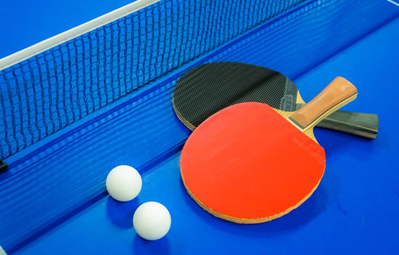
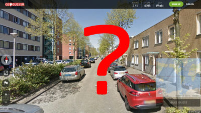

# Ice Break

## 概要
開発業務から離れて、チームで一緒にゲームなどを行います。

## 目的
メンバ間のコミュニケーション活性化や心身のリフレッシュを目的とします。

## 実施頻度・タイミング
- 1回程度/2週間
- 開発の時間を大きく削ることがないように実施
- チームで合意できれば、業務時間内、昼休みや小休憩の時間、定時後でも好きなタイミングで実施

## 進め方
- やることを決める
- やる時間を決める
- 楽しく遊ぶ


**実施例**
- 卓球  
  
- Switch  
  
- [ワードウルフ](https://www.wordwolf.tokyo/)
  [[遊び方]](https://www.wordwolf.tokyo/howto)  
  
- 各種ボードゲーム
- 共通点探しゲーム
  [[遊び方]](http://yorozumemo.com/looking-for-something-in-common-3050/)
- [GeoGuessr（ストリートビューの場所の推理ゲーム）](https://www.geoguessr.com/)
  [[遊び方]](https://gigazine.net/news/20180508-geoguessr/)  
  
- 雑談
