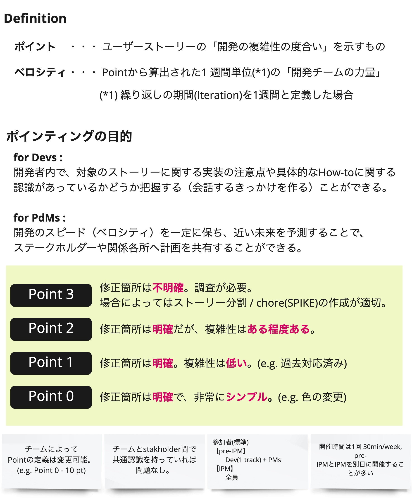

# IPM

## 概要
IPM(Iteration Planning Meeting)は、各ユーザーストーリーの見積もりを行って次のイテレーションの計画を立てるミーティングです。
ProductManagerが進行し、ProductManagerとDesignerから提供価値の説明を行い、Developerが全員で見積もりを行います。

## 目的
優先順位付けされたユーザーストーリーの内容を共有して、Developerが実装を進められるようにします。
また、見積もりを行って一週間〜二週間先のイテレーションでどの程度ユーザーストーリーを完了できるか見込みを立てます。

この計画は次のイテレーションで「実施しなければならない」ノルマではありません。  
実装の計画を立てることによって、ProductManagerやDesignerがプロダクトで新たな価値を提供するためにいつまでに何の準備をすれば良いか、
また、早く価値を提供するために優先順位の見直しが必要か、を判断できるようになります。  
また、小さく一貫したサイズのユーザーストーリーを実装し続けられれば、通常は各イテレーションで同じ量の作業を進められますが、
１イテレーションで進んだストーリーのポイント数が予定（その時点でのベロシティ）と乖離している場合には改善の余地があると考えられ、
原因を追求しアクションに繋げることができます。

## 実施頻度・タイミング
- 1回/週、30-60分
- チームのリズムを整えるために、一週間で固定の曜日に定期的に開催
- 開発を優先したい、必要なメンバーがいないなど、チームの状況に応じて任意のタイミングで緊急IPMを開催

## 進め方
1. 見積もり対象のストーリーの概要の共有

   次のリリースなどのマイルストーンに向けて、EPICレベルでどのような内容のストーリーを実装していくのか共有します。

1. 進行中／見積もり済のストーリーの振り返り

   見積もりをするにあたって、そのストーリーに着手するまでにどこまでが実装できている状態になっているかを確認するため、
   進行中／見積もり済のストーリーを簡単に確認してメンバーの記憶を呼び起こします。

1. ストーリーの説明

   各ストーリーについてProductManagerとDesignerから説明を行います。
   - ストーリーのタイトルの読み上げ
   - ユーザーに提供する価値の説明
   - 受け入れの基準の説明
   - その他の付加情報の説明（画面イメージなど）

   ストーリーの内容について不明点などがあればその場で確認します。

1. ストーリーの見積もり（ポインティング）

   Developerがストーリーの複雑さを0〜3ポイントのいずれかで見積もります。
   - 各々でポイントを心の中で決めたら、サムズアップ👍
   - Developer全員の準備が整ったら、一斉に指を立ててポイント数を提示
   - ポイントにパラつきがあれば、それぞれポイント付けした理由を説明して議論
   - 最終的に何ポイントにするかを合意
 
   見積もりの結果やメンバーの意見を踏まえて、必要であればストーリーをマージしたり分割したりします。

1. 次のイテレーションでの予定を確認

   見積もりの結果を踏まえて、次のイテレーションでどこまでのストーリーが完了する見込みかチームで確認します。


**Tips**
- ポインティングの基準は複雑さ

  ポイントは計画や改善のための一つの情報であるため、作業量を正確に見積もるよりも、短時間で労力を割かずに見積もるよう「複雑さ」を基準にします。
  また、簡単だけど作業量が多いというストーリーがある場合には、ストーリーを分割することを検討します。
  （粒度があらかったり量が多いだけのストーリーは実装漏れ、考慮漏れが発生しやすい）

  

- ポイントの基準はチーム毎に異なる

  ストーリーの分割の単位はチームが高いパフォーマンスを発揮するために最適なものにすべきであること、
  また、ポイントを付ける感度は個人差があることからポイントの基準はチームによって異なります。
  完了したストーリーのポイントの合計が、Aチームは30ポイント、Bチームは15ポイントだとしても、Bチームが相対的に劣っているわけではありません。

- choreの実施タイミング

  リファクタリングや技術的な負債の解消などを行うchoreは、機能開発の合間に実施していきます。
  特に時間がかかるchoreを実施する場合などには、IPMの場などでchoreの実施タイミングもチームで模索して合意します。

- バックログには先一週間〜二週間程度を保つ

  確実に早く進むために先二週間分が見える状態を保つよう、ストーリー数を限定してIPMを実施します。  
  実装していないストーリーが多い状態で見積もりを進めるのは頭の中でイメージが大変であるし、
  途中で変更があった場合にはストーリーの見直しが必要となるため、バックログにストーリーをため過ぎることはリスクとなります。  
  枯渇しない程度にバックログのストーリー数を保ちつつ、直近のことだけに集中することで、チームの誰もが目に見える新しい機能に集中できるようにします。

- IPMは短期間で生産的な場とする

  一時間もすると集中力が落ちてくるため、時間がかかる場合には休憩を挟んだり、別の日に分けて開催したりするようにします。
  定期的に行うためだけにストーリーの準備に苦しんだり、長いミーティングにして疲れを溜めたりするよりも、二日後に開催するほうがはるかに良いです。

- IPMでの議論はログに残す

  IPMで決めたことも実装するタイミングでは忘れてしまうため、議論の内容や決定事項をログに残したり、ストーリーの記載内容を見直したりします。
  ログを残す担当はミーティングの開始時に決めておきます。

