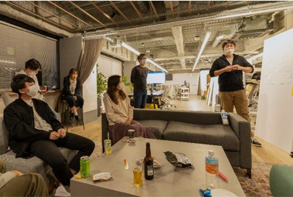
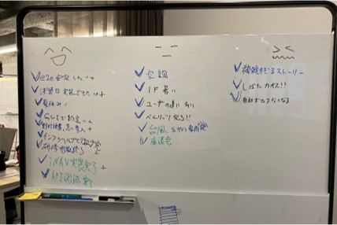

# レトロスペクティブ

## 概要
レトロスペクティブ（レトロ）は、チームの活動の振り返りを行う活動です。
イテレーションでよかったこと、よくなかった点を遠慮なく出し合い、改善に向けたアクションを決めます。
お酒を飲みながらリラックスした状態で実施します。

## 目的
チームのプロセスを継続的に改善していくことが目的であり、アジャイル開発において重要な活動です。
良いことは継続し、うまくいかないことは改善するよう、チームで認識を合わせて、チームのパフォーマンス向上に繋げます。
また、チームで一緒になって良かったことや苦しんだことを共有して対処方法を考えていくことで、一体感が生まれます。

## 実施頻度・タイミング
- 1回/週、60分
- 1週間の終了時（金曜日の夕方）に必ず実施
- 1週間のプロセス以外でも、プロジェクトの区切りなどで長い期間の振り返りを実施

## 進め方
1. 個別に振り返り
   1. 振り返りを行い以下を書き出す
      - よかったこと
      - 普通なこと
      - よくなかったこと、課題なこと
   1. 他のメンバーが書いたことに共感するものがあればマークする
1. チームで共有
   1. 前回のアクションアイテムの状況を確認する
   1. ホストが振り返りの内容を一つずつ読み上げ、書いた人がシェアする
   1. 振り返りの内容について意見を出し合う
   1. 必要なアクションがあればアクションアイテムに書き出す
   1. 今後に向けたアクションアイテムを再確認する
1. 一本締めで終了

{}
**Tips**
- 「よかったこと」には拍手を送る
- 多少プライベートなことでも良いので自由にたくさん書く
- より良いチームになるため遠慮なく話し合う
- チームで共有する際は「よかったこと」から始め「よかったこと」で終わるようにする（前向きに活動）
- コアチーム（Designer+Product Manager+Developer）で実施する際、マネージャー層の参加や見物は遠慮してもらう（心理的安全性を確保）
{}
