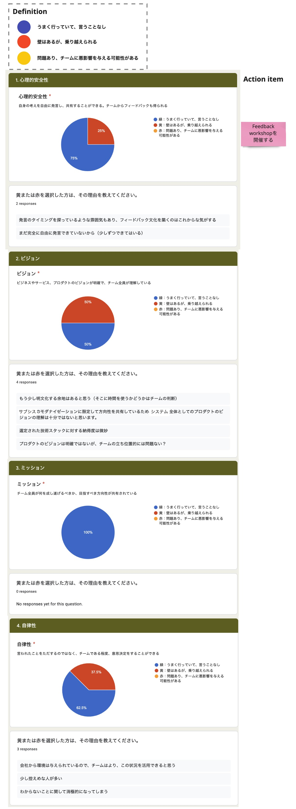

# Team Health Check

## 概要
チームで匿名のアンケートを実施し、チームの状態を可視化します。

## 目的
アンケートの結果を踏まえ、意見を共有することでメンバーがどう思っているかを知り、
チームに必要なアクションをとって、より良いチームにしていくことが目的です。

## 実施頻度・タイミング
- 1回程度/2週間
- プロジェクトの状況(体制、スケジュール…)に変化があったとき

## 進め方
- Step1：アンケートの項目作成（担当:PdM）
  - 以下のような項目を設定します
    - **心理的安全性** :自身の考えを自由に発言し、共有することができる。チームからフィードバックも得られる
    - **ビジョン** :ビジネスやサービス、プロダクトのビジョンが明確で、チーム全員が理解している
    - **ミッション** :チーム全員が何を成し遂げるべきか、目指すべき方向性が共有されている
    - **自律性** :言われたことをただするのではなく、チームである程度、意思決定をすることができる
    - **エネーブルメント** :エンゲージメントが終わった後も他のチームに学んだことを教えることができる
    - **リスク** :失敗を恐れずに業務に取り組むことができる
    - **ユーザー** :ユーザーのニーズを把握している
    - **ステークホルダー** :チームやプロダクトをサポートしてくれている（興味をもってくれている）
    - **継続的な改善** :ユーザーからのフィードバックをもとに常に改善している
    - **仕事に対するマインド** :チームで仕事をしていて楽しい
  - 以下のような回答方法を設定します
    - 回答の選択肢
      - うまく行っていて、言うことなし
      - 壁はあるが、乗り越えられる
      - 問題あり、チームに悪影響を与える可能性がある
    - 任意記入欄 (壁がある/問題ありを選択した場合の理由)
- Step2：アンケートの回答（担当:コアメンバー）
- Step3：アンケートの回答集計（担当:PdM）
- Step4：集計結果の共有（担当:コアメンバー）
  - アンケートの結果を見て、チーム内で意見を交わします
  - 何らかの理由でうまくいっていないところがあった場合、必要なアクションアイテムを抽出します
  - 集計結果イメージ

    


**参考資料**
 - [TeamHealthCheck Template](https://docs.google.com/forms/d/1aXiWplcLOdq4VQZZmYfO_zzYkUYXZT-xNtx0cGMC7KE/edit?usp=sharing)

