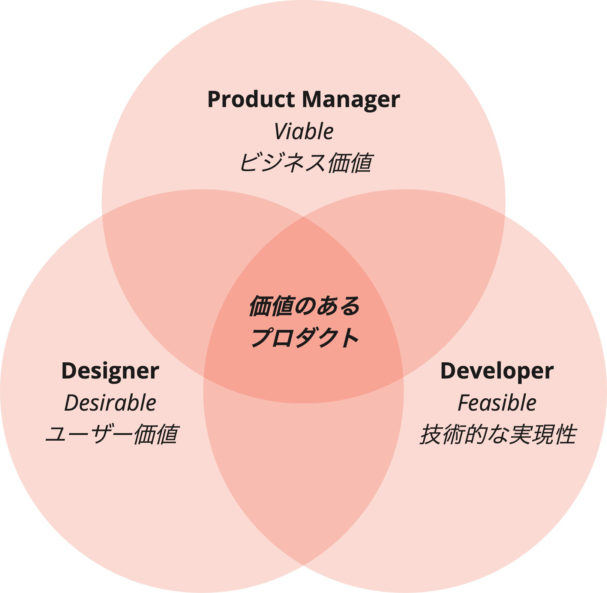

# バランスチーム

## 3つの役割
バランスチームでは、ビジネス価値・ユーザー価値・技術的な実現性のそれぞれに責任を持つ3つの役割（Product Manager/Designer/Developer）でチームを形成します。これによって、スピーディーかつ正しい判断が可能となり、プロダクトを成功に導きます。
プロダクトの成功には、いずれの視点も不可欠であり、それぞれが情報を提供し合い、各視点の考えを尊重することが重要です。
このために、チームは小規模の体制とし、同じ場所に集まって作業を行い、お互いにフラットな関係として常に自発的にコミュニケーションを取り合います。

### ビジネス価値: ビジネスに貢献するか
「ソリューションを提供することで、価値のあるユーザーとビジネスの成果を得ることができるか」を考えます。

### ユーザー価値: ユーザーの問題を解決するか
ユーザーへの影響を常に意識し、「ユーザーの問題は何か」「そのソリューションがユーザーの問題を解決するか」を説明できるようにします。

### 技術的な実現性: 作れるか
技術的な制約があればそれによる影響をチームで議論し、「どのような技術・実装が最も良い形でユーザーに必要なソリューションを提供できるか」を模索します。

## Core Values
バランスチームでは、役割や責任範囲、成果物で縛られたチームではなく、イノベーションの源としてのユーザー価値に焦点を当てた、多くの専門分野に及ぶコラボレーションと反復的なデリバリーを重視します。

バランスチームでは、以下をCore Valuesとしています。

### 信頼関係を築く
部門・会社を超えて集結したチームメンバー同士の心理的安全性を確立し、どのようなアイデアでも共有し、忌憚ない意見が出し合える関係を構築します。

### 試行を共有する
継続的に行う仮説検証の結果をチームで共有し、プロダクトがユーザーにとってどのような価値を持つかの共通理解を促すことで、チームメンバー全員の当事者意識を醸成します。

### 失敗を祝う
リーンの価値観では、失敗は回避するものではなく、貴重な学びの機会であることをチームメンバー全員が理解し、最終的な成功確率をあげます。

### 多様な意見を歓迎する
各メンバーの専門領域に対する敬意を払いつつ、全員で意見交換をすることで、問題を素早く解決し、もっと魅力的なプロダクトにするためのきっかけを作ります。
