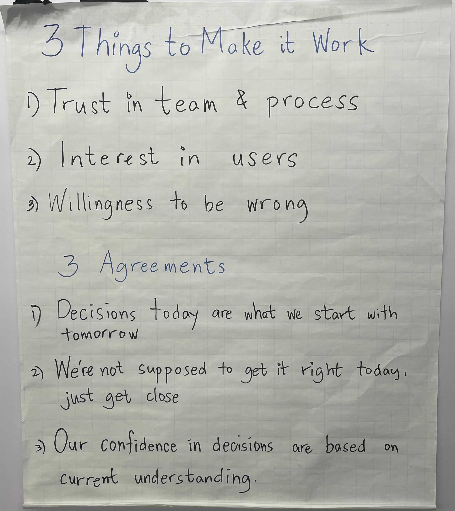

# ONEbaseの価値観

## Core Values


## 3 Things to Make it Work / 3 Agreements



### 3 Things to Make it Work / 3つの成功させるためのポイント
```
1. Trust in team & process / チームとプロセスへの信頼
2. Interest in users / ユーザーへの関心
3. Willingness to be wrong / 間違ってもいいという気持ち
```

### 3 Agreements / 3つの合意
```
1. Decisions today are what we start woth tomorrow  
   今日の決定が明日のスタートとなる
2. We're not supposed to get it right today, just get close  
   今日の決定が正しいとは限らない
3. Our confidence in decisions are based on current understanding  
   決断に対する自信は、現在の理解に基づいている
```
