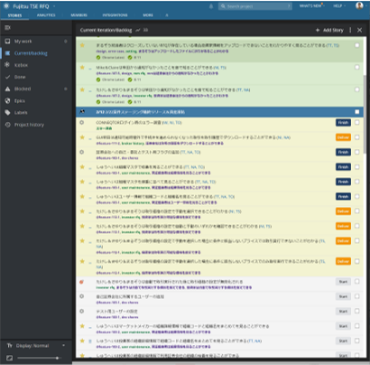
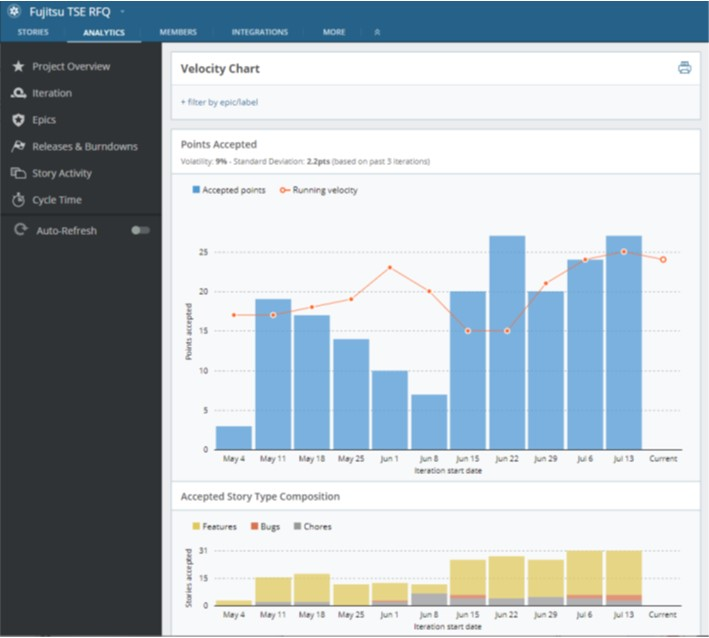

# チームの働き方

**心理的な安全性のあるチームで、安定したペースでの開発を目指します。**

- **ペアワーク**
    - すべての作業をペアで行います。
    - 手戻り防止、情報シェア、スキルトランスファーなどの効果があります。
- **集中**
    - プロジェクトに100%専任にします。（クライアントのメンバーも含む）
    - ミーティング中、脇で会話しないようにします。
    - お菓子・飲み物を事務所に設置し、自由に利用します。（買いに行く時間が無駄）
- **フラット**
    - メンバーは全員フラットな関係（リーダーなし）を維持し、ニックネームで呼び合います。
    - 一人一人を尊重し、発言の機会を作ります。
    - 良いことも悪いこともすべてチームで対応します。
- **タイムボックス**
    - 時間を意識しリズムよく作業します。
    - 議論が長引いている場合は議題の分割を考えます。
    - 議論が詰まる時には何があれば判断できるかを考えます。
- **疲れをためない**
    - 1時間に5~10分程度の休憩を取ります。
    - 卓球でリフレッシュします。
    - 18:00退社を厳守します。
- **カイゼンと成長**
    - 毎週チームでのレトロスペクティブを行います。
    - ペアでのフィードバックの時間を定期的に確保します。
    - チームの健康状態を意識し、早めに対処をします。

## チームのリズム

チームは、一週間単位のイテレーションで、開発を実施します。
IPMで開発の見通しを立てて、デイリースタンドアップで日々の状況の確認、金曜日にレトロスペクティブ（振り返り）を行って翌週にさらに良いチームになるよう改善を続けて行きます。

- **イテレーション**
    - ユーザーリサーチを通じてプロダクトに何か必要かを学びます。
    - 必要と分かったものはユーザストーリーを執筆し、優先度を付けます。
    - ペアプロ/TDDで高品質なプロダクトを開発します。
    - チームが同じ場所に集い、頻繫にコミュニケーションを行います。
- **Pre-IPM(Iteration Planning Meeting)**
    - IPMの準備として実施します。
    - ドラフト版のユーザーストーリーに対してDeveloper観点で確認します。
- **IPM(Iteration Planning Meeting)**
    - 開発するユーザーストーリーの内容をチームに共有します。
    - コミュニケーションにより、ストーリーについて理解を深めます。
    - ユーザーストーリーの複雑さの見積ります。
- **デイリースタンドアップ（全体スタンドアップ/チームスタンドアップ）**
    - その名の通り、毎朝立ちながら実施する数分のミーティングです。
    - 昨日やったこと、今日やること、困っていることを共有します。
- **レトロスペクティブ**
    - 金曜夕方に行う、チームのための時間です。
    - お酒を飲みながら、今週よかったこと、よくなかった点を遠慮なく出し合います。
    - 改善に向けたアクションを決めます。

{}イテレーション{}
{}Pre-IPM{}
{}IPM{}
{}全体スタンドアップ{}
{}チームスタンドアップ{}
{}レトロスペクティブ{}

これらを基本としつつ、プロジェクトの体制やチームの状況によって以下を普段のサイクルに取り入れます。

{}CLミーティング{}
{}フィードバック{}
{}営業確認会議{}
{}Internal Sync{}

{}
**一日のスケジュールの例**
> 例1
> - 09:06~09:15 全体スタンドアップ＋チームスタンドアップ
> - 09:15~09:30 Developer+Infraのタスク確認
> - 09:30~09:40 Product Manager+Designerのタスク確認
> - 09:30~12:30 開発
> - 12:30~13:30 Lunch
> - 13:30~18:00 開発

> 例2
> - 09:06~09:15 全体スタンドアップ
> - 09:15~09:30 Free time
> - 09:30~10:00 チームスタンドアップ
> - 10:00~12:30 開発
> - 12:30~13:30 Lunch
> - 13:30~17:00 開発
> - 17:00~18:00 Internal Sync
{}

## イテレーション開発の基本的な考え方
イテレーション開発では、前のイテレーションの「チーム活動」や「レトロスペクティブ」、「顧客からのフィードバック」をもとに、次のイテレーションのやり方をアップデートします。

### ユーザーストーリー作成から受け入れまでの流れ

1. Product Manager/Designerがユーザーストーリーを作成（ドラフト版）
1. Pre-IPMでユーザーストーリーをDeveloperの観点で確認（必ず会話）
1. Pre-IPMでのフィードバックをProduct Manager/Designerがユーザーストーリーに反映
1. IPMでユーザーストーリーに対して、Developer全員が実装イメージを合わせて複雑さの観点で見積もり
1. IPMでProduct Manager/Designerが開発の複雑さを理解し、必要であればユーザーストーリーを細分化
1. 開発開始
1. 開発中に不明点や確認事項が出たらProduct Manager/Designerと随時会話
1. 開発完了
1. Product Manager/Designerが意図通り動作するか確認
1. 問題なければ受け入れ／問題があればDeveloperに問題点を伝えてDeveloperが修正

> **バックログの例**
>
> 

> **イテレーションで完了したポイント数とベロシティの遷移の例**
>
> 
